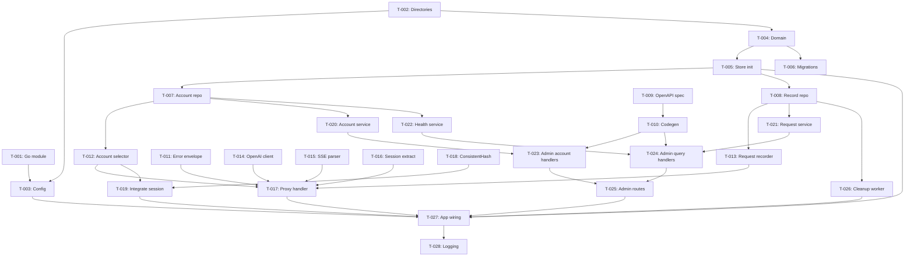

# Tasks: Codex Router MVP

**Feature**: 001-codex-router-mvp
**Plan**: specs/001-codex-router-mvp/plan/tech-design.md
**Spec**: specs/001-codex-router-mvp/spec.md
**Roadmap (project-wide)**: ROADMAP.md
**Created**: 2026-04-16
**Status**: Ready

## Task Format
`- [ ] T-NNN [P?] [US-X?] [L1|L2|L3] Description — path/to/file`

- `[P]` = Can run in parallel (different files, no dependencies)
- `[US-X]` = Traces to User Story X from spec
- `[L1]` = AI generates directly | `[L2]` = AI + human confirm | `[L3]` = Human implements

---

## Phase 1: Setup
> Checkpoint: `go build ./...` passes

- [x] T-001 [P] [L1] Initialize Go module with all dependencies — `go.mod`, `go.sum`
  - Create `go.mod` for `github.com/user/one-llm-router` with Go 1.24.
  - Dependencies: `xorm.io/xorm`, `modernc.org/sqlite`, `github.com/lib/pq`, `github.com/golang-migrate/migrate/v4`, `github.com/oapi-codegen/runtime`, `github.com/stretchr/testify`.
  - Run `go mod tidy`.

- [x] T-002 [P] [L1] Create project directory structure with package doc files — multiple dirs
  - Create directories: `cmd/one-llm-router/`, `internal/domain/`, `internal/core/`, `internal/api/`, `internal/api/admin/`, `internal/provider/openai/`, `internal/store/`, `internal/store/migrations/postgres/`, `internal/store/migrations/sqlite/`, `internal/generated/adminapi/`, `openapi/`, `scripts/`.
  - Add `doc.go` with package comment in each `internal/` package so `go build ./...` succeeds.

- [x] T-003 [L1] Config loading from environment variables — `cmd/one-llm-router/config.go`
  - Define `Config` struct with fields: `ListenAddr`, `DBDriver`, `DBURL`, `DBMaxConns`, `DBMinConns`, `LogLevel`, `LogClientRequestBody`, `LogUpstreamRequestBody`, `LogUpstreamResponseBody`, `LogRetentionDays`.
  - Defaults: `ListenAddr=":8080"`, `DBDriver="sqlite3"`, `DBURL="router.db"`, `DBMaxConns=10`, `DBMinConns=2`, `LogLevel=slog.LevelInfo`, all body logging flags `false`, `LogRetentionDays=30`.
  - Parse from `os.Getenv` with validation.
  - depends_on: T-002

## Phase 2: Foundation
> Checkpoint: `go build ./...` + `golangci-lint run` pass
> Blocks: All User Story phases

- [x] T-004 [P] [L1] Domain entities, enums, and errors — `internal/domain/account.go`, `internal/domain/request_record.go`, `internal/domain/errors.go`
  - `UpstreamAccount` struct: ID (int64), Name, Provider, APIKey, BaseURL (*string), Status, CreatedAt, UpdatedAt. XORM tags.
  - `AccountStatus` constants: `active`, `disabled`, `deleted`.
  - `RequestRecord` struct: all fields from tech-design XORM models. `JSONMap` type.
  - `RequestOutcome` constants: `success`, `upstream_error`, `no_available_account`, `router_error`.
  - `ResponseMode` constants: `json`, `sse`.
  - Provider defaults map: `openai` → `https://api.openai.com`, `anthropic` → `https://api.anthropic.com`.
  - `RequestID()` function: generates `req_` + 8 random hex chars.
  - Sentinel errors: `ErrNoCapacity`, `ErrAccountNotFound`, `ErrAccountDeleted`.
  - depends_on: T-002

- [x] T-005 [L1] XORM store initialization + driver selection — `internal/store/store.go`
  - `Store` struct wrapping `*xorm.Engine`.
  - `NewStore(driver, dsn string, maxConns, minConns int32) (*Store, error)` factory.
  - Driver switch: `sqlite3` → import `modernc.org/sqlite`, apply WAL/busy_timeout/foreign_keys pragmas; `postgres` → import `github.com/lib/pq`; unknown → error.
  - `Sync()` method for XORM table sync (dev convenience, not for production migrations).
  - `Close()` method.
  - depends_on: T-004

- [x] T-006 [P] [L1] Database migrations (PostgreSQL + SQLite) — `internal/store/migrations/`
  - PostgreSQL `000001_init.up.sql`: CREATE TABLE `upstream_accounts` (bigserial PK, text fields, timestamptz), CREATE TABLE `request_records` (bigserial PK, text fields, jsonb for token_usage/model_params/router_metadata, timestamptz), indexes.
  - PostgreSQL `000001_init.down.sql`: DROP TABLE.
  - SQLite `000001_init.up.sql`: equivalent DDL with INTEGER PRIMARY KEY AUTOINCREMENT, TEXT for JSON fields, datetime strings.
  - SQLite `000001_init.down.sql`: DROP TABLE.
  - depends_on: T-004

- [x] T-007 [L1] Account repository (XORM) — `internal/core/interfaces.go`, `internal/store/accounts.go`
  - `AccountRepository` interface in `internal/core/interfaces.go` (interfaces live where consumed).
  - Methods: `Create(ctx, *UpstreamAccount) error`, `GetByID(ctx, int64) (*UpstreamAccount, error)`, `List(ctx, statusFilter []string) ([]UpstreamAccount, error)`, `UpdateStatus(ctx, id int64, status string) error`, `ListActive(ctx) ([]UpstreamAccount, error)`.
  - XORM implementation in `internal/store/accounts.go`.
  - depends_on: T-005

- [x] T-008 [L1] Request record repository (XORM) — `internal/core/interfaces.go`, `internal/store/records.go`
  - `RequestRecordRepository` interface in `internal/core/interfaces.go` (same file as AccountRepository).
  - Methods: `Insert(ctx, *RequestRecord) error`, `Query(ctx, QueryParams) ([]RequestRecord, error)`, `DeleteBefore(ctx, time.Time) (int64, error)`.
  - `QueryParams` struct: `Start`, `End`, `AccountID`, `Outcome`, `Limit`, `BeforeID`.
  - XORM implementation in `internal/store/records.go`.
  - depends_on: T-005

- [ ] T-009 [L1] OpenAPI spec for admin API — `openapi/admin.yaml`
  - OpenAPI 3.0.3 spec covering all admin endpoints from tech-design Section 10.
  - Paths: POST/GET /api/admin/accounts, GET /api/admin/accounts/{id}, POST /api/admin/accounts/{id}/enable|disable|delete, GET /api/admin/requests, GET /api/admin/requests/{id}, GET /api/admin/requests/options, GET /api/admin/sessions/resolve, GET /api/admin/health.
  - Schemas: UpstreamAccount, RequestRecord, CreateAccountRequest, AccountListResponse, RequestHistoryResponse, HealthResponse, ErrorResponse.
  - Pagination: `limit`, `before` query params.
  - Request history filters: `start`, `end`, `account_id`, `outcome`, `model`, `response_mode`, `search`, `limit`, `before`.

- [ ] T-010 [L1] Generate admin API server interfaces — `internal/generated/adminapi/`
  - Run `oapi-codegen` v2 to generate strict server interface + types from `openapi/admin.yaml`.
  - Config file for oapi-codegen (generate net/http server, strict responses).
  - Add `go generate` directive.
  - Commit generated code.
  - depends_on: T-009

## Phase 3: Stable Codex Access (P0)
> Story: US-1 — Internal developers send Codex requests through one managed entry point
> Acceptance: AC-1.1 (API-key provider-compatible proxy), AC-1.2 (capacity-unavailable error)
> Checkpoint: `go test ./internal/api/... ./internal/core/... ./internal/provider/...` passes

### Helpers & Error Handling
- [x] T-011 [P] [US-1] [L1] Router error envelope + middleware — `internal/api/errors.go`
  - `RouterError` struct: Type, Code, Message, RequestID.
  - `WriteRouterError(w, statusCode, errorCode, message, requestID)` helper.
  - Error code constants: `no_available_account`, `internal_error`, `upstream_connect_failed`, `upstream_timeout`.
  - JSON envelope: `{"error": {"type": "router_error", "code": "...", "message": "...", "request_id": "..."}}`.

### Services
- [x] T-012 [US-1] [L1] Account selector with round-robin — `internal/core/account_selector.go`
  - `AccountSelector` struct with `AccountRepository`, atomic counter.
  - `Select(ctx, sessionKey string) (UpstreamAccount, error)`: load active accounts, return `ErrNoCapacity` if empty, round-robin if no session key. Uses `atomic.Uint64` counter (no mutex).
  - Session routing integration placeholder (filled in Phase 4).
  - depends_on: T-007

- [x] T-013 [US-1] [L1] Async buffered request recorder — `internal/core/request_recorder.go`
  - `RequestRecorder` struct with `RequestRecordRepository`, buffered channel (size 1024), WaitGroup, logger.
  - `Start()` launches worker goroutine.
  - `Record(ctx, RequestRecord)`: non-blocking send to channel; if full, synchronous fallback insert.
  - `Close(ctx)`: close channel, wait for drain.
  - depends_on: T-008

### Upstream Provider
- [x] T-014 [P] [US-1] [L1] OpenAI upstream client + request forwarder — `internal/provider/openai/client.go`, `internal/provider/openai/forwarder.go`
  - `Client` struct wrapping `*http.Client` with configurable timeout.
  - `ForwardRequest(ctx, upstreamURL, apiKey string, originalReq *http.Request) (*http.Response, error)`: clone request, replace Authorization header, replace Host, send to upstream.
  - Handle connection errors → return typed error for `upstream_connect_failed`.
  - Handle timeout → return typed error for `upstream_timeout`.

- [x] T-015 [P] [US-1] [L2] SSE parser + inline forwarding with token extraction — `internal/api/sse.go`, `internal/provider/openai/usage.go`
  - `SSEForwarder` in `internal/api/sse.go`: reads upstream response line-by-line with `bufio.Scanner`, forwards each line to client immediately, flushes on blank lines.
  - Accumulates `data:` lines per event; on event boundary, parses JSON.
  - `ExtractUsage(eventJSON)` in `internal/provider/openai/usage.go`: if event type is `response.completed`, extract `usage.input_tokens`, `usage.output_tokens`, `usage.input_tokens_details.cached_tokens`, `usage.output_tokens_details.reasoning_tokens` → return `JSONMap`.
  - `ExtractJSONUsage(responseBody)` for non-streaming JSON responses.
  - `ExtractModel(requestBody)` and `ExtractModelParams(requestBody)` for parsing model info from request.
  - `DetectResponseMode(contentType)` → `json`, `sse`.
  - note: SSE parsing is the most complex part. Must handle partial lines, multi-line data fields, and connection drops gracefully.

### Handlers
- [x] T-016 [US-1] [L1] Session key extraction from Codex headers — `internal/api/session.go`
  - `ExtractSessionKey(r *http.Request) string`: check `x-codex-session-id` first, then `x-codex-conversation-id`. Return first non-empty value, or empty string.

- [x] T-017 [US-1] [L2] Transparent proxy handler (/v1/*) — `internal/api/proxy.go`
  - `ProxyHandler` struct with dependencies: `AccountSelector`, `RequestRecorder`, `openai.Client`, `Config` (body logging flag), `slog.Logger`.
  - `ServeHTTP(w, r)`:
    1. Generate request ID.
    2. Extract session key via `ExtractSessionKey`.
    3. `AccountSelector.Select(ctx, sessionKey)` → on `ErrNoCapacity`, write 503 router error, record outcome=`no_available_account`.
    4. Determine upstream URL from account's BaseURL or provider default.
    5. Forward request via `openai.Client.ForwardRequest`.
    6. On connect/timeout error → write 502/504 router error, record outcome=`router_error`.
    7. Detect response mode. SSE → use `SSEForwarder`. JSON → read body, extract usage, write to client.
    8. Build `RequestRecord` with timing, tokens, outcome, optional bodies.
    9. Send to `RequestRecorder.Record`.
  - depends_on: T-011, T-012, T-013, T-014, T-015, T-016

## Phase 4: Multi-Account Continuity (P0)
> Story: US-2 — Router preserves session continuity across multiple upstream accounts
> Acceptance: AC-2.1 (route to healthy), AC-2.2 (session stickiness), AC-2.3 (sticky fallback)
> Checkpoint: `go test ./internal/core/...` — consistent hash tests pass

- [x] T-018 [US-2] [L2] SessionRouter interface + ConsistentHashRouter — `internal/core/session_router.go`
  - `SessionRouter` interface: `Route(sessionKey string, activeAccounts []UpstreamAccount) (UpstreamAccount, error)`.
  - `ConsistentHashRouter` implementation: hash ring with virtual nodes (default 150 per account). Uses `crc32` or `fnv32a` hash.
  - Given the same session key and same set of active account IDs, always returns the same account.
  - When accounts are added/removed, only ~1/N sessions are reassigned.
  - Unit tests: determinism, stability on add/remove, even distribution.

- [x] T-019 [US-2] [L1] Integrate session routing into account selector — `internal/core/account_selector.go`
  - Update `AccountSelector.Select`:
    - If `sessionKey` is non-empty → use `SessionRouter.Route(sessionKey, activeAccounts)`.
    - If `sessionKey` is empty → round-robin via atomic counter.
  - depends_on: T-012, T-018

## Phase 5: Operational Control (P0)
> Story: US-3 — Operators manage accounts and inspect request history
> Acceptance: AC-3.1 (account CRUD takes effect immediately), AC-3.2 (request history query)
> Checkpoint: `go test ./internal/api/admin/... ./internal/core/...` passes

### Services
- [x] T-020 [P] [US-3] [L1] Account service (CRUD logic) — `internal/core/account_service.go`
  - `AccountService` struct with `AccountRepository`, `slog.Logger`.
  - Methods: `Create(ctx, name, provider, apiKey, baseURL)`, `Enable(ctx, id)`, `Disable(ctx, id)`, `Delete(ctx, id)`, `GetByID(ctx, id)`, `List(ctx, statusFilter)`.
  - Validation: name non-empty, apiKey non-empty. Status transition rules: only `disabled`→`active` for enable, `active`/`disabled`→`disabled` for disable, any→`deleted` for delete.
  - depends_on: T-007

- [x] T-021 [P] [US-3] [L1] Request query service — `internal/core/request_service.go`
  - `RequestService` struct with `RequestRecordRepository`.
  - `Query(ctx, QueryParams) ([]RequestRecord, error)`: delegates to repo with pagination.
  - depends_on: T-008

- [x] T-022 [P] [US-3] [L1] Health service — `internal/core/health_service.go`
  - `HealthService` struct with `AccountRepository`, build info.
  - `GetHealth(ctx) HealthStatus`: returns counts of active/disabled/deleted accounts, DB status, uptime.
  - `HealthStatus` struct: Status string, ActiveAccounts int, DisabledAccounts int, Uptime string.
  - depends_on: T-007

### Handlers
- [x] T-023 [US-3] [L1] Admin account handlers — `internal/api/admin/handler.go`
  - `AdminHandler` struct implementing generated server interface.
  - Implement: CreateAccount, ListAccounts, GetAccount, EnableAccount, DisableAccount, DeleteAccount.
  - Map between generated types and domain types.
  - Return appropriate HTTP status codes (201, 200, 404, 409).
  - depends_on: T-020, T-010

- [x] T-024 [US-3] [L1] Admin request/session/health handlers — `internal/api/admin/handler.go`
  - Implement: QueryRequests (with pagination + filters), ResolveSession (consistent hash lookup), GetHealth.
  - Parse query parameters: start/end (ISO 8601), account_id, outcome, limit, before.
  - depends_on: T-021, T-022, T-010

- [x] T-025 [US-3] [L1] Admin route registration — `internal/api/admin/routes.go`
  - `RegisterRoutes(mux *http.ServeMux, handler AdminHandler)` function.
  - Wire generated server interface to http.ServeMux using oapi-codegen handler wrapper.
  - depends_on: T-023, T-024

## Phase 6: Assembly & Polish
> Checkpoint: `go build ./...` + `go test ./...` + `golangci-lint run` all pass

- [x] T-026 [L1] Background cleanup goroutine — `internal/core/cleanup.go`
  - `CleanupWorker` struct with `RequestRecordRepository`, `retentionDays int`, `slog.Logger`.
  - `Start(ctx)`: runs `DeleteBefore(now - retentionDays)` every hour. Deletes in batches of 1000.
  - Respects context cancellation for graceful shutdown.
  - depends_on: T-008

- [x] T-027 [L2] App wiring, mux setup, graceful shutdown — `cmd/one-llm-router/app.go`, `cmd/one-llm-router/main.go`
  - `main()`: load config, init logger, init store, run migrations (golang-migrate with dialect-specific path), create services, create handlers, build mux, start server.
  - Mux routing: `/v1/` → ProxyHandler, `/admin/` → AdminHandler.
  - Graceful shutdown: listen for SIGINT/SIGTERM, stop accepting connections, wait for in-flight (30s timeout), drain recorder, close store.
  - Start background cleanup worker.
  - depends_on: T-003, T-005, T-017, T-019, T-025, T-026

- [x] T-028 [P] [L1] Structured logging setup — `cmd/one-llm-router/app.go`
  - Configure `slog` JSON handler with configured log level.
  - Request logging middleware: log method, path, status, latency, request_id for every request.
  - depends_on: T-027

- [x] T-029 [P] [L1] CI workflow — `.github/workflows/ci.yaml`
  - GitHub Actions: checkout, setup Go 1.24, `go build ./...`, `golangci-lint run`, `go test -race -coverprofile ./...`.
  - SQLite tests run by default (no external DB needed).
  - Optional PostgreSQL service container for integration tests.

## Phase 7: Testing
> Checkpoint: full `go test -race ./...` + `golangci-lint run` + `go build ./...`

- [x] T-030 [P] [L1] Unit tests — `internal/api/`, `internal/core/`, `internal/provider/openai/`
  - Session key extraction: header precedence, empty headers, both present.
  - Consistent hash: determinism, stability on account add/remove, distribution evenness.
  - SSE event parser: normal stream, partial lines, multi-line data, connection drop.
  - JSON usage parser: complete usage object, missing fields, null usage.
  - Router error envelope: correct JSON structure, all error codes.
  - Config loading: defaults, overrides, validation errors.
  - Account service: status transitions, validation.
  - Request ID generation: format, uniqueness.

- [x] T-031 [L2] Integration tests — `internal/store/`, `internal/api/`, `cmd/one-llm-router/`
  - Use SQLite in-memory for fast test DB. Optional: testcontainers-go for PostgreSQL.
  - Test scenarios (from tech-design Section 11):
    1. Proxy happy path: request proxied, response returned, record created with outcome=success.
    2. SSE streaming: response.completed event parsed, tokens extracted.
    3. Non-streaming JSON: usage extracted from response body.
    4. Round-robin: N requests distributed across active accounts.
    5. Consistent hash stickiness: same session_key routes to same account.
    6. Sticky fallback: disable pinned account, next request routes elsewhere.
    7. No capacity: all accounts disabled → 503 with router error envelope.
    8. Upstream error passthrough: upstream 429 → same 429 to client, outcome=upstream_error.
    9. Admin CRUD lifecycle: create → list → disable → enable → delete.
    10. Request history filtering: filter by time, account, outcome.
    11. Request body logging: enabled vs disabled.
    12. Retention cleanup: old records deleted by cleanup worker.
  - Use httptest.Server as mock upstream for proxy tests.

---

## Dependencies

## Traceability Matrix

| Spec Item | Type | Task IDs | Coverage |
|-----------|------|----------|----------|
| US-1 | User Story | T-011, T-012, T-013, T-014, T-015, T-016, T-017 | ✅ Full |
| AC-1.1 (API-key provider-compatible proxy) | Acceptance | T-014, T-015, T-017 | ✅ Full |
| AC-1.2 (capacity-unavailable) | Acceptance | T-011, T-012, T-017 | ✅ Full |
| US-2 | User Story | T-018, T-019 | ✅ Full |
| AC-2.1 (route to healthy) | Acceptance | T-012, T-019 | ✅ Full |
| AC-2.2 (session stickiness) | Acceptance | T-016, T-018, T-019 | ✅ Full |
| AC-2.3 (sticky fallback) | Acceptance | T-018, T-019 | ✅ Full |
| US-3 | User Story | T-020, T-021, T-022, T-023, T-024, T-025 | ✅ Full |
| AC-3.1 (account CRUD immediate) | Acceptance | T-020, T-023 | ✅ Full |
| AC-3.2 (request history query) | Acceptance | T-021, T-024 | ✅ Full |
| US-4 | User Story | — | ⏳ Deferred (Phase 3) |
| US-5 | User Story | T-002 (package structure) | ✅ Full (structural) |
| FR-001 (API-key provider-compatible proxy) | Functional | T-017 | ✅ |
| FR-003 (route to active) | Functional | T-012, T-019 | ✅ |
| FR-004 (session continuity) | Functional | T-016, T-018, T-019 | ✅ |
| FR-005 (account management) | Functional | T-020, T-023 | ✅ |
| FR-007 (record every request) | Functional | T-013, T-017 | ✅ |
| FR-008 (history filters) | Functional | T-021, T-024 | ✅ |
| FR-010 (token extraction) | Functional | T-015 | ✅ |
| FR-011 (additive compat) | Functional | T-002 (structure) | ✅ |
| FR-012 (body logging) | Functional | T-017 | ✅ |
| FR-013 (sticky fallback) | Functional | T-018, T-019 | ✅ |
| FR-014 (error format) | Functional | T-011 | ✅ |
| EC: upstream error → transparent | Edge Case | T-017 | ✅ |
| EC: all capacity unavailable | Edge Case | T-012, T-017 | ✅ |
| EC: sticky account disabled | Edge Case | T-018, T-019 | ✅ |
| EC: retention reached | Edge Case | T-026 | ✅ |
| NFR: P95 routing < 200ms | Non-Functional | T-031 (benchmark) | ⚠️ Partial |
| NFR: P95 history query < 2s | Non-Functional | T-031 (benchmark) | ⚠️ Partial |
| NFR: 99% reliability | Non-Functional | T-031 (scenario 7) | ⚠️ Partial |
| NFR: 100% correlation IDs | Non-Functional | T-017, T-013 | ✅ |
| NFR: 30-day retention | Non-Functional | T-026 | ✅ |

## Statistics

| Metric | Value |
|--------|-------|
| Total Tasks | 31 |
| Phases | 7 |
| L1 Tasks | 26 (84%) |
| L2 Tasks | 5 (16%) |
| L3 Tasks | 0 (0%) |
| Parallel Tasks | 14 (45%) |
| Estimated AI Sessions | 31 |
| Human Tasks | 0 |

### Distribution Health
- L1 ≥ 70%: ✅ (84%)
- L2 ≤ 20%: ✅ (16%)
- L3 ≤ 10%: ✅ (0%)

### Coverage
- P0 AC Coverage: 7/7 (100%)
- P1 AC Coverage: N/A
- P2 AC Coverage: 2/2 (100% structural for US-5, US-4 deferred)
- Edge Case Coverage: 4/4 (100%)
- NFR Coverage: 3/5 partial (perf benchmarks are validation, not implementation tasks)

## Execution Strategies

### MVP (fastest to working feature)
Phase 1 → Phase 2 → Phase 3 (US-1 proxy only) → validate end-to-end with curl

### Incremental (recommended)
Phase 1 → Phase 2 → Phase 3 → Phase 4 → Phase 5 → Phase 6 → Phase 7

### Full Parallel (fastest total, needs multiple sessions)
Phase 1 → Phase 2 → [Phase 3 + Phase 4 in parallel] → Phase 5 → Phase 6 → Phase 7

### Next Step
To start implementation, use **sdd-implement**:
> "Use sdd-implement for 001-codex-router-mvp"
