# Tasks: Multi-mode Codex Authentication

**Feature**: 003-multi-mode-codex-auth
**Plan**: `specs/003-multi-mode-codex-auth/plan.md`
**Spec**: `specs/003-multi-mode-codex-auth/spec.md`
**Contracts**: `specs/003-multi-mode-codex-auth/contracts/oauth-flow-api.md`, `specs/003-multi-mode-codex-auth/contracts/accounts-api.md`, `specs/002-setup-wizard-and-admin-portal-skeleton/contracts/setup-api.md`
**OpenAPI (authoritative from 003+)**: `openapi/admin.yaml`
**Created**: 2026-04-15 · **Revised (Stage 3 rewrite)**: 2026-04-16 · **Revised (Setup entrypoint reopen + closeout)**: 2026-04-23
**Status**: Reviewed

> **How to read this file.** Each task is self-contained — `sdd-implement` must be able to pick any task, read its `context_files` list, and generate code without asking for more. Every L2/L3 task carries a full `verify` block (command + happy / error / boundary / coverage). Checkpoint gates at the end of each phase are non-negotiable: the phase is NOT complete until the checkpoint command exits 0.
>
> **Envelope policy — non-negotiable.** Every `/api/admin/*` endpoint in this feature returns HTTP 200 with a `{code, msg, data}` payload per `docs/error-codes.md` §HTTP envelope policy; HTTP 4xx is forbidden on any admin route (CI gate in T-095a). Two documented exemptions: (a) `GET /auth/callback` (browser-facing plaintext, Rail A of the dual-rail browser OAuth flow — not under `/api/*`); (b) `POST /api/admin/accounts/{id}/export-auth-json` **success** body (raw Codex CLI `auth.json` attachment; its error bodies still use the envelope). Error bodies throughout this file reference envelope `code:NNNN symbol` pairs from `internal/api/errcode/codes.go` + `docs/error-codes.md` §Feature 003 (3001–3016 business, 3900–3902 system — note 3902 `oauth_export_read_failed` was added in Stage 5 so that T-080 export read-side errors don't collide with T-037's write-side `3901 oauth_store_failed`).
>
> Read the [task format legend](#task-format-legend) at the bottom for marker semantics.

---

## Task Format Legend

- **ID**: `T-NNN` (sequential, stable across revisions)
- **Markers**:
  - `[P]` = parallelizable within its phase (different files, no data dep on siblings)
  - `[US-X]` = traces to a User Story from `spec.md` (or `[FR-X]` / `[Infra]` if story-less)
  - `[L1]` = AI generates complete implementation, no human gate
  - `[L2]` = AI generates + `// [CONFIRM]` markers at decision points
  - `[L3]` = AI scaffolds interface only, human implements body
- **verify**: must be executable (a `go test …`, `pnpm test …`, or `curl …` line) plus explicit assertions. L2/L3 tasks also carry `happy_path` / `error_path` / `boundary` / `coverage` dimensions.
- **context_files**: the COMPLETE list of spec/plan/contract files the implementer must read — no implied reads.

Build / test / lint commands (from `AGENTS.md`):
- Go build: `go build ./...`
- Go test: `go test ./...`
- Go lint: `golangci-lint run`
- Frontend build: `pnpm --dir frontend build`
- Frontend test: `pnpm --dir frontend test`
- Frontend lint: `pnpm --dir frontend lint`
- E2E: `pnpm --dir frontend test:e2e`

---

## Phase 1: Setup
> **Checkpoint**: `go build ./... && golangci-lint run && pnpm --dir frontend build` exits 0.
> **Blocks**: Phases 2+.

- [x] **T-001** [P] [Infra] [L1] Scaffold `internal/oauth/` package directory with `doc.go` — `internal/oauth/doc.go`
  - verify:
    - command: `test -f internal/oauth/doc.go && go vet ./internal/oauth/...`
    - assert: file exists; `package oauth` is the only declaration; `go vet` exits 0.
- [x] **T-002** [P] [Infra] [L1] Scaffold `internal/api/oauthapi/` package directory with `doc.go` — `internal/api/oauthapi/doc.go`
  - verify:
    - command: `test -f internal/api/oauthapi/doc.go && go vet ./internal/api/oauthapi/...`
    - assert: file exists; `package oauthapi` is the only declaration; `go vet` exits 0.
- [x] **T-003** [P] [Infra] [L1] Scaffold `internal/api/exportapi/` package directory with `doc.go` — `internal/api/exportapi/doc.go`
  - verify:
    - command: `test -f internal/api/exportapi/doc.go && go vet ./internal/api/exportapi/...`
    - assert: file exists; `package exportapi` is the only declaration; `go vet` exits 0.
- [x] **T-004** [P] [Infra] [L1] Verify `golang.org/x/sync` pinned to `v0.19.0` in `go.mod` and present in `go.sum` — `go.mod`, `go.sum`
  - verify:
    - command: `go list -m golang.org/x/sync`
    - assert: prints `golang.org/x/sync v0.19.0` exactly; non-zero exit if dep is missing.
- [x] **T-005** [Infra, FR-all] [L1] **Reuse existing** envelope helpers `internal/api/envelope.go` (`WriteOK` / `WriteBizErr` / `WriteSysErr`) — add a shared test helper `AssertEnvelope` + a 003-specific test file — `internal/api/testutil/envelope_assert.go` (NEW), `internal/api/testutil/envelope_assert_test.go` (NEW), `internal/api/errcode/codes_003_test.go` (NEW — ensures every 3xxx business code (3001..3016) plus every 003 system code (3900, 3901, 3902) has a non-empty `Symbol(code)`)
  - depends_on: T-001, T-002, T-003
  - context_files:
    - `internal/api/envelope.go` (AUTHORITATIVE — `WriteOK(w, reqID, data)` for success, `WriteBizErr(w, reqID, code, msg, data)` for business errors with HTTP 200, `WriteSysErr(w, reqID, code, msg)` for system errors with HTTP 500; all route through a single `writeEnvelope` that emits `Content-Type: application/json; charset=utf-8` + optional `X-Request-Id`; nil-`data` on `WriteBizErr` is normalised to `struct{}{}` → `"data":{}` on the wire; `WriteOK` panics on nil `data` by design)
    - `docs/error-codes.md` (§HTTP envelope policy — success `msg` is `"ok"`; contracts repeat this)
    - `internal/api/errcode/codes.go` (003 constants 3001–3016 + 3900–3902; `errcode.Symbol(code) string` is the canonical code→snake_case symbol lookup every caller MUST use when building the `msg` argument)
    - `specs/003-multi-mode-codex-auth/plan.md` (§Module Boundaries — `adminapi` / `oauthapi` / `exportapi` all consume these helpers directly; NO wrapper package)
  - constraints:
    - **No new envelope package.** 003 MUST NOT introduce `internal/api/apihttp/…`; contracts explicitly point at `internal/api/envelope.go` (see `contracts/oauth-flow-api.md` §Response envelope and `contracts/accounts-api.md` §Response envelope). Creating a second helper stack would fork the project-wide HTTP policy.
    - **Usage pattern every handler follows:**
      - Success: `api.WriteOK(w, reqID, data)` where `data` MUST be non-nil (pass `struct{}{}` when there is no payload).
      - Business error: `api.WriteBizErr(w, reqID, code, errcode.Symbol(code), data)` — `data` may be nil (auto-normalised to `{}`).
      - System error: `api.WriteSysErr(w, reqID, code, errcode.Symbol(code))` — always HTTP 500; code MUST be in the system range (`3900/3901/3902/1900/1901/2900..2903`); `data` is always `{}`.
    - **Success `msg`** MUST be `"ok"` (already the case via `WriteOK`). **Business / system `msg`** MUST come from `errcode.Symbol(code)`; hand-typed strings are a review blocker.
    - **Content-Type** is set by the existing helper to `application/json; charset=utf-8`; response body NEVER contains token bytes (callers use token-free projection structs, NOT `*domain.UpstreamAccount`).
    - **No new write path.** The only acceptable extension in 003 is a testing helper + coverage test; the wire helpers themselves are frozen until a 004+ RFC changes them.
  - what:
    1. Create `internal/api/testutil/envelope_assert.go` exporting `AssertEnvelope(t *testing.T, rec *httptest.ResponseRecorder, wantCode int) map[string]any` — decodes the JSON body; asserts `rec.Code == 200` when `wantCode` is `0` or in the business range (`1xxx..3xxx` excluding system codes), `rec.Code == 500` when `wantCode` is in the system range (`3900..3901` or any `1900/1901/2900..2903`); asserts `body.code == wantCode`; asserts `body.msg == "ok"` when `wantCode == 0` else `body.msg == errcode.Symbol(wantCode)`; asserts `body.data` is non-null (either a map or the sentinel `{}`); returns `body.data.(map[string]any)` (or an empty map) for further chained assertions.
    2. Unit-test the helper itself: call it against `WriteOK(w, "req-1", map[string]any{"a": 1})`, `WriteBizErr(w, "req-2", errcode.OAuthFlowInProgress, errcode.Symbol(errcode.OAuthFlowInProgress), nil)`, and `WriteSysErr(w, "req-3", errcode.OAuthInternalError, errcode.Symbol(errcode.OAuthInternalError))`.
    3. Add `internal/api/errcode/codes_003_test.go` that iterates every 003 constant exported by `codes.go` (build the list via reflection OR hard-code the 18-entry slice from the registry) and asserts each has a non-empty `Symbol(code)`; fail fast if a code is added without a symbol row.
    4. Document the usage pattern in `internal/api/envelope.go`'s package doc (one-paragraph amendment, no behavioural change).
  - must_not: create `internal/api/apihttp/`; re-export `WriteOK` under a new name; introduce a parallel `Envelope` struct.
  - verify:
    - command: `go test ./internal/api/... -run 'TestWriteOK|TestWriteBizErr|TestWriteSysErr|TestAssertEnvelope|TestSymbols003' -v`
    - assert:
      - happy_path (`AssertEnvelope` on `WriteOK`): `rec.Code == 200`, `body.code == 0`, `body.msg == "ok"`, `body.data == {"a":1}`.
      - business_error (`AssertEnvelope` on `WriteBizErr(3001)`): `rec.Code == 200`, `body.code == 3001`, `body.msg == "oauth_flow_in_progress"`, `body.data == {}` (nil normalised).
      - system_error (`AssertEnvelope` on `WriteSysErr(3900)`): `rec.Code == 500`, `body.code == 3900`, `body.msg == "oauth_internal_error"`, `body.data == {}`.
      - boundary: `AssertEnvelope(t, rec, 3901)` against a response that used the wrong helper (e.g. `WriteBizErr(…, 3901)` returning HTTP 200 instead of 500) MUST fail the test with a descriptive message ("system-range code must be written via WriteSysErr / HTTP 500"). Same assertion for `3902`.
      - registry_completeness: `TestSymbols003` iterates all 19 003 codes (3001..3016 + 3900 + 3901 + 3902) and asserts each `errcode.Symbol(code)` is a non-empty lowercase snake_case string.
      - coverage: 4 helper scenarios + 18 registry rows = 22 assertions.
- [x] **T-005b** [Infra, FR-all] [L1] **Shared body-cap + JSON-decoder helper** — one source of truth for every `/api/admin/*` JSON handler so T-040, T-041, T-043, T-050, T-061, T-070, T-080 (and the T-098 probe suite) all emit a consistent envelope on malformed / oversized / wrong-content-type / empty bodies — `internal/api/httpio/decode.go` (NEW), `internal/api/httpio/decode_test.go` (NEW)
  - depends_on: T-005
  - context_files:
    - `internal/api/setup/handler.go` (existing 002 `http.MaxBytesReader` usage pattern — this task generalises it)
    - `internal/api/adminapi/settings.go` (existing 002 decoder-cap usage pattern)
    - `internal/api/errcode/codes.go` (`MalformedBody = 2008`, `RequestBodyTooLarge = 2009`)
  - constraints:
    - The helper MUST live in `internal/api/httpio/` (`package httpio`) — a narrow utility package that imports only `encoding/json`, `errors`, `io`, `net/http`, `strings`, and `internal/api` + `internal/api/errcode`. MUST NOT introduce third-party deps. MUST NOT import handler packages (`adminapi` / `oauthapi` / `exportapi` depend on `httpio`, NOT the other way round — one-directional dep graph).
    - Exposes exactly two functions + one constant:
      - `const DefaultAdminBodyCap = 8 * 1024` (002's cap; `import-auth-json` in T-065 uses its own dual-layer values per research.md Decision 7 and does NOT call `DecodeJSON`).
      - `DecodeJSON[T any](w http.ResponseWriter, r *http.Request, reqID string, cap int64) (T, bool)` — wraps `http.MaxBytesReader(w, r.Body, cap)`, checks `Content-Type` starts with `application/json`, calls `json.NewDecoder(body).Decode(&out)` with `DisallowUnknownFields=false` (002 posture kept), returns `(zero, false)` + writes the appropriate envelope on error:
        - `*http.MaxBytesError` → `api.WriteBizErr(w, reqID, errcode.RequestBodyTooLarge, errcode.Symbol(errcode.RequestBodyTooLarge), map[string]any{"scope": "envelope", "limit_bytes": cap})` (HTTP 200). Single-layer callers (all JSON `/api/admin/*` handlers) always emit `scope="envelope"`; the only dual-layer caller is T-065's multipart `import-auth-json`, which does NOT go through `DecodeJSON` and emits `scope="envelope"|"part"` on its own (per T-065 constraints).
        - `io.EOF` (empty body) → `api.WriteBizErr(w, reqID, errcode.MalformedBody, errcode.Symbol(errcode.MalformedBody), nil)`.
        - any other `json.SyntaxError` / `json.UnmarshalTypeError` / `errors.Is(err, io.ErrUnexpectedEOF)` → same `MalformedBody` envelope.
        - wrong `Content-Type` (not `application/json`) → same `MalformedBody` envelope (the project's 2008 covers both "JSON parse failure" and "not JSON" — per `docs/error-codes.md` §2008).
      - `WriteMalformedBody(w http.ResponseWriter, reqID string)` — imperative form for non-decoder call sites (multipart handler, ad-hoc parsers) that need to emit the same canonical envelope.
    - Returning `bool` (not `error`) forces callers to `if _, ok := httpio.DecodeJSON[…](…); !ok { return }` — a single `return` after the helper is the entire error-handling surface; callers MUST NOT emit their own envelope on decoder errors (compile-time enforced by `httpio` not exposing the raw error).
  - what:
    1. Create the package + the two functions + constants.
    2. Unit-test every branch: happy + oversized + empty + malformed JSON + wrong Content-Type + `io.ErrUnexpectedEOF` — six cases.
    3. Refactor T-040 / T-041 / T-043 / T-050 / T-061 / T-070 / T-080 to use `httpio.DecodeJSON` (this task's `what` step 3 updates their respective task cards; the actual handler edits are still within each downstream task — this task is ONLY the helper).
  - must_not: add a per-handler copy of `http.MaxBytesReader` usage (the helper is the single source of truth); emit anything other than the two canonical codes (`2008` or `2009`); leak the raw `error` to callers.
  - verify:
    - command: `go test ./internal/api/httpio/... -v -race`
    - assert:
      - happy_path: a valid JSON body under the cap decodes into the generic `T` and returns `true`.
      - error_path oversized: `cap+1` bytes → `rec.Code == 200` + envelope `code:2009 request_body_too_large` + `data.scope == "envelope"` + `data.limit_bytes == cap`.
      - error_path empty: body `""` → `code:2008 malformed_body`.
      - error_path malformed: body `{` → `code:2008 malformed_body`.
      - error_path wrong-content-type: `Content-Type: text/plain` + valid JSON body → `code:2008 malformed_body` (the check runs before decode).
      - boundary: `cap == 0` → any non-empty body → `code:2009 request_body_too_large` + `data.scope == "envelope"` + `data.limit_bytes == 0`.
      - coverage: 6 branches above.
- [x] **T-006** [Infra, FR-all] [L2] Wire `oapi-codegen` to generate Go server types + handler interfaces from `openapi/admin.yaml` — `tools/oapi-codegen.go` (build-tag `tools`), `internal/generated/adminapi/types.gen.go`, `internal/generated/adminapi/server.gen.go`, `scripts/codegen-go.sh`, `openapi/codegen-types.yaml`, `openapi/codegen-server.yaml`, `go.mod`
  - depends_on: T-002, T-003
  - context_files:
    - `openapi/admin.yaml` (authoritative schema)
    - `openapi/README.md` (§Codegen pipeline)
    - `AGENTS.md` (OpenAPI mandate from 003+)
  - constraints: codegen MUST be deterministic (pin `github.com/deepmap/oapi-codegen/v2` version in `go.mod` + `tools.go`); generated files MUST live under `internal/generated/adminapi/` and carry a `// Code generated … DO NOT EDIT.` header; generated code MUST NOT implement handler bodies — only types + an interface the real handlers satisfy; generated imports MUST NOT pull in any runtime framework (use `net/http` strict-server style).
  - what:
    1. Add `tools.go` (build-tag `tools`) importing `github.com/deepmap/oapi-codegen/v2/cmd/oapi-codegen` so `go mod tidy` pins it.
    2. Write `scripts/codegen-go.sh` that runs `oapi-codegen -generate types,strict-server -package adminapi -o internal/generated/adminapi/types.gen.go openapi/admin.yaml` (plus a second call for `server.gen.go`).
    3. Run the script ONCE in this task so generated files land on disk; commit them.
    4. Document the invocation in `openapi/README.md`.
  - verify:
    - command: `bash scripts/codegen-go.sh && go build ./internal/generated/... && git diff --exit-code internal/generated/adminapi/`
    - assert: script exits 0; build exits 0; `git diff --exit-code` exits 0 (freshness).
- [x] **T-007** [Infra, FR-all] [L2] Wire `@hey-api/openapi-ts` to generate TS client types + fetch wrapper from `openapi/admin.yaml` — `frontend/package.json`, `frontend/openapi-ts.config.ts`, `frontend/src/generated/openapi/` (generated), `scripts/codegen-frontend.sh`
  - depends_on: T-006
  - context_files:
    - `openapi/admin.yaml` (authoritative schema)
    - `openapi/README.md` (§Codegen pipeline — TS side)
  - constraints: codegen MUST be deterministic (pin `@hey-api/openapi-ts` in `frontend/package.json`); generated files MUST live under `frontend/src/generated/openapi/` and be gitignore-excluded from linting edits but tracked; the TS envelope type `Envelope<T> = {code:number; msg:string; data?:T}` MUST be emitted.
  - what:
    1. Add `@hey-api/openapi-ts` to `frontend/package.json` devDependencies at an exact pinned version.
    2. Create `frontend/openapi-ts.config.ts` targeting `openapi/admin.yaml` → `frontend/src/generated/openapi/`.
    3. Add `scripts/codegen-frontend.sh` running `pnpm --dir frontend exec openapi-ts`.
    4. Run the script ONCE and commit generated files.
  - verify:
    - command: `bash scripts/codegen-frontend.sh && pnpm --dir frontend build && git diff --exit-code frontend/src/generated/openapi/`
    - assert: script exits 0; build exits 0; `git diff --exit-code` exits 0 (freshness).
- [x] **T-008** [P] [Infra, FR-all] [L1] CI "OpenAPI freshness" gate — fail CI if `openapi/admin.yaml` changes without regenerating either codegen output — `.github/workflows/ci.yml` (append job `openapi-freshness`), `scripts/check-openapi-freshness.sh`
  - depends_on: T-006, T-007
  - context_files:
    - `openapi/README.md` (§Codegen pipeline)
    - `AGENTS.md` (OpenAPI mandate)
  - constraints: the gate MUST run `bash scripts/codegen-go.sh && bash scripts/codegen-frontend.sh && git diff --exit-code`; the job MUST also run `npx @redocly/cli@1 lint openapi/admin.yaml` using the repo `openapi/redocly.yaml`.
  - verify:
    - command: `bash scripts/check-openapi-freshness.sh` (locally)
    - assert:
      - happy_path: on a clean checkout, exits 0.
      - error_path: after hand-editing `openapi/admin.yaml` without regenerating, exits 1 with a clear `git diff` pointer.

---

## Phase 2: Foundation
> **Checkpoint**: `go build ./... && go test ./internal/domain/... ./internal/store/... && golangci-lint run` exits 0 AND a fresh SQLite DB boots against `000002_multi_mode_auth.up.sql` with no `dirty` flag.
> **Blocks**: All User Story phases.

- [x] **T-010** [Infra] [L1] Add migration file `000002_multi_mode_auth.up.sql` for SQLite — `internal/store/migrations/sqlite/000002_multi_mode_auth.up.sql`
  - depends_on: T-001
  - context_files:
    - `specs/003-multi-mode-codex-auth/data-model.md` (§Migration Strategy — SQLite template, §Forward migration (SQLite))
    - `specs/003-multi-mode-codex-auth/plan.md` (§Project Structure)
  - constraints: MUST NOT touch any 002 column or constraint; MUST NOT drop the existing `upstream_accounts` table; MUST use the SQLite rename-dance to relax `api_key` NOT NULL.
  - what: one migration file that adds 9 columns (`auth_method`, `access_token`, `refresh_token`, `id_token`, `last_refresh`, `access_expires_at`, `email`, `plan_type`, `chatgpt_account_id`), then uses the table-rename dance to drop the `NOT NULL` on `api_key`. Matches the template in `data-model.md`.
  - must_not: use SQLite features unavailable in ≥3.34 (the floor 002 already locks in).
  - verify:
    - command: `sqlite3 ":memory:" ".read internal/store/migrations/sqlite/000001_init.up.sql" ".read internal/store/migrations/sqlite/000002_multi_mode_auth.up.sql" ".schema upstream_accounts"`
    - assert: the printed schema contains the 9 new columns with the exact types from `data-model.md` (including `access_expires_at DATETIME NULL`); the `api_key` column shows `NULL` (not `NOT NULL`).
- [x] **T-011** [P] [Infra] [L1] Add migration file `000002_multi_mode_auth.down.sql` for SQLite — `internal/store/migrations/sqlite/000002_multi_mode_auth.down.sql`
  - depends_on: T-010
  - verify:
    - command: `sqlite3 ":memory:" ".read internal/store/migrations/sqlite/000001_init.up.sql" ".read internal/store/migrations/sqlite/000002_multi_mode_auth.up.sql" ".read internal/store/migrations/sqlite/000002_multi_mode_auth.down.sql" ".schema upstream_accounts"`
    - assert: schema matches the 002 post-init shape (no 003 columns; `api_key` is `NOT NULL` again).
- [x] **T-012** [P] [Infra] [L1] Add migration file `000002_multi_mode_auth.up.sql` for PostgreSQL — `internal/store/migrations/postgres/000002_multi_mode_auth.up.sql`
  - depends_on: T-001
  - context_files:
    - `specs/003-multi-mode-codex-auth/data-model.md` (§Forward migration (PostgreSQL))
  - verify:
    - command: `psql -f internal/store/migrations/postgres/000002_multi_mode_auth.up.sql …` (runs against a fresh pg that already ran 000001)
    - assert: `\d upstream_accounts` lists 9 new columns with `BYTEA` for all three token columns AND `TIMESTAMPTZ` for `access_expires_at`; `api_key` shows `NULL` allowed.
- [x] **T-013** [P] [Infra] [L1] Add migration file `000002_multi_mode_auth.down.sql` for PostgreSQL — `internal/store/migrations/postgres/000002_multi_mode_auth.down.sql`
  - depends_on: T-012
  - verify:
    - command: run `up` then `down`; `\d upstream_accounts`
    - assert: schema matches 002 post-init shape exactly.
- [x] **T-014** [P] [Infra] [L1] Add migration file `000002_multi_mode_auth.up.sql` for MySQL — `internal/store/migrations/mysql/000002_multi_mode_auth.up.sql`
  - depends_on: T-001
  - context_files:
    - `specs/003-multi-mode-codex-auth/data-model.md` (§Forward migration (MySQL) — `VARBINARY(8192)` for tokens — OpenAI rotates refresh tokens and JWT access tokens can exceed 4 KB with embedded claims; the 4 KB ceiling would truncate on rotation.)
  - verify:
    - command: `mysql < … 000002_multi_mode_auth.up.sql` + `DESCRIBE upstream_accounts;`
    - assert: 9 new columns with `VARBINARY(8192)` for `access_token` / `refresh_token` / `id_token` AND `DATETIME NULL` for `access_expires_at`; `api_key` shown as `NULL` allowed.
- [x] **T-015** [P] [Infra] [L1] Add migration file `000002_multi_mode_auth.down.sql` for MySQL — `internal/store/migrations/mysql/000002_multi_mode_auth.down.sql`
  - depends_on: T-014
  - verify:
    - command: run `up` then `down`; `DESCRIBE upstream_accounts`
    - assert: schema matches 002 post-init shape.
- [x] **T-020** [FR-002] [L2] Extend `internal/domain/account.go` with `AuthMethod` discriminator + 8 new fields on `UpstreamAccount` + `Validate()` invariant helper — `internal/domain/account.go`, `internal/domain/account_test.go`
  - depends_on: T-010, T-012, T-014
  - context_files:
    - `specs/003-multi-mode-codex-auth/data-model.md` (§`UpstreamAccount` attribute table + §Invariants)
    - `specs/003-multi-mode-codex-auth/spec.md` (FR-002, FR-011, FR-011a)
    - `specs/003-multi-mode-codex-auth/plan.md` (§Module Boundaries row for `internal/domain/account.go`)
  - constraints: existing 002 fields / JSON tags / DB tags MUST NOT change; `AuthMethod` MUST be `type AuthMethod string` (per plan Trade-off table); token fields MUST be `[]byte` (not `string`) so they round-trip through the BYTEA/BLOB columns.
  - what:
    1. New `type AuthMethod string` with constants `AuthMethodAPIKey = "api_key"`, `AuthMethodOAuthBrowser = "oauth_browser"`, `AuthMethodOAuthDevice = "oauth_device"`, `AuthMethodOAuthImport = "oauth_import"`.
    2. Eight new fields on `UpstreamAccount`: `AuthMethod AuthMethod`, `AccessToken []byte`, `RefreshToken []byte`, `IDToken []byte`, `LastRefresh *time.Time`, `AccessExpiresAt *time.Time`, `Email *string`, `PlanType *string`, `ChatgptAccountID *string`. Add `xorm` / `json` struct tags per data-model.md (note: `AccessToken`/`RefreshToken`/`IDToken` MUST carry `json:"-"` to stay off the wire; `AccessExpiresAt` MUST carry `json:"access_expires_at,omitempty"` to appear in admin-list responses per data-model.md §AccountListItem).
    3. `func (a *UpstreamAccount) Validate() error` enforcing data-model.md §Invariants (api_key mode ⇒ all 8 token/metadata fields NULL; oauth_* modes ⇒ `api_key` NULL AND `{AccessToken, RefreshToken, IDToken, LastRefresh, AccessExpiresAt}` NOT-NULL).
  - must_not: expose the raw token bytes via `fmt.Stringer` / `MarshalJSON` — add a `String()` that returns `"<redacted>"` and make sure `json.Marshal` omits the token fields via `json:"-"` on the three token fields plus any redaction wrappers.
  - verify:
    - command: `go test ./internal/domain/... -run TestUpstreamAccount -v`
    - assert:
      - happy_path: `Validate()` on an `auth_method="api_key"` row with `APIKey="sk-…"` and every OAuth field nil returns nil; `Validate()` on an `auth_method="oauth_browser"` row with the 4 mandatory OAuth fields set and `APIKey=nil` returns nil.
      - error_path: `Validate()` on a row with `auth_method="api_key"` AND a non-nil `AccessToken` returns an error wrapping `domain.ErrInvalidAccountShape`; `Validate()` on `auth_method="oauth_browser"` with `RefreshToken=nil` returns the same sentinel.
      - boundary: unknown `auth_method` value returns `domain.ErrUnknownAuthMethod` (not nil).
      - coverage: all four `AuthMethod` constants AND the "unknown value" case have a test case each.
- [x] **T-021** [P] [FR-011a] [L1] Add the `plan_type` label mapping (`chatgpt-plus → "ChatGPT Plus"` …) as a pure function — `internal/domain/plan_label.go`, `internal/domain/plan_label_test.go`
  - depends_on: T-020
  - context_files:
    - `specs/003-multi-mode-codex-auth/spec.md` (FR-011a)
    - `specs/003-multi-mode-codex-auth/contracts/accounts-api.md` (§GET /accounts Notes — label mapping)
  - verify:
    - command: `go test ./internal/domain/... -run TestPlanLabel -v`
    - assert:
      - happy_path: `PlanTypeLabel("chatgpt-plus") == "ChatGPT Plus"`; `"chatgpt-team" == "ChatGPT Team"`; `"chatgpt-enterprise" == "ChatGPT Enterprise"`.
      - boundary: unknown value (`"chatgpt-edu"`) returns the raw input verbatim; empty string returns `""`.
      - coverage: the three known values + one unknown + empty.
- [x] **T-022** [FR-002] [L2] Extend `internal/store/accounts.go` with SELECT/INSERT/UPDATE covering the 8 new columns + a token-free `ListForAdminAPI()` projection — `internal/store/accounts.go`, `internal/store/accounts_test.go`
  - depends_on: T-020
  - context_files:
    - `specs/003-multi-mode-codex-auth/data-model.md` (§`UpstreamAccount` — all columns + Indexes)
    - `specs/003-multi-mode-codex-auth/plan.md` (§Module Boundaries row for `internal/store/accounts.go`)
    - `specs/002-setup-wizard-and-admin-portal-skeleton/contracts/admin-api.md` (existing 002 GET /accounts contract — api_key rows MUST stay token-free and API-compatible while adding the explicit `auth_method` discriminator)
  - constraints: MUST use xorm's `Cols(...)` for the projection so unpinned columns don't leak token bytes even if someone forgets to list them; INSERT MUST call `Validate()` before the DB hit; `ListForAdminAPI` MUST NOT SELECT the 3 token columns nor `api_key`.
  - what:
    1. `InsertUpstreamAccount(ctx, *UpstreamAccount) (int64, error)` — inserts with all fields; returns new ID.
    2. `UpdateCredentials(ctx, id int64, creds CredentialPatch) error` — updates ONLY the credential columns (either `api_key` for api_key mode OR `{access_token, refresh_token, id_token, last_refresh, access_expires_at, email, plan_type, chatgpt_account_id}` for OAuth modes — NOT `name`/`provider`/`base_url`/stats). The `access_expires_at` field MUST be updated atomically alongside `last_refresh` and the three token bytes — they are a single unit of staleness. Used by T-070 reauth + T-054 refresh.
    3. `ListForAdminAPI(ctx) ([]AccountListItem, error)` returning the token-free projection including `plan_type_label` as a server-computed field (call T-021's `PlanTypeLabel`) AND `access_expires_at` for operator visibility (data-model.md §AccountListItem).
    4. `GetForExport(ctx, id int64) (*ExportPayload, error)` returning the 3 token columns + `chatgpt_account_id` + `last_refresh` — the ONE read path that is allowed to fetch token bytes. Used by T-081.
  - must_not: emit a query that SELECTs `access_token` / `refresh_token` / `id_token` / `api_key` from any code path other than `GetForExport` and the selector's refresh path.
  - verify:
    - command: `go test ./internal/store/... -run TestAccountsStore -v`
    - assert:
      - happy_path: round-trip INSERT → `ListForAdminAPI` returns a row with all metadata fields populated AND no token bytes visible; INSERT → `GetForExport` returns token bytes verbatim.
      - error_path: INSERT with `Validate()`-failing input returns the validate sentinel WITHOUT writing to the DB (assert row count unchanged).
      - boundary: `ListForAdminAPI` on a mixed DB (1 api_key row + 2 oauth rows) returns 3 items; the api_key item omits the 5 OAuth metadata keys (they are NOT `null`, they are absent — this is what FR-011a requires).
      - coverage: all four `AuthMethod` values represented in at least one test row.

---

## Phase 3: US-1 — OAuth Browser (P0)
> **Story**: US-1 — Onboard a ChatGPT-plan account via OAuth in the browser, dual-rail (FR-012).
> **Acceptance**: AC-1 (loopback + paste happy paths), AC-2 (health reports active within 5s), AC-3 (cancel leaves no row).
> **Checkpoint**: `go test ./internal/oauth/... ./internal/api/oauthapi/... -v` passes AND `pnpm --dir frontend test -- --run oauth-browser` passes.

### 3a: Core `internal/oauth` package

- [x] **T-030** [P] [US-1, FR-006] [L1] Declare sentinel errors — `internal/oauth/errors.go`
  - depends_on: T-001
  - context_files:
    - `specs/003-multi-mode-codex-auth/plan.md` (§Sentinel errors)
  - what: exactly the five sentinels listed in the plan (`ErrFlowInProgress`, `ErrFlowNotFound`, `ErrStateMismatch`, `ErrAlreadyConsumed`, `ErrFlowExpired`), each created via `errors.New("oauth: …")`, each with a short godoc line referencing its HTTP mapping in `contracts/oauth-flow-api.md`.
  - verify:
    - command: `go test ./internal/oauth/... -run TestSentinels -v`
    - assert:
      - happy_path: all five sentinels are `error`-typed, non-nil, and distinct under `errors.Is`.
      - coverage: one assertion per sentinel.
- [x] **T-031** [US-1, FR-006] [L2] Build `Provider` concrete struct + `Flow` struct + `FlowMethod`/`Rail`/`FlowStatus` enums — `internal/oauth/flow.go`
  - depends_on: T-030
  - context_files:
    - `specs/003-multi-mode-codex-auth/data-model.md` (§`OAuthFlow` attribute table + §Concurrency model)
    - `specs/003-multi-mode-codex-auth/plan.md` (§Module Boundaries row for `internal/oauth/`)
    - `specs/003-multi-mode-codex-auth/research.md` (Decision 1 — provider endpoints + client_id + scope + redirect_uri)
  - constraints: `Flow.mu` MUST be unexported; `Flow.Consumed` MUST be `atomic.Bool` (not `int32` or a wrapper); `Flow.ConsumedBy` MUST be mutable only under `Flow.mu` by the CAS winner.
  - what:
    1. `type FlowMethod string` with `FlowBrowser = "browser"`, `FlowDevice = "device"`.
    2. `type Rail string` with `RailLoopback = "loopback"`, `RailManualPaste = "manual_paste"`.
    3. `type FlowStatus string` with `FlowStatusIdle, Pending, Success, Error`.
    4. `type Flow struct` carrying every field listed in `data-model.md` §`OAuthFlow` — in the order and types specified there (atomic.Bool for `Consumed`; `*http.Server` for `CallbackServer`; `sync.Mutex` for `mu` — unexported).
    5. `type Provider interface { BuildAuthorizeURL(state, verifier string) (url string); ExchangeCode(ctx, code, verifier string) (Tokens, error); Refresh(ctx, refreshToken []byte) (Tokens, error); RequestDeviceCode(ctx) (DeviceCode, error); PollDeviceCode(ctx, deviceAuthID string) (Tokens, error) }` + a concrete `openAIProvider` that pins the 6 constants from `research.md` Decision 1.
    6. `type Tokens struct { AccessToken, RefreshToken, IDToken []byte; ExpiresIn time.Duration; LastRefresh time.Time }`.
  - must_not: expose `Tokens.String()` / `MarshalJSON` that leaks token bytes — redact like `domain.UpstreamAccount`.
  - verify:
    - command: `go test ./internal/oauth/... -run TestFlowTypes -v`
    - assert:
      - happy_path: `openAIProvider{}.BuildAuthorizeURL("s", "v")` returns a URL containing `client_id=app_EMoamEEZ73f0CkXaXp7hrann`, `redirect_uri=http://localhost:1455/auth/callback`, `originator=codex_cli_rs`, `scope=openid+profile+email+offline_access+api.connectors.read+api.connectors.invoke`, `code_challenge_method=S256`, `code_challenge=<base64url(sha256("v"))>`, `state=s`, `id_token_add_organizations=true`, `codex_cli_simplified_flow=true` (all params present and URL-encoded).
      - error_path: an empty `state` or `verifier` MUST cause `BuildAuthorizeURL` to return a non-nil error (panics are not acceptable per AGENTS.md §Code Style — recoverable validation failures are errors, not panics). The error's `Error()` MUST include the missing field name to aid caller diagnosis.
      - boundary: `Tokens.String()` returns `"<redacted>"`.
      - coverage: each of the 7 authorize-URL params has a test assertion; each of the 2 redacted shapes has a test assertion.
- [x] **T-032** [US-1, FR-006] [L2] PKCE + state generators + SHA-256 challenge builder — `internal/oauth/pkce.go`, `internal/oauth/pkce_test.go`
  - depends_on: T-031
  - context_files:
    - `specs/003-multi-mode-codex-auth/data-model.md` (§`OAuthFlow.State` + §`OAuthFlow.CodeVerifier` — 32 bytes crypto/rand → base64url → 43 chars)
    - `specs/003-multi-mode-codex-auth/plan.md` (§Data Flow US-1)
  - what:
    1. `GenerateState() (string, error)` — 32 bytes from `crypto/rand.Read` → `base64.RawURLEncoding.EncodeToString`.
    2. `GenerateCodeVerifier() (string, error)` — same generator.
    3. `CodeChallenge(verifier string) string` — `base64.RawURLEncoding.EncodeToString(sha256.Sum256([]byte(verifier))[:])`.
    4. `CompareStatesConstantTime(a, b string) bool` — `crypto/subtle.ConstantTimeCompare([]byte(a), []byte(b)) == 1`.
  - verify:
    - command: `go test ./internal/oauth/... -run TestPKCE -v`
    - assert:
      - happy_path: `GenerateState` returns a 43-char string; 1000 consecutive calls produce 1000 distinct values.
      - boundary: `CodeChallenge("v")` matches the RFC 7636 test vector for "v" (compute it once and pin).
      - error_path: `CompareStatesConstantTime` on different-length inputs returns false without panicking.
      - coverage: all four funcs have at least one happy-path assertion.
- [x] **T-033** [US-1, FR-012] [L2] Dual-stack loopback listener binder — `internal/oauth/listener.go`, `internal/oauth/listener_test.go`
  - depends_on: T-031
  - context_files:
    - `specs/003-multi-mode-codex-auth/research.md` (Decision 2 — best-effort dual-stack loopback on canonical port 1455, both `127.0.0.1` AND `[::1]` families)
    - `specs/003-multi-mode-codex-auth/plan.md` (§Data Flow US-1 lines 103-106: best-effort bind; `listener_bound=false` when canonical port 1455 is unavailable is a normal `200 OK`, not a 500)
    - `specs/003-multi-mode-codex-auth/data-model.md` (§`OAuthFlow.ListenerBound`)
  - constraints: MUST NOT return an error when canonical port 1455 is busy; MUST set `Flow.ListenerBound=false` and return `nil, nil` so the caller proceeds.
  - what:
    - `BindLoopback(handler http.Handler) (*http.Server, bound bool, port int, err error)`:
      1. For canonical port `1455`, try to bind `net.Listen("tcp4", "127.0.0.1:1455")` AND `net.Listen("tcp6", "[::1]:1455")`. If EITHER succeeds, wire both into a `http.Server` via a goroutine per `net.Listener` both calling `http.Server.Serve`, return `bound=true`, port `1455`, no error.
      2. If both families fail on 1455, return `bound=false, port=0, err=nil` (NOT an error — this is a legitimate state per FR-012).
      3. Only return a non-nil error if something non-port-related fails (e.g. `http.NewServeMux` panics — should not happen).
  - must_not: return a non-nil error for port-in-use conditions.
  - verify:
    - command: `go test ./internal/oauth/... -run TestBindLoopback -v`
    - assert:
      - happy_path: on a clean box, `BindLoopback` returns `bound=true, port=1455, err=nil`; the returned `*http.Server` answers `GET http://127.0.0.1:1455/auth/callback` AND `GET http://[::1]:1455/auth/callback`; calling `srv.Close()` returns cleanly.
      - error_path: with 1455 pre-occupied by `net.Listen` calls held inside the test, `BindLoopback` returns `bound=false, port=0, err=nil` (not an error).
      - boundary: with 1455 occupied but 1456 free, `BindLoopback` still returns `bound=false, port=0, err=nil`; no fallback port is used because OpenAI only accepts the canonical redirect URI.
      - coverage: three scenarios above.
- [x] **T-034** [US-1, FR-003, FR-006] [L2] `Provider.ExchangeCode` + `Provider.Refresh` against `https://auth.openai.com/oauth/token` — `internal/oauth/exchange.go`, `internal/oauth/exchange_test.go`
  - depends_on: T-031, T-032
  - context_files:
    - `specs/003-multi-mode-codex-auth/research.md` (Decision 1 — token endpoint)
    - `specs/003-multi-mode-codex-auth/plan.md` (§Data Flow US-1, §Security Considerations)
    - `specs/003-multi-mode-codex-auth/contracts/oauth-flow-api.md` (§`POST /browser/manual-callback` §Response (Errors) — the envelope codes the exchange MUST map to: `3009 oauth_invalid_grant`, `3016 oauth_upstream_error`)
  - constraints: every log line MUST use `slog` with the `oauth` component tag; token bytes MUST NOT appear in logs (wrap with `[]byte → "<redacted>"` before logging); HTTP client MUST have a 10s timeout; response body reading MUST be capped at 64KB (guard against giant response DOS).
  - what:
    1. `(p *openAIProvider) ExchangeCode(ctx, code, verifier string) (Tokens, error)` — POSTs `grant_type=authorization_code&code=…&code_verifier=…&redirect_uri=<same redirect_uri used by the authorize request>&client_id=app_EMoamEEZ73f0CkXaXp7hrann` form-encoded to `/oauth/token`. On 2xx, parses `{access_token, refresh_token, id_token, expires_in}` and returns `Tokens`. On 4xx, returns an error wrapping the provider's `error` field verbatim under a `TokenExchangeError` type (so callers can map to envelope `code:3009 oauth_invalid_grant` when the provider's `error=="invalid_grant"`, or `code:3016 oauth_upstream_error` for any other 4xx/malformed-body). On 5xx, returns a wrapping error indicating retryability is up to the caller (surfaces as `code:3016 oauth_upstream_error`).
    2. `(p *openAIProvider) Refresh(ctx, refreshToken []byte) (Tokens, error)` — mirror of ExchangeCode but `grant_type=refresh_token&refresh_token=<bytes>&client_id=…`.
  - must_not: log the body of the HTTP response (it contains tokens); log the `Authorization` header; panic on non-JSON bodies (wrap into `invalid_response`).
  - verify:
    - command: `go test ./internal/oauth/... -run TestExchange -v`
    - assert:
      - happy_path: with an `httptest.Server` returning `{"access_token":"at","refresh_token":"rt","id_token":"eyJ…","expires_in":3600}`, `ExchangeCode` returns `Tokens{[]byte("at"), []byte("rt"), []byte("eyJ…"), 1 hour, …}` within 10ms.
      - error_path: `httptest.Server` returning `400 {"error":"invalid_grant"}` ⇒ `ExchangeCode` returns a `TokenExchangeError` whose `.Code() == "invalid_grant"`.
      - boundary: `httptest.Server` sleeping 11 seconds ⇒ `ExchangeCode` returns a context-deadline-exceeded error within 10-11 seconds (does not hang).
      - coverage: happy + 400 + 500 + timeout + non-JSON (5 branches).
- [x] **T-035** [US-1, FR-002, FR-011a] [L2] `claims.go` — decode `id_token` payload to extract `{email, plan_type, chatgpt_account_id}` — `internal/oauth/claims.go`, `internal/oauth/claims_test.go`
  - depends_on: T-031
  - context_files:
    - `specs/003-multi-mode-codex-auth/research.md` (Decision 6 — JWT decode-only, no signature verification; Decision justifies this)
    - `specs/003-multi-mode-codex-auth/data-model.md` (§`chatgpt_account_id` — three-path probe, `email`, `plan_type`)
    - `specs/003-multi-mode-codex-auth/contracts/accounts-api.md` (§`POST /accounts/import-auth-json` — probing order)
  - what:
    - `ExtractClaims(idToken []byte) (Claims, error)` — splits on `.`, base64url-decodes the middle segment, `json.Unmarshal`s into a `map[string]any`, then probes:
      - `email`: `claims["email"]` (RFC 7519 standard).
      - `plan_type`: `claims["https://api.openai.com/auth"]["plan_type"]` → `claims["auth"]["plan_type"]` (first hit wins, nil if both missing).
      - `chatgpt_account_id`: `claims["https://api.openai.com/auth"]["chatgpt_account_id"]` → `claims["auth"]["chatgpt_account_id"]` (the `tokens.account_id` third fallback is handled OUT of this function — only the US-6 import handler reaches for it).
  - verify:
    - command: `go test ./internal/oauth/... -run TestExtractClaims -v`
    - assert:
      - happy_path: a fixture id_token carrying `{"email":"alice@example.com","https://api.openai.com/auth":{"plan_type":"chatgpt-plus","chatgpt_account_id":"org_X"}}` yields the three values exactly.
      - error_path: a two-segment (not three) string returns `ErrMalformedIDToken`; non-base64url middle returns same sentinel.
      - boundary: id_token with only top-level `auth` scope (legacy codex-lb shape) still extracts both fields via the fallback.
      - coverage: two-path happy + two-path fallback + broken shape (3+ branches).
- [x] **T-036** [US-1, FR-008, FR-012] [L2] `Coordinator` struct: atomic.Pointer[Flow] guard + `TryStartFlow` / `CurrentFlow` / `ReleaseFlow` / `Cancel` / `StartBrowser` — `internal/oauth/coordinator.go`, `internal/oauth/coordinator_test.go`
  - depends_on: T-030, T-031, T-032, T-033, T-034, T-035
  - context_files:
    - `specs/003-multi-mode-codex-auth/plan.md` (§Module Boundaries row for `internal/oauth/`, §Data Flow US-1 lines 99-151)
    - `specs/003-multi-mode-codex-auth/data-model.md` (§`OAuthFlow` §Concurrency model)
    - `specs/003-multi-mode-codex-auth/contracts/oauth-flow-api.md` (§Observability — events the coordinator emits)
  - constraints: the at-most-one-flow rule MUST be enforced via `atomic.Pointer[Flow].CompareAndSwap(nil, newFlow)`, NOT a mutex around the pointer; the expiry reaper goroutine MUST use the `Coordinator.clock` abstraction (`clock.AfterFunc(duration, fn)`) — NEVER call `time.AfterFunc` / `time.Now` directly from production code in this package, so tests can inject a fake clock deterministically; the reaper MUST call `Flow.Consumed.CompareAndSwap(false, true)` before setting `Status=error` (so it doesn't race a mid-flight CAS winner). **No new third-party deps** (research.md Decision 9 — "zero new Go modules"): the `oauth.Clock` interface is defined in-package at `internal/oauth/clock.go` with the minimal surface `interface { Now() time.Time; Since(time.Time) time.Duration; AfterFunc(time.Duration, func()) Stopper }` where `Stopper` is `interface { Stop() bool }`. Production default is `realClock{}` wrapping `time.Now` / `time.Since` / `time.AfterFunc`. Tests use the in-package `fakeClock` (also in `internal/oauth/clock.go`, test-only build tag not required — exporting `NewFakeClock(t time.Time)` in the same package) that implements the same interface with manual `Step(d)` control. **MUST NOT import `k8s.io/utils/clock`** (would add a new module to `go.mod`, violating research.md Decision 9). Tests assert timing boundaries via explicit `fake.Step(5*time.Minute + time.Second)` calls — NEVER via real `time.Sleep`.
  - what:
    1. `type Coordinator struct { flowPtr atomic.Pointer[Flow]; sf singleflight.Group; provider Provider; logger *slog.Logger; clock Clock (interface for test override) }`.
    2. `StartBrowser(ctx, provider string) (*Flow, error)` per the plan pseudocode lines 99-108: generate PKCE + state, call `BindLoopback(handler)` (handler injected later via `SetCallbackHandler` — see T-037), build the `Flow`, call `TryStartFlow`. On success emit `oauth_flow_started` INFO (`method=browser`, `flow_id`, `provider`, `expires_at`, `listener_bound=<true|false>`, `request_id`). On `TryStartFlow` failure returns `ErrFlowInProgress` (NO `oauth_flow_started` in this branch — the flow is not this operator's).
    3. `TryStartFlow(*Flow) error` — CAS on `flowPtr` nil → flow; on failure reads the current flow and returns `ErrFlowInProgress` wrapping a `FlowAlreadyInProgressInfo` struct (so the handler can emit envelope `code:3001 oauth_flow_in_progress` with `data={method, flow_id, expires_at, created_at}`).
    4. `CurrentFlow() *Flow` — simple Load().
    5. `ReleaseFlow(flowID string)` — CAS-nils the pointer IFF the current flow's ID matches; Closes the `CallbackServer` if `ListenerBound=true`. Idempotent.
    6. `Cancel(flowID string) error` — CAS-guards `Flow.Consumed` (winner), transitions `Status=error` under `Flow.mu`, emits `oauth_flow_cancelled` INFO log with `method` (no `rail`), then `ReleaseFlow`. Returns `ErrFlowNotFound` if ID doesn't match.
    7. `startExpiryReaper(flow *Flow)` — internal goroutine spawned by `StartBrowser`/`StartDevice`; on `ExpiresAt` fires `flow.Consumed.CompareAndSwap(false, true)`, sets `Status=error` under mu, emits `oauth_flow_expired` INFO log, then `ReleaseFlow`. MUST be cleanly cancelable via `flow.reaperCancel()` when `ConsumeCode` succeeds first.
  - must_not: hold `Flow.mu` across the `/oauth/token` HTTP round-trip (that's a 10s blocker while other observers are locked out); that call happens in `ConsumeCode` — the lock around the final Status/ConsumedBy/persist transition is a separate short critical section.
  - verify:
    - command: `go test ./internal/oauth/... -run TestCoordinator -v -race`
    - assert:
      - happy_path: `StartBrowser` on a clean coordinator returns a `*Flow` with `Status=pending, Method=browser, ListenerBound=true, ExpiresAt ≈ now+5min`, `flowPtr` is non-nil; EXACTLY 1 `oauth_flow_started` INFO log line fires with `method=browser` + `listener_bound=true` + `flow_id=<flow.ID>`. A second `StartBrowser` returns `ErrFlowInProgress` with the first flow's metadata AND emits ZERO additional `oauth_flow_started` lines (verified by a slog-capture test that the log buffer has exactly one matching line after both calls).
      - error_path: `Cancel("wrong-id")` returns `ErrFlowNotFound`; `Cancel(flow.ID)` with no live flow returns `ErrFlowNotFound`.
      - boundary: expiry fires exactly once under -race with a 50-goroutine concurrent-read scenario. **MUST be driven by `fake.Step(…)` on the injected clock — NOT `time.Sleep`**: the test sets `fake := oauth.NewFakeClock(baseTime)` (in-package fake — NOT `k8s.io/utils/clock/testing`; no new module deps per research.md Decision 9), calls `coord := NewCoordinatorWithClock(fake, …)`, starts a flow, verifies `ExpiresAt == baseTime+5min`, calls `fake.Step(5*time.Minute + time.Millisecond)`, and asserts (with a short `eventually`-poll on the atomic pointer) that `CurrentFlow()` returns nil. Any test that spins a real goroutine for ≥100ms to "wait for expiry" is a review blocker — replace with `fake.Step`.
      - coverage: `StartBrowser` + `TryStartFlow` collision + `Cancel` + expiry-reaper-via-fake-clock + `ReleaseFlow` idempotency (5 cases).
- [x] **T-037** [US-1, FR-006, FR-012] [L2] `ConsumeCode` — the single shared code-exchange path for Rail A + Rail B — `internal/oauth/coordinator.go` (append), `internal/oauth/coordinator_consume_test.go`
  - depends_on: T-036
  - context_files:
    - `specs/003-multi-mode-codex-auth/plan.md` (§Data Flow US-1 lines 115-148 — pseudocode for both rails meeting at ConsumeCode)
    - `specs/003-multi-mode-codex-auth/data-model.md` (§`OAuthFlow.Consumed` CAS + §Concurrency model)
    - `specs/003-multi-mode-codex-auth/contracts/oauth-flow-api.md` (§Observability — `oauth_rail_rejected` / `oauth_flow_completed` / `oauth_flow_failed`)
  - constraints: Rail-vs-Rail CAS MUST be the ONLY serialisation point in the happy path (no `Flow.mu` held during `/oauth/token`); on CAS-loss the caller returns `ErrAlreadyConsumed` IMMEDIATELY — the loser MUST NOT acquire `Flow.mu`.
  - what:
    - `ConsumeCode(ctx, flowID, code, state string, rail Rail) (*domain.UpstreamAccount, error)`:
      1. Load current flow; if nil or ID mismatch → `ErrFlowNotFound`.
      2. If `coord.clock.Now().After(flow.ExpiresAt)` → `ErrFlowExpired` (MUST go through the injected clock — direct `time.Now()` breaks fake-clock tests).
      3. `CompareStatesConstantTime(flow.State, state) == false` → emit `oauth_rail_rejected` INFO (`error_code=oauth_state_mismatch`, `rail=<rail>`), return `ErrStateMismatch`.
      4. **Atomic CAS + winner publication** (fixes race where step 5 and step 4 were split): `flow.Consumed.CompareAndSwap(false, true)` is the winner-election primitive. **On CAS-win**, the winner MUST IMMEDIATELY (in the same goroutine, before any other side effect) publish its rail to `flow.ConsumedBy` — but under `flow.mu` (so reads at step 6/8/9 see a consistent pair). Concretely: after a successful CAS, the winner takes `flow.mu.Lock()`, asserts `flow.ConsumedBy == RailUnknown` (it MUST be zero-valued — any other state is a bug), sets `flow.ConsumedBy = rail`, releases `flow.mu`, then proceeds. This closes the window where a CAS-loser reads a zero `ConsumedBy` for `winner_rail` observability.
      5. `flow.Consumed.CompareAndSwap(false, true) == false` → **rail-aware CAS-loss handling** (the CAS-loss branch — winner reached step 4 above):
         - Read `winner_rail := flow.ConsumedBy` **under `flow.mu.RLock()`** (NOT a raw field read — the winner's write at step 4 is under `flow.mu.Lock()`, so the happens-before edge is through the mutex; reading without the lock is a data race even if the value happens to be correct). If the winner is mid-publication and `ConsumedBy` is still `RailUnknown`, the CAS-loser MUST `RUnlock` + `runtime.Gosched()` + retry ONCE (bounded retry — never busy-spin); after the retry `ConsumedBy` is guaranteed to be set because the winner holds `flow.mu.Lock()` exactly for the `ConsumedBy` publication.
         - If `rail == RailLoopback` (Rail A): **silent pass-through** — emit `oauth_rail_rejected` at **DEBUG** level only (NO INFO log — operators would otherwise see noise every time the manual-paste rail wins while the loopback is mid-flight), return `ErrAlreadyConsumed`. Rail A's handler (T-038) translates this into a benign 200 success HTML (`data-rail="lost"` marker for the close-tab script) so the operator's browser tab still closes cleanly. Rail A losing is the expected, benign outcome whenever a remote-deployed router's paste rail beats the laptop's loopback.
         - If `rail == RailManualPaste` (Rail B): emit `oauth_rail_rejected` **INFO** (`error_code=already_consumed`, `rail=manual_paste`, `winner_rail=<winner_rail snapshot>`), return `ErrAlreadyConsumed`. Rail B's handler (T-041) translates this into envelope `code:3005 already_consumed` so the UI can surface "looks like the callback already landed — refresh to continue".
      6. (CAS-winner path, continued from step 4.) Call `provider.ExchangeCode(ctx, code, flow.CodeVerifier)` (OUTSIDE `flow.mu` — the network call must not hold the mutex). On error: under `flow.mu` set `Status=error`, emit `oauth_flow_failed` **INFO** (contract-canonical level; WARN is reserved for `oauth_refresh_failed` / `oauth_refresh_transient_fallback`) with `rail`+provider-code, `ReleaseFlow` **immediately here** (NOT deferred to a /flow-poll goroutine — the flow is terminal and the next request for this provider's flow slot MUST be unblocked on the same goroutine that wrote `Status=error`), return the error.
      7. `claims.ExtractClaims(tokens.IDToken)`.
      8. Build `domain.UpstreamAccount` with `AuthMethod=oauth_browser` OR use `TargetAccountID` to call `store.UpdateCredentials` (reauth branch). On DB error: same error-path as step 6 (including the eager `ReleaseFlow`).
      9. Under `flow.mu`: set `Status=success`, emit `oauth_flow_completed` with `rail`+`account_id`+`email`+`plan_type`; **`ReleaseFlow(flowID)` is called immediately on the same goroutine while still holding `flow.mu`** — NO deferred "released after next /flow poll" behaviour (that was a stale idea from an earlier revision; it creates a window where a second operator's `StartBrowser` sees `3001 oauth_flow_in_progress` even though this flow is terminal). The UI's next `/flow` poll observes the transition by hitting `GetFlow → ErrFlowNotFound` (idle state) and rendering the success page from the returned `*UpstreamAccount`.
  - must_not: emit the raw `code` or `verifier` in any log line; double-exchange the same code (CAS protects this).
  - verify:
    - command: `go test ./internal/oauth/... -run TestConsumeCode -v -race`
    - assert:
      - happy_path: with a stubbed provider returning a fixed Tokens, `ConsumeCode` with valid code+state+loopback rail returns a `*UpstreamAccount` whose fields are populated from T-035 claims; Flow.Status → success; exactly one `oauth_flow_completed` log line fires with `rail=loopback`.
      - error_path: state mismatch → `ErrStateMismatch` + one `oauth_rail_rejected` INFO; Flow.Consumed stays false; second call with correct state succeeds.
      - boundary: race test — 50 goroutines firing `ConsumeCode` on the same flow (25 with rail=loopback + 25 with rail=manual_paste) ⇒ EXACTLY 1 returns the `*UpstreamAccount`, the other 49 return `ErrAlreadyConsumed`, the provider's ExchangeCode is called EXACTLY ONCE, `oauth_flow_completed` fires EXACTLY ONCE. **Log counts are rail-specific**: let `W ∈ {RailLoopback, RailManualPaste}` be the winner's rail. If `W == RailManualPaste`, the 25 `rail=manual_paste` losers produce 24 INFO `oauth_rail_rejected` lines (the winner was one of them) + the 25 `rail=loopback` losers produce 25 DEBUG (NOT INFO) `oauth_rail_rejected` lines. If `W == RailLoopback`, the count inverts: 24 loopback DEBUG + 25 manual_paste INFO. **INFO count MUST be exactly 24 or 25** (never 49) — this is the key regression the silent-Rail-A rule protects.
      - boundary: CAS-loss-silent (Rail A alone): a single `ConsumeCode(…, RailLoopback)` that loses CAS against a pre-consumed flow MUST emit **0 INFO lines** + **exactly 1 DEBUG `oauth_rail_rejected` line with `rail=loopback`**; the test captures slog output via `slog.NewTextHandler(buf, &slog.HandlerOptions{Level: slog.LevelDebug})` and greps.
      - boundary: CAS-loss-vocal (Rail B alone): a single `ConsumeCode(…, RailManualPaste)` that loses CAS MUST emit **exactly 1 INFO `oauth_rail_rejected` line** with `rail=manual_paste`, `error_code=already_consumed`, `winner_rail=<loopback|manual_paste>`; MUST NOT emit at DEBUG.
      - coverage: state-mismatch + expired + CAS-loss-Rail-A-silent + CAS-loss-Rail-B-vocal + upstream-4xx + upstream-5xx + happy (7 branches).
  - test_discipline: every timing-sensitive assertion in this task MUST use the injected in-package `oauth.NewFakeClock` (see T-036 constraints — stdlib-only, no new `go.mod` deps) and `fake.Step(…)` — direct `time.Sleep` is a review blocker. The "expired" branch at step 2 uses `fake.Step(5*time.Minute + time.Second)` before calling `ConsumeCode`.
- [x] **T-038** [P] [US-1, FR-012] [L1] Wire the loopback `CallbackHandler` (Rail A) into `StartBrowser` — `internal/oauth/flow.go` (append `callbackHandler(flow *Flow) http.Handler`)
  - depends_on: T-037
  - context_files:
    - `specs/003-multi-mode-codex-auth/contracts/oauth-flow-api.md` (§`GET /auth/callback` — response shapes 200 / 400 / 502 + `?error=access_denied` branch)
  - what:
    - `callbackHandler(flow *Flow) http.HandlerFunc` that:
      1. If `r.URL.Path != "/auth/callback"` → 404.
      2. Parse `code`, `state`, `error` from query.
      3. If `error != ""`: FIRST validate `state` via `CompareStatesConstantTime(flow.State, state)` — on mismatch emit `oauth_rail_rejected` INFO (`error_code=oauth_state_mismatch`, `rail=loopback`) and return plaintext `400` (DO NOT transition the flow). If state matches AND `error == "access_denied"` → call `Coordinator.cancelFromRail(flow.ID, RailLoopback, providerError)` (helper that CAS-guards `Flow.Consumed`, sets `Status=error`, emits `oauth_flow_cancelled` INFO with `rail=loopback`); serve 200 cancel-page HTML. Any other `error` value with matching state → plaintext `422` with `?error` echoed in the HTML; this is a **rail-side rejection**, NOT a terminal flow failure — the other rail may still complete (the operator can close the authorize-server error page and retry the paste rail in the same flow). Emit `oauth_rail_rejected` **INFO** with `rail=loopback` + `error_code=<provider_error_string>` (MUST NOT emit `oauth_flow_failed` here: the flow stays `pending` on the coordinator side; the only thing "failed" is this rail's handshake).
      4. Else: call `Coordinator.ConsumeCode(ctx, flow.ID, code, state, RailLoopback)`. On success: serve 200 success HTML that auto-closes the tab. On `ErrStateMismatch`: 400 plaintext. On `ErrAlreadyConsumed`: serve 200 success HTML with a `data-rail="lost"` attribute so the auto-close script can distinguish "we won" vs "the other rail won" in e2e tests; the log was already suppressed to DEBUG by T-037 step 4 (silent Rail A rule) — this handler MUST NOT emit any additional WARN/INFO for this branch. On `ErrFlowExpired`: 410 plaintext. On upstream error: 502 plaintext.
  - envelope_exempt: YES — `GET /auth/callback` is browser-facing plaintext/HTML (documented exemption in `docs/error-codes.md` §HTTP envelope policy). It is NOT under `/api/*` and therefore excluded from the envelope parity gate T-095a.
  - verify:
    - command: `go test ./internal/oauth/... -run TestCallbackHandler -v`
    - assert:
      - happy_path: `?code=abc&state=<matching>` → 200 success HTML; `ConsumeCode` called exactly once with `rail=loopback`.
      - error_path: `?error=access_denied&state=<matching>` → 200 cancel HTML; `oauth_flow_cancelled` INFO with `rail=loopback`; Flow.Status=error.
      - boundary: `?error=access_denied&state=<mismatch>` → 400 plaintext; `oauth_rail_rejected` INFO; Flow.Status UNCHANGED (still pending) — this is the "validate state before cancel" rule.
      - boundary (CAS-loss silent): manual-paste rail (Rail B) wins first; Rail A then arrives → 200 success HTML + body MUST contain `data-rail="lost"` as an HTML attribute (assert via `strings.Contains(rec.Body.String(), `data-rail="lost"`)` — this is the client-side discriminator for the close-tab script) AND log captures MUST show **exactly 0 log lines at INFO/WARN/ERROR** emitted from this handler path (verify by capturing `slog` with a per-test `*bytes.Buffer` handler and asserting `len(strings.Split(buf.String(), "\n")) == 0` after the cancel-and-success branch; the one DEBUG line from T-037 is emitted from the Coordinator, not this handler).
      - coverage: response codes 200-success / 200-cancel / 200-CAS-lost-with-data-rail-marker / 400-state-mismatch / 400-state-mismatch-on-error / 410-expired / 422-other-error / 502-upstream / 404-wrong-path for all 9 branches with an `httptest.NewRecorder`.
- [x] **T-039** [US-1, US-3, FR-004, FR-005] [L2] `Coordinator.RefreshIfStale` — singleflight-backed refresh-before-forward hook — `internal/oauth/coordinator.go` (append), `internal/oauth/refresh_test.go`
  - depends_on: T-034, T-022
  - context_files:
    - `specs/003-multi-mode-codex-auth/spec.md` (US-4 + FR-004 + FR-005 + FR-009)
    - `specs/003-multi-mode-codex-auth/research.md` (Decision 3 — `singleflight.Group` keyed on `account.ID`; Decision 7 — refresh threshold = `expires_in / 2`)
    - `specs/003-multi-mode-codex-auth/contracts/oauth-flow-api.md` (§Observability — `oauth_refresh_started/ok/failed`)
  - constraints: MUST use `golang.org/x/sync/singleflight.Group`; the key MUST be `fmt.Sprintf("%d", account.ID)` (NOT a struct pointer); on `invalid_grant`/`account_deactivated`/`invalid_client` MUST transition account to `status=disabled` via the store (the caller invokes on every forward, so a permanently-disabled account gets skipped by the selector on subsequent calls). MUST derive staleness from `access_expires_at - last_refresh` (the provider-stated validity window), NEVER a hardcoded constant. Every time read in this function MUST go through `coord.clock` (the injected `oauth.Clock` interface from T-036) — any direct `time.Now()` / `time.Since()` call is a review blocker.
  - what:
    - `RefreshIfStale(ctx, acct *UpstreamAccount) (accessToken []byte, usedFallback bool, err error)`:
      - `usedFallback == true` iff the transient-error fallback path was taken (step 6 below); `false` on the happy refresh path (step 4 below) and on the not-stale short-circuit (step 3 below).
      1. If `acct.AuthMethod == api_key` → return `acct.APIKey, false, nil` (`usedFallback=false`, FR-009 fast path for non-OAuth).
      2. **Stale check (uses `access_expires_at`, NOT a hardcoded 45-min rule)**: let `expiresIn = acct.AccessExpiresAt.Sub(*acct.LastRefresh)` (the true provider-stated validity window). The account is stale iff `coord.clock.Now().After(acct.LastRefresh.Add(expiresIn / 2))` — i.e. "we have used up more than half the runway". If `acct.AccessExpiresAt` or `acct.LastRefresh` is nil the row is a domain invariant violation (T-020's `Validate()` should have caught it) — return an error immediately, do not paper over it. Direct `time.Now()`/`time.Since` is a review blocker: every time read MUST go through `coord.clock` (injected fake clock in tests).
      3. If not stale → return `acct.AccessToken, false, nil` (`usedFallback=false`).
      4. If stale → `singleflight.Do(key, func() { … provider.Refresh + store.UpdateCredentials(tokens, last_refresh=coord.clock.Now(), access_expires_at=last_refresh+provider_returned_expires_in) … })`. Emit `oauth_refresh_started` INFO before, `oauth_refresh_ok` INFO on return (EXACTLY ONCE per burst — that's the point of singleflight). On success, return `(newAccessToken, false, nil)` (`usedFallback=false`).
      5. On permanent error (error code ∈ `{"invalid_grant","account_deactivated","invalid_client"}`): set acct.Status=disabled via store, emit `oauth_refresh_failed` WARN, return the error.
      6. On **transient error** (network error, 5xx, timeout, `temporarily_unavailable`, `slow_down`, any error code NOT in the permanent set above): **stale-token fallback** — emit `oauth_refresh_transient_fallback` WARN with `error_code`+`account_id`+`last_refresh_age_seconds` (computed as `coord.clock.Since(*acct.LastRefresh).Seconds()` — injected clock), return `(acct.AccessToken, true, nil)` (`usedFallback=true`) so the forwarder proceeds with the still-stale-but-maybe-usable bearer. **`access_expires_at` is NOT updated on the fallback path** (the stored row still reflects the last real refresh's window). The account stays **active** (NOT disabled). The underlying upstream request will either succeed (if the token is still inside the provider's grace window) or 401 — a 401 on that request path is the normal signal that the token is dead and the operator should re-auth; the router MUST NOT surface the transient refresh error to the client per FR-009 (clients never see an OAuth-derived 4xx body). **Leader-only log discipline**: under `singleflight`, only the leader (the goroutine whose closure actually runs) emits this WARN — the followers receive `(token, nil)` from `Do` and MUST NOT log again; in test this is asserted as "exactly 1 transient-fallback line regardless of concurrency".
  - must_not: disable the account on a transient refresh error (that would regress SC-2); return `nil, err` on a transient error (the forwarder would cascade the error to the downstream client, violating FR-009's "never surface OAuth failures as 4xx").
  - verify:
    - command: `go test ./internal/oauth/... -run TestRefresh -v -race`
    - assert:
      - happy_path: aged-token acct → `RefreshIfStale` calls provider once, returns fresh access token; row in store shows bumped `last_refresh` + new tokens.
      - error_path permanent: `invalid_grant` → acct.Status=disabled in store; `oauth_refresh_failed` WARN with `error_code=invalid_grant`; return is the error.
      - error_path transient-fallback: provider returns `temporarily_unavailable` (or a transport-level 503) → `RefreshIfStale` returns `(acct.AccessToken, true, nil)` (`usedFallback=true`, NOT an error); acct.Status stays `active` in store (NOT disabled); `oauth_refresh_transient_fallback` WARN log fires exactly once with `error_code=temporarily_unavailable` + `last_refresh_age_seconds > 0`; `last_refresh` is NOT bumped; the fallback MUST NOT be counted as a successful refresh (NO `oauth_refresh_ok` log for this branch).
      - error_path transient-fallback-timeout: `ctx.Err()==context.DeadlineExceeded` on the provider call → same fallback as above, `error_code=refresh_timeout`.
      - boundary: 50 concurrent `RefreshIfStale(acct)` calls ⇒ EXACTLY 1 provider call; all 50 get the same fresh bytes; EXACTLY 1 `oauth_refresh_started` and 1 `oauth_refresh_ok` log line.
      - boundary transient-then-retry: a second `RefreshIfStale` right after a transient fallback MUST try the provider again (singleflight key is already released because the prior call returned from `Do`); this guards against a "stuck stale" state.
      - coverage: api_key fast path + fresh-OAuth fast path + stale-happy + permanent-fail + transient-fallback + transient-timeout-fallback + transient-then-retry + concurrent-50 (8 branches).

### 3b: `internal/api/oauthapi` handlers

- [x] **T-040** [US-1, FR-008, FR-012] [L2] `POST /api/admin/oauth/browser/start` handler — `internal/api/oauthapi/handlers.go` (append `StartBrowser`), `internal/api/oauthapi/start_browser_contract_test.go`
  - depends_on: T-036, T-002, T-005
  - context_files:
    - `openapi/admin.yaml` (§`paths./api/admin/oauth/browser/start` — authoritative schema)
    - `specs/003-multi-mode-codex-auth/contracts/oauth-flow-api.md` (§`POST /api/admin/oauth/browser/start` — narrative)
    - `specs/003-multi-mode-codex-auth/plan.md` (§Data Flow US-1)
    - `internal/api/errcode/codes.go` (`3001 oauth_flow_in_progress`, `3002 invalid_oauth_provider`)
  - constraints: happy → envelope `code:0 ok`; `data.callback_url` ALWAYS present; `data.listener_bound` reflects the bind outcome; no `mode` field exists in the response. `ErrFlowInProgress` → `code:3001 oauth_flow_in_progress`, `data={method, flow_id, expires_at, created_at}` of the in-flight flow. Unknown `provider` → `code:3002 invalid_oauth_provider`, `data={field:"provider"}` ONLY — the envelope MUST match OpenAPI `InvalidOAuthProviderEnvelope` (required: `field` with enum `[provider]`, NO `allowed`/`got` keys — those were a tasks-side drift; clients should not receive implementation-probe information in this error). HTTP 4xx FORBIDDEN (T-095a enforces).
  - what: parse `{"provider":"openai"}`; unknown top-level keys MUST be silently ignored (FR-012 compat); if `provider` is not in the allow-list `{"openai"}` → `api.WriteBizErr(w, reqID, errcode.InvalidOAuthProvider, errcode.Symbol(errcode.InvalidOAuthProvider), map[string]any{"field":"provider"})`; happy path → `api.WriteOK(w, reqID, flowInfo)`; in-progress → `api.WriteBizErr(w, reqID, errcode.OAuthFlowInProgress, errcode.Symbol(errcode.OAuthFlowInProgress), flowInfo)`.
  - verify:
    - command: `go test ./internal/api/oauthapi/... -run TestStartBrowserContract -v`
    - assert:
      - happy_path: first call → `testutil.AssertEnvelope(t, rec, 0)`; `data.callback_url` starts with `http://localhost:`, `data.listener_bound == true`, `data.method == "browser"`, `data.expires_at` is ~5min ahead.
      - error_path concurrent flow: second call → `AssertEnvelope(t, rec, 3001)`; `data.method/flow_id/expires_at/created_at` all populated from the first flow.
      - error_path invalid provider: `{"provider":"anthropic"}` → `AssertEnvelope(t, rec, 3002)`; `data.field == "provider"` AND `len(data) == 1` (NO `allowed` / `got` keys — OpenAPI-clean).
      - boundary: body `{"provider":"openai","mode":"auto-listener"}` → `code:0` envelope (unknown keys ignored, FR-012).
      - no 4xx: `rec.Code == 200` on every branch.
      - coverage: envelope codes 0 + 3001 + 3002 + ignored-unknown-keys (4 branches).
- [x] **T-041** [US-1, FR-012] [L2] `POST /api/admin/oauth/browser/manual-callback` handler (Rail B) — `internal/api/oauthapi/handlers.go` (append `ManualCallback`), `internal/api/oauthapi/manual_callback_contract_test.go`
  - depends_on: T-037, T-005
  - context_files:
    - `openapi/admin.yaml` (§`paths./api/admin/oauth/browser/manual-callback`)
    - `specs/003-multi-mode-codex-auth/contracts/oauth-flow-api.md` (§`POST /browser/manual-callback` — authoritative envelope mapping table L107–158)
    - `internal/api/errcode/codes.go` (the ONLY source of truth for code↔symbol pairs — `3003 oauth_state_mismatch`, `3004 no_flow_in_progress`, `3005 already_consumed`, `3006 flow_expired`, `3007 invalid_callback_url`, `3009 oauth_invalid_grant`, `3016 oauth_upstream_error`)
  - constraints: URL prefix validation MUST accept only `http://localhost:1455/auth/callback?…`; EVERY error path returns HTTP 200 with envelope; HTTP 4xx is FORBIDDEN. Before any flow mutation the handler MUST validate `state` via `CompareStatesConstantTime`; state validation precedes the `error=access_denied` branch. **Cancel is NOT a business error**: `?error=access_denied` with MATCHING state + CAS-win returns envelope `code:0 ok` with `data.status="cancelled"` (per `contracts/oauth-flow-api.md` L135–145). The `data` field name for CAS-loss is **`rail_won`** (NOT `rail_winner` — per contract L113 + `openapi/admin.yaml`). Missing `code` AND missing `error` is `code:3007 invalid_callback_url` (NOT `3002` — `3002` is `invalid_oauth_provider` reserved for `/browser/start`).
  - what: parse `callback_url`, extract `code`/`state`/`error`. Mapping table (all at HTTP 200, all using `errcode.Symbol(code)` for `msg`):
    - URL prefix mismatch → `code:3007 invalid_callback_url`, `data.reason="url_prefix_mismatch"`.
    - Missing both `code` and `error` → `code:3007 invalid_callback_url`, `data.reason="missing_code_and_error"`.
    - State mismatch (applies to `error=access_denied` too, before mutation) → `code:3003 oauth_state_mismatch`, `data={}`; emit `oauth_rail_rejected` INFO.
    - `?error=access_denied` with matching state + CAS-WIN → `code:0 ok`, `data={status:"cancelled", rail:"manual_paste"}`; emit `oauth_flow_cancelled` INFO with `rail=manual_paste`.
    - `?error=access_denied` with matching state + CAS-LOSS → `code:3005 already_consumed`, `data.rail_won="loopback"`.
    - `?error=<other>` (i.e. NOT `access_denied`) with matching state → `code:3016 oauth_upstream_error`, `data={provider_error:<value>, provider_message:<?>}`; flow stays `pending`; emit `oauth_rail_rejected` **INFO** with `rail=manual_paste` + `error_code=<provider_error_string>` (NOT `oauth_flow_failed` — that event is reserved for terminal flow errors where `Flow.Status=error`; here the flow stays pending and the other rail / retry can still win).
    - `ErrFlowNotFound` → `code:3004 no_flow_in_progress`, `data={}`.
    - `ErrFlowExpired` → `code:3006 flow_expired`, `data={}`.
    - `ErrAlreadyConsumed` (happy-path CAS-loss) → `code:3005 already_consumed`, `data.rail_won="loopback"`.
    - `TokenExchangeError{Code:"invalid_grant"}` → `code:3009 oauth_invalid_grant`, `data={provider_error:"invalid_grant", provider_message:<?>}`.
    - Other upstream exchange errors → `code:3016 oauth_upstream_error`, `data={provider_error, provider_message, http_status?}`.
    - Happy path → `code:0 ok`, `data={account:<AccountListItem>, rail:"manual_paste", status:"success"}`.
  - verify:
    - command: `go test ./internal/api/oauthapi/... -run TestManualCallbackContract -v`
    - assert (every branch uses `testutil.AssertEnvelope(t, rec, wantCode)` — never touches `rec.Code` directly except for the "no 4xx" gate below):
      - happy_path: valid URL with matching state → `code:0` + `data.account.auth_method=="oauth_browser"` + `data.rail=="manual_paste"`.
      - error_path state-mismatch: → `code:3003`; `oauth_rail_rejected` INFO fires.
      - error_path CAS-loss (other rail won): → `code:3005` + `data.rail_won=="loopback"`.
      - error_path access-denied with matching state + CAS-win: → `code:0` + `data.status=="cancelled"` + `data.rail=="manual_paste"` + `oauth_flow_cancelled` INFO with `rail=manual_paste`.
      - error_path access-denied with state mismatch: → `code:3003` (NOT `code:0` — state must validate before cancel).
      - error_path other upstream error with matching state: → `code:3016` + `data.provider_error==<value>`.
      - error_path invalid_grant on exchange: → `code:3009` + `data.provider_error=="invalid_grant"`.
      - boundary: `host=https://evil.com/auth/callback` → `code:3007` + `data.reason=="url_prefix_mismatch"`.
      - boundary: body with neither `code` nor `error` in URL → `code:3007` + `data.reason=="missing_code_and_error"`.
      - no 4xx: assert `rec.Code == 200` on every branch (blanket "no 4xx under /api/admin/*" policy; also enforced globally by T-095a).
      - coverage: envelope codes 0-happy / 0-cancelled / 3003 / 3004 / 3005 / 3006 / 3007 / 3009 / 3016 (9 branches).
- [x] **T-042** [P] [US-1] [L1] `GET /api/admin/oauth/flow` status-poll handler — `internal/api/oauthapi/handlers.go` (append `GetFlow`), `internal/api/oauthapi/get_flow_contract_test.go`
  - depends_on: T-036, T-005
  - context_files:
    - `openapi/admin.yaml` (§`paths./api/admin/oauth/flow`)
    - `specs/003-multi-mode-codex-auth/contracts/oauth-flow-api.md` (§`GET /api/admin/oauth/flow` — idle/pending-browser/pending-device/success/error shapes)
  - constraints: always HTTP 200 `code:0 ok` (this endpoint never returns a business error — absence of a flow IS a valid state expressed via `data.status="idle"`).
  - verify:
    - command: `go test ./internal/api/oauthapi/... -run TestGetFlowContract -v`
    - assert:
      - happy_path: idle / pending-browser / pending-device / success / error — all 5 shapes → `AssertEnvelope(t, rec, 0)` + exact field-set match (including `data.target_account_id` on reauth flows — see T-070).
      - no 4xx: `rec.Code == 200` on every branch.
      - coverage: 5 shapes.
- [x] **T-043** [P] [US-1] [L1] `POST /api/admin/oauth/cancel` handler — `internal/api/oauthapi/handlers.go` (append `Cancel`), `internal/api/oauthapi/cancel_contract_test.go`
  - depends_on: T-036, T-005
  - context_files:
    - `openapi/admin.yaml` (§`paths./api/admin/oauth/cancel`)
    - `specs/003-multi-mode-codex-auth/contracts/oauth-flow-api.md` (§`POST /api/admin/oauth/cancel` L341–360)
    - `internal/api/errcode/codes.go` (`3008 flow_id_mismatch` — NOT `3007`)
  - constraints: `flow_id` match → `code:0 ok`, `data.status="idle"`. Mismatch → `code:3008 flow_id_mismatch`, `data={expected_flow_id:"<id>"}` (MUST match OpenAPI `FlowIDMismatchEnvelope` and `contracts/oauth-flow-api.md` §cancel — do NOT use `current_flow_id`). No flow at all → `code:0 ok`, `data.status="idle"` (idempotent). HTTP 4xx FORBIDDEN.
  - verify:
    - command: `go test ./internal/api/oauthapi/... -run TestCancelContract -v`
    - assert:
      - happy_path: `flow_id` match → `AssertEnvelope(t, rec, 0)` + `data.status=="idle"`.
      - error_path: mismatch → `AssertEnvelope(t, rec, 3008)` + `data.expected_flow_id` populated (the flow that IS pending, NOT the caller's mismatched id).
      - boundary: no live flow → `AssertEnvelope(t, rec, 0)` + `data.status=="idle"` (idempotent).
      - no 4xx: `rec.Code == 200` on every branch.
      - coverage: 3 branches.
- [x] **T-044** [US-1, FR-008] [L2] Handler registration for **Phase 3 (US-1 browser rail only)** + `RegisterBrowserHandlers(mux, coord, chain)` + reserved admin-auth middleware hook — `internal/api/oauthapi/register.go`, `internal/api/oauthapi/register_test.go`
  - depends_on: T-040, T-041, T-042, T-043
  - context_files:
    - `openapi/admin.yaml` (the authoritative route inventory + `components.securitySchemes.adminAuth` header)
    - `specs/003-multi-mode-codex-auth/contracts/oauth-flow-api.md` (§header — admin-auth plugin impl is deferred to Feature 004; 003 endpoints MUST be ready to be wrapped by that future plugin)
    - `specs/002-setup-wizard-and-admin-portal-skeleton/contracts/plugin-interface.md` (existing 002 plugin chain shape)
  - constraints: **Scope is strictly Phase 3 / US-1 browser rail.** The one device route (`POST /oauth/device/start`) is registered in Phase 5 by **T-064** — it MUST NOT appear here (forward-dependency on T-061 would break phase ordering). There is NO public `/device/poll` route anywhere — device completion is observed via `GET /oauth/flow`. `RegisterBrowserHandlers` MUST accept a middleware chain argument `chain func(http.Handler) http.Handler` (default: identity); all four US-1 routes MUST pass through the same chain; the 003 scope does NOT implement admin-auth — a future 004 plugin will, and it too MUST return HTTP 200 envelope errors (project-wide no-4xx-under-/api/admin policy) — any future `UnauthorizedHandler` used by that plugin MUST emit envelope `code` in the 4000+ band at HTTP 200 (documented for 004 in `docs/error-codes.md`). The test in this task MUST NOT simulate an HTTP 4xx chain (that would permanently bake a contradiction into the policy); instead, the test simulates an "observable" chain that asserts each request IS routed through the wrapper without changing the status code.
  - what:
    1. `RegisterBrowserHandlers(mux *http.ServeMux, coord *oauth.Coordinator, chain func(http.Handler) http.Handler)` — registers EXACTLY these FOUR endpoints via `mux.Handle(path, chain(handler))`:
       - `POST /api/admin/oauth/browser/start`          → T-040 handler
       - `POST /api/admin/oauth/browser/manual-callback` → T-041 handler
       - `GET  /api/admin/oauth/flow`                    → T-042 handler
       - `POST /api/admin/oauth/cancel`                  → T-043 handler (body-param `flow_id`, per OpenAPI `operationId: oauthCancel` — NOT a path-param `/flow/{id}/cancel` shape)
    2. Export `BrowserRouteInventory() []string` returning the exact ordered 4-element slice of path strings for OpenAPI parity checking (Phase 3 scope only).
    3. **DO NOT** register or enumerate `device/start` — that lands via T-064's `RegisterDeviceHandlers` in Phase 5; the OpenAPI parity assertion in step 3 of verify reflects this Phase 3 split. (There is NO public `device/poll` route — device completion is signalled via server-side background polling + `GET /api/admin/oauth/flow`, per `contracts/oauth-flow-api.md` §device/start and `openapi/admin.yaml`.)
  - must_not: pre-register device handlers (would break Phase 5 phase isolation); register a `/oauth/flow/{id}/cancel` path-param alias (cancel is body-param per OpenAPI — adding the path-param variant would violate single-source-of-truth); treat `GET /auth/callback` as an admin route (it is a browser-facing plaintext/HTML page rooted at `/auth/*`, registered separately).
  - verify:
    - command: `go test ./internal/api/oauthapi/... -run TestRegisterBrowserHandlers -v`
    - assert:
      - happy_path: with identity chain, all four endpoints reachable and return HTTP 200 envelopes.
      - chain-observed: with a chain that increments a counter and then calls `next.ServeHTTP`, one request to each of the four endpoints increments the counter exactly once (verifies the chain IS applied without violating the no-4xx policy).
      - openapi_parity: `BrowserRouteInventory()` EXACTLY equals the Phase 3 subset of `paths.*` keys under `openapi/admin.yaml` — namely `{browser/start, browser/manual-callback, flow, cancel}` — loaded via `gopkg.in/yaml.v3`. FAIL on missing or extra routes. Device routes MUST be excluded (they are owned by T-064).
      - phase-isolation: `BrowserRouteInventory()` MUST NOT include `device/start` — a test assertion `require.NotContains(inventory, "/api/admin/oauth/device/start")` guards the phase split. No `device/poll` entry may exist in either inventory (that endpoint is not part of the public admin API).
      - no 4xx: every probed endpoint returns `rec.Code == 200`.

### 3c: Frontend — dual-rail browser-OAuth form

- [x] **T-045** [P] [US-1] [L1] `oauth-flow.ts` — TanStack Query hook polling `GET /api/admin/oauth/flow` at 1 Hz — `frontend/src/lib/oauth-flow.ts`
  - context_files:
    - `specs/003-multi-mode-codex-auth/contracts/oauth-flow-api.md` (§`GET /api/admin/oauth/flow`)
    - `specs/003-multi-mode-codex-auth/plan.md` (frontend delta summary)
  - verify:
    - command: `pnpm --dir frontend test oauth-flow`
    - assert: hook returns `{ status, flow, isPolling }`; polls once per second while `status==="pending"`; stops on `success`/`error`/`idle`.
- [x] **T-046** [P] [FR-011a] [L1] `plan-label.ts` — client-side fallback for `plan_type_label` — `frontend/src/lib/plan-label.ts`
  - context_files:
    - `specs/003-multi-mode-codex-auth/spec.md` (FR-011a — exact mapping)
  - verify:
    - command: `pnpm --dir frontend test plan-label`
    - assert: three happy mappings + unknown-falls-through; empty string returns `""`.
- [x] **T-047** [US-1, FR-012] [L2] `new-oauth.tsx` route — dual-rail OAuth form (browser tab + always-on paste textarea) — `frontend/src/routes/admin/accounts/new-oauth.tsx`
  - depends_on: T-045, T-046
  - context_files:
    - `specs/003-multi-mode-codex-auth/spec.md` (US-1 AC-1 both sub-scenarios + FR-012)
    - `specs/003-multi-mode-codex-auth/plan.md` (§Summary — frontend delta)
    - `specs/003-multi-mode-codex-auth/contracts/oauth-flow-api.md` (§`POST /browser/start` + §`POST /browser/manual-callback`)
  - constraints: the paste textarea MUST be rendered UNCONDITIONALLY while the flow status is `pending`, regardless of `listener_bound`; the UI MUST NOT show any `mode` selector / toggle; on `listener_bound=false` surface a low-key info badge "Paste-only mode — loopback unavailable" (MAY, not MUST — just avoid any alarming error chrome). **i18n-readiness**: all user-facing strings (labels, badges, inline error copy, toast text) MUST be externalized into a single `frontend/src/routes/admin/accounts/new-oauth.strings.ts` module exporting a `const strings = { ... } as const` map and imported by the component — NO inline string literals in JSX for any copy the operator reads. 003 does NOT introduce a runtime i18n library (out of scope; adds no translations, no locale detection), but the strings module establishes the extraction point so a future localization spec can swap the map for `useTranslation()` returns without touching component logic. Error-copy keys MUST be keyed by the `errcode` symbol (e.g. `strings.err.oauth_state_mismatch`) so the errcode registry remains the single source of truth for error identity.
  - what: a React route component that:
    1. On submit POST `{"provider":"openai"}` to `/api/admin/oauth/browser/start`; `window.open(authorize_url)`.
    2. Renders the paste textarea with the exact label "Paste callback URL" from the start of the flow until `oauth-flow` hook reports `success`/`error`/`idle`.
    3. On Submit of the pasted URL, POST to `/browser/manual-callback` and read the envelope `code` (NEVER the raw HTTP status — HTTP is always 200 for business outcomes):
       - `code:0` + `data.status=="success"` → navigate to `/admin/accounts/{new_id}` using `data.account.id`.
       - `code:0` + `data.status=="cancelled"` → UI-side this was the operator's own cancel; navigate back to the OAuth start screen.
       - `code:3005 already_consumed` → treat as success (the other rail won); re-poll `GET /flow` to hydrate the account row and then navigate.
       - `code:3003 oauth_state_mismatch` → inline error "state mismatch" keyed on `errcode.Err003OAuthStateMismatch`, KEEP the textarea live.
       - `code:3007 invalid_callback_url` → inline error using `data.reason` as the discriminator (`url_prefix_mismatch` vs `missing_code_and_error`), KEEP the textarea live.
       - `code:3016 oauth_upstream_error` → inline error showing `data.provider_error`, KEEP the textarea live so operator can re-paste a corrected URL.
       - `code:3006 flow_expired` → navigate back to the OAuth start screen with a toast "flow expired, please start again".
    4. On `oauth-flow` transitioning to `success` auto-dismiss the whole form and navigate to `/admin/accounts/{new_id}`.
  - must_not: render the authorize URL into React state more than once (avoid re-rendering causing a second tab); expose token bytes to console even if they appear in a response (there should be none, but defensively strip); special-case a raw HTTP status — the UI MUST consume the envelope `code` ONLY (no `if (res.status !== 200)` branches for business errors).
  - verify:
    - command: `pnpm --dir frontend test new-oauth` (Vitest + RTL)
    - assert:
      - happy_path: mount → Start → `{code:0, data:{listener_bound:true,…}}` response → paste textarea PRESENT in DOM; mock `/flow` → `success` → form unmounts and router navigates.
      - error_path state-mismatch: paste → `{code:3003}` → inline error "state mismatch" visible; textarea still editable.
      - error_path upstream-error: paste → `{code:3016, data:{provider_error:"server_error"}}` → inline error with `server_error` visible; textarea still editable.
      - boundary listener-bound-false: `{code:0, data:{listener_bound:false,…}}` → textarea still present, info badge "Paste-only mode" rendered.
      - boundary cas-loss: paste → `{code:3005}` → treat as success (navigate).
      - boundary cancel: paste → `{code:0, data:{status:"cancelled"}}` → navigate back to start.
      - coverage: loopback-wins, paste-wins, state-mismatch, upstream-error, listener-bound-false, cas-loss, cancel (7 branches).
- [x] **T-047a** [FR-001, US-1, US-3, US-6] [L1] `new-account-picker.tsx` — one dedicated sub-route that surfaces the **four auth methods** (API key / OAuth browser / OAuth device / Import auth.json) as the operator's single entry point into "New account" — `frontend/src/routes/admin/accounts/new-account-picker.tsx`, `frontend/src/routes/admin/accounts/new-account-picker.test.tsx`
  - depends_on: T-046
  - context_files:
    - `specs/003-multi-mode-codex-auth/spec.md` (FR-001 — "Router MUST present four distinct `auth_method` choices in the admin 'Add account' flow"; this task is the traceability anchor that FR-001 was missing in the prior task matrix)
    - `specs/003-multi-mode-codex-auth/plan.md` (§Summary — "Frontend delta is additive — one new picker sub-route")
    - `specs/002-setup-wizard-and-admin-portal-skeleton/contracts/admin-api.md` (§`POST /api/admin/accounts` — the existing api_key route the picker's first card delegates to)
  - constraints: MUST render exactly four cards in this order: API key (badge: "Paste an OpenAI API key"), OAuth browser (badge: "Sign in with ChatGPT in your browser"), OAuth device (badge: "Headless? Use a device code"), Import auth.json (badge: "Upload your local ~/.codex/auth.json"). MUST deep-link to the existing 002 api_key form (`/admin/accounts/new-apikey`) for card 1 and to the new 003 routes (`/admin/accounts/new-oauth`, `/admin/accounts/new-oauth-device`, `/admin/accounts/new-import`) for cards 2/3/4. MUST NOT embed the actual form chrome — this is a router decision page, not a wizard step. Cards MUST have accessible labels (one `<button>` or `<Link>` per card, keyboard-reachable with `Tab`, `Enter` activates). **i18n-readiness**: the four shared card titles + badges MUST live in `frontend/src/lib/account-auth-methods.ts` so the Admin picker and Setup wizard cannot drift; route-specific detail copy stays in `frontend/src/routes/admin/accounts/new-account-picker.strings.ts`. NO inline JSX string literals for operator-visible copy.
  - what: a minimal React route component that renders the four-card grid, wires `useNavigate()` to push the corresponding sub-route, and renders each card with a `data-auth-method` attribute (`api_key` / `oauth_browser` / `oauth_device` / `oauth_import`) so E2E tests can locate cards by that stable selector.
  - verify:
    - command: `pnpm --dir frontend test new-account-picker`
    - assert:
      - happy_path: mount renders exactly 4 cards with `data-auth-method ∈ {api_key, oauth_browser, oauth_device, oauth_import}`; clicking each card calls `useNavigate()` with the expected path.
      - accessibility: all 4 cards are reachable via `Tab` in DOM order; `Enter` / `Space` on a focused card triggers navigation (RTL `userEvent.tab()` / `keyboard('{Enter}')`).
      - coverage: 4 mount assertions + 4 click assertions + 1 a11y Tab-order assertion = 9 assertions.
- [x] **T-047b** [P] [US-3, FR-007, FR-012] [L2] `new-oauth-device.tsx` — standalone device-flow UI (user_code + countdown + polling status) — `frontend/src/routes/admin/accounts/new-oauth-device.tsx`, `frontend/src/routes/admin/accounts/new-oauth-device.test.tsx`
  - depends_on: T-045, T-046, T-061
  - context_files:
    - `specs/003-multi-mode-codex-auth/spec.md` (US-3 AC-1/2/3 + EC-US3-* edge cases)
    - `specs/003-multi-mode-codex-auth/contracts/oauth-flow-api.md` (§`POST /oauth/device/start` envelope — `interval_seconds`, `expires_at`, `user_code`, `verification_url` fields; note there is NO public `/device/poll` route — device progress is observed via the `GET /oauth/flow` poller hook T-045)
    - `specs/003-multi-mode-codex-auth/tasks.md` (T-061 envelope assertions for the device-start branches — the UI MUST read the exact same envelope fields the backend emits)
    - `codex-lb` device-flow dialog UI (reference — we render integrated into the admin portal rather than a modal)
  - constraints: This is a separate route from `new-oauth.tsx` (T-047 is now strictly the dual-rail browser flow; mixing the two would re-introduce the crowded tab UI the reviewer flagged). The poll cadence MUST read `interval_seconds` from the `/oauth/device/start` envelope (contract §device/start); when the backend emits a `slow_down` poll response, the UI MUST double the interval (mirrors T-060's RFC 8628 §3.5 server-side rule — the UI is a read-only mirror, not the authority on pacing, so it simply polls at whatever cadence the latest envelope dictates). Countdown MUST use `expires_at` from the envelope (NOT a local clock — operator clock skew must not create a false "expired" banner). UI MUST NEVER render any token bytes; the success transition is gated on `status==="success"` from the `/flow` poll hook (T-045). HTTP 4xx is not tolerated — like every 003 handler, the UI discriminates on `code` not `rec.status`. **i18n-readiness**: all user-facing strings (status pill copy, action-button labels, empty-state + error copy) MUST be externalized into `frontend/src/routes/admin/accounts/new-oauth-device.strings.ts`. Error copy keyed by errcode symbol (e.g. `strings.err.oauth_flow_in_progress`, `strings.err.device_auth_unavailable`).
  - what: a React route component that:
    1. On mount POSTs `{"provider":"openai"}` to `/api/admin/oauth/device/start`. Reads `code:0` + `data.{user_code, verification_url, interval_seconds, expires_at}`; on `code:3001` shows "A flow is already pending — finish or cancel it first" + a `Cancel pending flow` button; on `code:3015` (`device_auth_unavailable`) surfaces "This account cannot use the device flow — try browser sign-in instead" with a link to `/admin/accounts/new-oauth`; on `code:3002` (`invalid_oauth_provider`) is a dev-only surface that shows `data.allowed` (shouldn't hit in prod because the picker only emits `openai`).
    2. Renders three DOM landmarks with stable `data-testid` anchors: `device-user-code` (the 9-char `XXXX-XXXX` formatted code with monospace style + copy-to-clipboard button), `device-verification-url` (anchor tag — `target="_blank" rel="noopener noreferrer"`, + a second copy button), `device-countdown` (seconds until `expires_at`, updates every 1s via a single `setInterval`).
    3. Uses T-045's `useOAuthFlow` hook to poll `/api/admin/oauth/flow` at 1 Hz; renders a status pill: `Waiting for approval…` (pending) / `Signed in — redirecting…` (success) / `Flow expired — please restart` (error+expired) / `Cancelled` (error+cancelled).
    4. On status transition to `success` auto-navigate to `/admin/accounts/{data.account.id}` using the hook's payload.
  - must_not: render token bytes to DOM or console; hardcode a poll interval (MUST use the `interval_seconds` returned by `/device/start`); use the local wall clock for countdown (MUST derive from `expires_at`); share state with T-047's `new-oauth.tsx` (a previous reviewer flagged risk of the two components coupling on a shared React context — they MUST NOT).
  - verify:
    - command: `pnpm --dir frontend test new-oauth-device` (Vitest + RTL with `@testing-library/user-event` for key events)
    - assert:
      - happy_path: mount → `{code:0, data:{user_code:"ABCD-1234", verification_url:"https://…", interval_seconds:5, expires_at:"2026-04-15T10:15:00Z"}}` → DOM contains all three landmarks; `[data-testid="device-user-code"]` exactly matches `ABCD-1234`; countdown shows a 900s-ish value. Poll hook receives `status="success"` → navigation fires with the account id.
      - error_path: start returns `code:3001` (flow in progress) → cancel button rendered + "A flow is already pending" copy + clicking `Cancel pending flow` POSTs to `POST /api/admin/oauth/cancel` with JSON body `{"flow_id": data.expected_flow_id}` (per OpenAPI `oauthCancel`), then retries start.
      - error_path: start returns `code:3015 device_auth_unavailable` → "try browser sign-in instead" copy + anchor to `/admin/accounts/new-oauth`.
      - boundary: `expires_at` elapses while on the page → countdown renders `Expired` + the `/flow` hook eventually reports `status=error` → page renders the "Flow expired" pill + a Restart button that re-invokes `/device/start`.
      - boundary copy-button: clicking either copy button writes the expected value to the (mocked) clipboard; the button flips to "Copied" for 2s (test with `vi.useFakeTimers()`).
      - a11y: user_code region has `aria-label="Device code"` + copy button has `aria-label="Copy device code"`; verification_url anchor has `rel="noopener noreferrer"`.
      - coverage: happy + in-progress-conflict + device-auth-unavailable + expired-countdown + copy-code + copy-url + a11y-labels (7 branches).

### 3d: Integration wiring for US-1

- [x] **T-048** [US-1, US-3] [L2] Wire `oauth.Coordinator` into `*app.App`; add `oauthapi.RegisterBrowserHandlers` (Phase 3) and — once T-064 lands — `oauthapi.RegisterDeviceHandlers` (Phase 5) to the admin mux — `internal/app/app.go`, `internal/app/app_test.go`
  - depends_on: T-036, T-044 (T-064 is a soft dependency — wire it when available; MVP path can ship US-1 only)
  - context_files:
    - `specs/003-multi-mode-codex-auth/plan.md` (§Module Boundaries row for `internal/app/app.go`)
    - `internal/api/oauthapi/register.go` (T-044 — browser handlers) + `internal/api/oauthapi/register_device.go` (T-064 — device handlers)
  - constraints: MUST call `RegisterBrowserHandlers(mux, coord, chain)` first; MUST call `RegisterDeviceHandlers(mux, coord, chain)` in the same app-wiring scope IF T-064 has landed; both calls MUST share the same `chain` so the future admin-auth plugin wraps every `/api/admin/oauth/*` endpoint uniformly.
  - verify:
    - command: `go test ./internal/app/... -run TestApp003Wiring -v`
    - assert: `BuildApp` returns an `*App` with a non-nil `Coordinator`; the admin mux answers `POST /api/admin/oauth/browser/start` with 200 on a fresh coordinator. When T-064 is present, the mux ALSO answers `POST /api/admin/oauth/device/start` with a 200 envelope.

> **Phase 3 Checkpoint**: `go test ./internal/oauth/... ./internal/api/oauthapi/... ./internal/app/... -v -race` exits 0 AND `pnpm --dir frontend test oauth-flow plan-label new-oauth` exits 0.

---

## Phase 4: US-2 — API-key path regression (P0)
> **Story**: US-2 — Preserve the existing API-key path. Platform-compatible behaviour with 002.
> **Checkpoint**: `go test ./internal/api/adminapi/... -run TestAccountsAPIRegression -v` exits 0.

- [x] **T-050** [US-2] [L1] Extend `POST /api/admin/accounts` to accept optional `auth_method` field — `internal/api/adminapi/accounts.go`, `internal/api/adminapi/accounts_test.go`
  - depends_on: T-022, T-005
  - context_files:
    - `specs/003-multi-mode-codex-auth/contracts/accounts-api.md` (§`POST /api/admin/accounts` — authoritative envelope mapping; note: 001/002 admin endpoints are NOT in `openapi/admin.yaml` per `openapi/README.md` — Markdown contract is authoritative for this route until 004+ migration)
    - `specs/002-setup-wizard-and-admin-portal-skeleton/contracts/admin-api.md` (002 baseline — must remain API-compatible when `auth_method` is omitted)
    - `internal/api/errcode/codes.go` (`3013 oauth_mode_requires_flow_endpoint` — note `3010` is `invalid_auth_json_structure`, NOT this code)
  - constraints: preserve 002 account-create semantics when `auth_method` is omitted (regression target). HTTP 4xx FORBIDDEN.
  - what:
    1. Default `auth_method="api_key"` when omitted (backwards compat).
    2. If `auth_method ∈ {oauth_browser, oauth_device, oauth_import}` → `code:3013 oauth_mode_requires_flow_endpoint`, `data={allowed_here:["api_key"], got:"<submitted value>"}` per `contracts/accounts-api.md` §Errors L95–97.
    3. `auth_method="api_key"` path calls `store.InsertUpstreamAccount` with the same required fields as 002 and returns `code:0` with the explicit `auth_method` discriminator.
    4. `auth_method="api_key"` with empty `api_key` field (or whitespace-only, or field absent) → `code:2005 invalid_api_key` (002 code reused — `errcode.InvalidAPIKey`), `data={field:"api_key"}`. This prevents silently inserting an unusable row.
  - verify:
    - command: `go test ./internal/api/adminapi/... -run TestAccountsCreate -v`
    - assert:
      - happy_path: no-`auth_method` body → `AssertEnvelope(t, rec, 0)` with `auth_method="api_key"`; `auth_method=api_key` → same.
      - error_path: `auth_method=oauth_browser` → `AssertEnvelope(t, rec, 3013)` + `data.allowed_here==["api_key"]` + `data.got=="oauth_browser"`.
      - error_path (empty api_key): `{auth_method:"api_key", api_key:""}` → `AssertEnvelope(t, rec, 2005)` + `data.field=="api_key"`; `{auth_method:"api_key", api_key:"   "}` (whitespace-only) → same.
      - no 4xx: `rec.Code == 200` on every branch.
      - coverage: omitted + api_key + each of 3 oauth modes + empty-api_key + whitespace-api_key (7 cases).
- [x] **T-051** [US-2, FR-011, FR-011a] [L2] Extend `GET /api/admin/accounts` to carry `auth_method` + `email` + `plan_type` + `plan_type_label` + `chatgpt_account_id` + `last_refresh` on OAuth rows; api_key rows omit the 5 OAuth keys entirely (not null) — `internal/api/adminapi/accounts.go`, `internal/api/adminapi/accounts_test.go`
  - depends_on: T-021, T-022, T-005
  - context_files:
    - `specs/003-multi-mode-codex-auth/contracts/accounts-api.md` (§`GET /accounts`)
  - constraints: Marshal MUST use `omitempty` on the 5 OAuth keys so api_key rows omit OAuth-only metadata (no extra keys present with null value). HTTP 4xx FORBIDDEN.
  - verify:
    - command: `go test ./internal/api/adminapi/... -run TestAccountsList -v`
    - assert:
      - happy_path: mixed DB (1 api_key + 1 oauth_browser) → `AssertEnvelope(t, rec, 0)`; `data.accounts` (canonical key per `contracts/accounts-api.md` — NOT `data.items`) has 2 entries; the api_key item has no OAuth-only metadata keys; the oauth_browser item adds the 5 new keys + correct `plan_type_label`.
      - security: no tokens (access_token / refresh_token / id_token / api_key) EVER present in the response body (grep-assert over the raw response bytes).
      - boundary: 100-row mixed list renders in ≤100ms (perf sanity).
      - no 4xx: `rec.Code == 200` on every branch.
      - coverage: mapped plan + unknown plan + api_key + missing email (4 cases).

---

## Phase 5: US-4 — Auto-refresh (P0)
> **Story**: US-4 — Auto-refresh OAuth tokens before they expire.
> **Checkpoint**: `go test ./internal/core/... ./internal/api/... -run 'Refresh|PreForward' -v -race` exits 0.

- [x] **T-054** [US-4, FR-009] [L2] Add `PreForward` function-hook field to `AccountSelector`; wire `Coordinator.RefreshIfStale` in `app.App`; `api/proxy.go` swaps the bearer from the hook's return — `internal/core/account_selector.go`, `internal/api/proxy.go`, `internal/app/app.go`, `internal/core/account_selector_test.go`, `internal/api/proxy_test.go`
  - depends_on: T-039, T-048
  - context_files:
    - `specs/003-multi-mode-codex-auth/spec.md` (US-4 + FR-004 + FR-009)
    - `specs/003-multi-mode-codex-auth/plan.md` (§Data Flow US-4, §Traceability US-4 row)
    - `specs/003-multi-mode-codex-auth/research.md` (Decision 7 — refresh threshold)
  - constraints: `PreForward` MUST be a plain `func` field (NOT an interface — the plan explicitly chooses this to avoid mock-lib explosion); path capability filtering must happen before sticky routing via `SelectEligible`.
  - what:
    1. `AccountSelector` gains `PreForward func(ctx, *UpstreamAccount) ([]byte, bool, error)`; defaults to nil (002 parity).
    2. Selector exposes `SelectEligible(ctx, sessionKey, eligible)` so unsupported OAuth rows are filtered before sticky routing; after pick it calls `PreForward(ctx, acct)` before returning `(account, accessToken, usedFallback, err)` to the proxy.
    3. `app.BuildApp` wires `selector.PreForward = coord.RefreshIfStale`.
    4. **Transient-refresh contract**: when `PreForward` returns `(accessToken, nil)`, the proxy MUST forward the request normally (the returned bytes are always the token to put in `Authorization: Bearer`, regardless of whether they are "fresh" or "stale-fallback"). To let tests **assert whether the fallback fired** without relying on slice-identity tricks (`reflect.ValueOf(a).Pointer() == reflect.ValueOf(b).Pointer()` is brittle; a copy via `append(nil, ...)` breaks it silently), the function signature is `PreForward func(ctx, *UpstreamAccount) (accessToken []byte, usedFallback bool, err error)` — `usedFallback=true` iff T-039 took the transient-fallback branch. `api/proxy.go` ignores the flag for routing (forwards the bytes either way); tests assert on the flag directly. If the upstream then responds 401, the proxy surfaces that to the client AS-IS per 002's pass-through policy — the router does NOT retry on 401 in 003. Clients retrying after a 401 will hit the re-auth flow via the UI; this is the documented SC-2 escape hatch.
  - verify:
    - command: `go test ./internal/core/... ./internal/api/... -run 'TestPreForward|TestRefreshIntegration' -v -race`
    - assert:
      - happy_path: fresh-OAuth acct → proxy request → upstream receives the current `access_token` bytes (not `api_key`).
      - error_path permanent: `PreForward` returns a permanent error (account disabled mid-forward) → proxy returns 502 with the sanitised message (no token bytes leak).
      - stale-token-fallback: provider's `/oauth/token` is 503, T-039 returns `(acct.AccessToken, true, nil)` (`usedFallback=true`) → proxy STILL forwards the request with the stale bytes (not a 502); the upstream receiver sees an `Authorization: Bearer <stale>` header; if the upstream replies 200 → client gets 200; if the upstream replies 401 → client gets 401 AS-IS (no retry, no special envelope — 001/002 pass-through rules apply). Tests assert `usedFallback == true` on this branch directly (NOT via slice-identity on the returned bytes). `oauth_refresh_transient_fallback` WARN log from T-039 is the only 003-specific signal.
      - boundary: 50 concurrent `/v1/responses` on one aged-OAuth acct → exactly one `/oauth/token` upstream call.
      - coverage: api_key passthrough + OAuth fresh + OAuth stale-refreshed + OAuth stale-fallback + OAuth perm-fail (5 branches).

---

## Phase 6: US-3 — OAuth Device (P1 — promoted to P0 in plan since 003 ships it)
> **Story**: US-3 — Onboard from a headless / SSH session via OAuth device code.
> **Checkpoint**: `go test ./internal/oauth/... -run 'Device' -v` + the `oauth-device-happy.spec.ts` E2E (smoke) passes.

- [x] **T-060** [US-3, FR-007] [L2] `Provider.RequestDeviceCode` + `Provider.PollDeviceCode` + `Coordinator.StartDevice` with the RFC-8628 poll loop — `internal/oauth/exchange.go` (append), `internal/oauth/coordinator.go` (append `StartDevice` + `startDevicePoller`), `internal/oauth/device_test.go`
  - depends_on: T-031, T-034, T-036
  - context_files:
    - `specs/003-multi-mode-codex-auth/spec.md` (US-3 AC-1/2/3)
    - `specs/003-multi-mode-codex-auth/research.md` (Decision 1 — `/api/accounts/deviceauth/*` endpoints)
    - `specs/003-multi-mode-codex-auth/contracts/oauth-flow-api.md` (§`POST /device/start` + §device poller Post-conditions)
  - constraints: poller MUST respect provider-returned `interval`; fall back to 5s per RFC 8628 §3.5 if provider returns 0; handle `slow_down` by **doubling the current interval** (per `research.md` Decision 1 + `plan.md` §US-3) — NOT `+5s`; stop at `expires_in`; on success persist atomically in one `store.InsertUpstreamAccount`. The poller loop MUST use `coord.clock.After(interval)` (or equivalent fake-clock-aware sleeper), NEVER `time.Sleep(interval)` — tests below depend on `fake.Step` to drive each iteration deterministically. `StartDevice` MUST emit `oauth_flow_started` INFO with `method=device`, `flow_id`, `provider`, `expires_at`, `request_id` IMMEDIATELY after `TryStartFlow` succeeds (BEFORE spawning the poll goroutine) — the log must precede any poll attempt.
  - verify:
    - command: `go test ./internal/oauth/... -run 'TestDevice' -v -race`
    - assert:
      - happy_path: mock provider returns `pending` twice then `tokens`. Test wires `fake := oauth.NewFakeClock(t0)` (in-package fake — stdlib-only); after `StartDevice` kicks the poller, the test calls `fake.Step(5*time.Second)` twice (driving the two `pending` polls) then `fake.Step(5*time.Second)` to receive `tokens`; asserts flow status success at `t0 + 15s` exactly (NOT "within N seconds" — the fake clock gives exact boundaries).
      - error_path: `access_denied` → `oauth_flow_cancelled` + `rail` absent + flow status error. Driven via `fake.Step(5*time.Second)` after the mock provider returns `access_denied`.
      - boundary slow-down: with current `interval=5s`, `fake.Step(5*time.Second)` triggers one poll → provider returns `slow_down` → poller SHOULD schedule the next poll at `t0 + 5s + 10s` (doubled); test asserts that `fake.Step(9*time.Second)` does NOT trigger a poll (poller still waiting) but `fake.Step(1*time.Second)` (total 10s) DOES — proves the doubling vs. a `+5s` bug.
      - boundary expired: `fake.Step(expires_in + 1*time.Second)` without a terminal response → `oauth_flow_expired` + flow status error.
      - test_discipline: grep the test file for `time.Sleep` — expected count is 0 (all timing driven via `fake.Step`). Any real `time.Sleep` fails the test (guard assertion at the top of the test).
      - coverage: pending + tokens + access_denied + slow_down-doubles + expired (5 branches).
- [x] **T-061** [US-3, FR-008] [L1] `POST /api/admin/oauth/device/start` handler — `internal/api/oauthapi/handlers.go` (append `StartDevice`), `internal/api/oauthapi/start_device_contract_test.go`
  - depends_on: T-060, T-005
  - context_files:
    - `openapi/admin.yaml` (§`paths./api/admin/oauth/device/start`)
    - `specs/003-multi-mode-codex-auth/contracts/oauth-flow-api.md` (§`POST /device/start`)
    - `docs/error-codes.md` (§Feature 003 — 3001)
  - constraints: HTTP 200 envelope on every branch; concurrent-flow → `code:3001 oauth_flow_in_progress`; HTTP 4xx forbidden.
  - verify:
    - command: `go test ./internal/api/oauthapi/... -run TestStartDeviceContract -v`
    - assert: happy → `AssertEnvelope(t, rec, 0)` + `data.user_code` matches `^[A-Z0-9]{4}-[A-Z0-9]{4}$` + `data.verification_url` + **`data.interval_seconds`** (canonical key per OpenAPI `DeviceStartEnvelope` + contract §device/start — NOT `data.interval`) + `data.expires_at` + `data.flow_id` + `data.method=="device"` present. The response MUST match `DeviceStartEnvelope.data` exactly (required: `flow_id, user_code, verification_url, interval_seconds, expires_at, method` — NO `verification_uri_complete` field; if the provider returns one it MUST be dropped server-side). Concurrent same-operator → `AssertEnvelope(t, rec, 3001)` (`oauth_flow_in_progress`) + `data.expires_at` + `data.method` + `data.flow_id` + `data.created_at` per `FlowInProgressEnvelope`. Upstream returns 404 on device-code endpoint (no ChatGPT plan) → `AssertEnvelope(t, rec, 3015)` (`device_auth_unavailable`) + `data.provider=="openai"` ONLY (NO `hint` field — aligned with OpenAPI `DeviceAuthUnavailableEnvelope.data={provider}`). Invalid provider → `AssertEnvelope(t, rec, 3002)` + `data.field=="provider"` ONLY (NO `allowed`/`got` — aligned with OpenAPI `InvalidOAuthProviderEnvelope.data={field}`). Provider responds with HTTP 500 → `AssertEnvelope(t, rec, 3016)` (`oauth_upstream_error`) + `data.provider_error` populated per `OAuthUpstreamErrorEnvelope`. No 4xx: `rec.Code == 200` on every business branch.
- [x] **T-064** [P] [US-3, FR-008] [L1] Handler registration for **Phase 5 (US-3 device rail only)** + `RegisterDeviceHandlers(mux, coord, chain)` — `internal/api/oauthapi/register_device.go`, `internal/api/oauthapi/register_device_test.go`
  - depends_on: T-061
  - context_files:
    - `openapi/admin.yaml` (§`paths./api/admin/oauth/device/start` — the authoritative device route inventory; note there is NO `/device/poll` public route: device progress is exposed exclusively via `GET /api/admin/oauth/flow`, driven by the server-side background poller T-060 spins up inside `StartDevice`)
    - `internal/api/oauthapi/register.go` (T-044 — same chain shape, identical observability guarantees, same no-4xx policy)
    - `specs/003-multi-mode-codex-auth/contracts/oauth-flow-api.md` (§`POST /api/admin/oauth/device/start` — explicitly documents "server-side background polling; UI polls `GET /flow`, no public `/device/poll`")
  - constraints: **Scope is strictly Phase 5 / US-3 device rail.** Registers ONLY `POST /api/admin/oauth/device/start` — there is no public `/device/poll` route (device progress flows through `GET /oauth/flow`, which is already owned by T-044's browser-handler `GetFlow`). MUST reuse the same `chain func(http.Handler) http.Handler` parameter shape as T-044 so `app.go` (T-048) composes them with one shared admin-auth plugin. MUST NOT re-register any browser routes — they are T-044's territory.
  - what:
    1. `RegisterDeviceHandlers(mux *http.ServeMux, coord *oauth.Coordinator, chain func(http.Handler) http.Handler)` — registers exactly ONE endpoint:
       - `POST /api/admin/oauth/device/start` → T-061 handler
    2. Export `DeviceRouteInventory() []string` — 1-element ordered slice `["/api/admin/oauth/device/start"]`; the union `append(BrowserRouteInventory(), DeviceRouteInventory()...)` MUST match the complete `/api/admin/oauth/*` path set in `openapi/admin.yaml` (5 routes total: browser/start, browser/manual-callback, cancel, flow, device/start).
  - verify:
    - command: `go test ./internal/api/oauthapi/... -run TestRegisterDeviceHandlers -v`
    - assert:
      - happy_path: the one device/start endpoint is reachable under identity chain and returns an HTTP 200 envelope on a benign probe.
      - chain-observed: counter-chain fires exactly once per request to `device/start`.
      - openapi_parity_union: `append(BrowserRouteInventory(), DeviceRouteInventory()...)` EXACTLY equals the full set of `paths.*` keys under `/api/admin/oauth/*` in `openapi/admin.yaml` (5 keys) — any drift fails the test (ensures the Phase 3 / Phase 5 split stays exhaustive; any accidental re-introduction of `/device/poll` MUST fail this assertion).
      - no-phantom-route: `require.NotContains(DeviceRouteInventory(), "/api/admin/oauth/device/poll")` — explicit negative assertion guarding against future regression.
      - no 4xx: `rec.Code == 200` on every probed endpoint.

---

## Phase 7: US-6 — Import auth.json (P1)
> **Story**: US-6 — Import a local Codex CLI `auth.json` in one step.
> **Checkpoint**: `go test ./internal/api/adminapi/... -run ImportAuthJSON -v` + the `auth-json-import.spec.ts` E2E passes.

- [x] **T-065** [US-6, FR-003] [L2] `POST /api/admin/accounts/import-auth-json` **multipart** handler + validator — `internal/api/adminapi/import_auth_json.go`, `internal/api/adminapi/import_auth_json_contract_test.go`
  - depends_on: T-035, T-022, T-005
  - context_files:
    - `openapi/admin.yaml` (§`paths./api/admin/accounts/import-auth-json` — `requestBody.content['multipart/form-data'].schema.properties.auth_json: {type: string, format: binary}` is the canonical wire shape; MUST be updated in the same commit as this task if not already in place)
    - `specs/003-multi-mode-codex-auth/contracts/accounts-api.md` (§`POST /accounts/import-auth-json` — authoritative envelope mapping; note the body is **multipart/form-data** with a single `auth_json` file field — aligned with codex-lb's production shape; NO `name` / `provider` in the request)
    - `specs/003-multi-mode-codex-auth/spec.md` (US-6 AC-1/2/3 + all four edge cases)
    - `specs/003-multi-mode-codex-auth/research.md` (Decision 7 — 16KB body cap applies to the `auth_json` part content, not the whole multipart envelope)
    - `internal/api/errcode/codes.go` (`3010 invalid_auth_json_structure`, `3011 invalid_auth_json`, `2009 request_body_too_large` — reused from Feature 002 for the oversized case; no separate `malformed_id_token` code exists — malformed id_token rolls up into `3011 invalid_auth_json` with `data.missing_fields=["tokens.id_token"]`)
  - constraints:
    - **Wire shape is multipart/form-data**, SINGLE required part `auth_json` (whose body is the raw Codex CLI `auth.json` bytes). `Content-Type: application/json` is rejected → `code:3010 invalid_auth_json_structure`.
    - **No `name` / `provider` fields in the request.** Server derives `name` from the id_token's `email` claim (fallback `chatgpt_account_id` if email missing). `provider` is always `"openai"` in 003 (the only supported provider for OAuth flows); a non-OpenAI import is out of scope for 003.
    - **Dual-layer body cap** (guards against multipart-preamble flood attacks; wire shape documented in `openapi/admin.yaml` §`RequestBodyTooLargeEnvelope` — `data={scope, limit_bytes}`):
      - **Outer cap (envelope)**: before any parsing, wrap `r.Body` with `http.MaxBytesReader(w, r.Body, 64<<10)` — 64 KB limit on the ENTIRE multipart envelope. Sized to NEVER trip on legitimate clients (single `auth_json` part framing is 300–500 bytes; 64 KB gives ~48 KB preamble headroom) while still bounding OOM risk in `mime/multipart`. On overflow, `ParseMultipartForm` surfaces `*http.MaxBytesError`; map that to `code:2009 request_body_too_large` + **`data = {scope:"envelope", limit_bytes:65536}`**. The operator-facing log MUST include `scope=envelope` so preamble-flood attacks are visible in ops dashboards distinct from legitimate oversized payloads.
      - **Inner cap (part)**: after `ParseMultipartForm` succeeds, read the `auth_json` part via `io.LimitReader(part, 16384+1)` and check `n > 16384`. On overflow, same envelope `code:2009` + **`data = {scope:"part", limit_bytes:16384}`**. Rationale: the outer cap prevents a 10 MB preamble flood from exhausting memory inside `mime/multipart`; the inner cap is the semantic budget we promise to operators.
      - Why both: a single `http.MaxBytesReader(w, r.Body, 16<<10)` would let an attacker send 15 KB of multipart preamble + a 2 KB `auth_json` part and bypass the semantic check; a single `io.LimitReader` on the part alone would let an attacker send 10 MB of junk parts before the `auth_json` part and OOM the handler. Both layers are required.
    - Unknown JSON top-level keys inside the `auth_json` payload MUST be silently dropped (`json.Decoder` with NO `DisallowUnknownFields`); every business rejection MUST emit `auth_json_import_rejected` INFO with `request_id` + `operator_id` + `reason` + `error_code` BUT NEVER the payload bytes; when `error_code=2009` the log MUST also include `scope="envelope"|"part"` (matches `contracts/oauth-flow-api.md §Observability`); HTTP 4xx FORBIDDEN.
  - what: parse the multipart body, read the `auth_json` part, validate `tokens.{access,refresh,id}_token` non-empty; decode id_token via `ExtractClaims`; derive `name` from `email` claim (fallback `chatgpt_account_id`); `chatgpt_account_id` probing includes the THIRD fallback `tokens.account_id` (oauth_import-only); derive `access_expires_at` per data-model.md §`access_expires_at` derivation fallback — first try the id_token `exp` claim (standard RFC 7519 integer seconds-since-epoch; convert to `time.Time` via `time.Unix(exp, 0).UTC()`), else fall through to `coord.clock.Now().Add(5*time.Minute)` and emit `auth_json_import_last_refresh_fallback` WARN with `reason=id_token_exp_absent`; derive `last_refresh` from the payload's top-level `last_refresh` field when present and parseable as RFC 3339 — this preserves import/export fidelity so a round-trip (export-auth-json followed by import-auth-json on another router instance) does not silently shift the refresh window. When `last_refresh` is absent, not parseable, or in the future (`> coord.clock.Now()`), fall back to `coord.clock.Now()` and emit `auth_json_import_last_refresh_fallback` WARN with `reason=payload_last_refresh_absent` (or `reason=payload_last_refresh_unparseable` / `reason=payload_last_refresh_future`). Persist via `store.InsertUpstreamAccount` with `auth_method=oauth_import`, `last_refresh=<derived>`, `access_expires_at=<derived>`; emit `account_created` INFO on success (per `contracts/accounts-api.md §Logs` — NO separate `auth_json_imported` event). Envelope mapping:
    - happy → `code:0 ok`, `data={account:<AccountListItem>}` where `account.name = derived email` and `account.provider = "openai"`.
    - `Content-Type` is NOT multipart/form-data OR missing `auth_json` part OR part body is not valid JSON OR valid JSON but not an object → `code:3010 invalid_auth_json_structure`, `data={}`.
    - `auth_json` part body exceeds 16 KB (inner cap) → `code:2009 request_body_too_large`, `data={scope:"part", limit_bytes:16384}` (**reuses 002 code**, not a 003-range code).
    - Multipart envelope exceeds 64 KB (outer cap, preamble-flood) → `code:2009 request_body_too_large`, `data={scope:"envelope", limit_bytes:65536}`.
    - body is an object but a required path is missing (`tokens.access_token`, `tokens.refresh_token`, `tokens.id_token`) OR `id_token` fails base64url-decode / JSON-parse of its claims segment → `code:3011 invalid_auth_json`, `data={missing_fields:["tokens.access_token", …]}` — `data.missing_fields` is a per-field list of dotted paths and MUST NOT echo any token bytes.
  - verify:
    - command: `go test ./internal/api/adminapi/... -run TestImportAuthJSON -v`
    - assert:
      - happy_path: minimal valid multipart body with valid `auth_json` → `AssertEnvelope(t, rec, 0)`; `data.account.auth_method=="oauth_import"` + `data.account.provider=="openai"` + `data.account.name` matches the id_token's `email` claim + all 3 tokens populated in the DB row.
      - error_path wrong content-type: `Content-Type: application/json` + raw JSON body → `AssertEnvelope(t, rec, 3010)`; `auth_json_import_rejected` INFO fires with `reason="missing_multipart_auth_json_part"`.
      - error_path missing part: multipart body with no `auth_json` part → `AssertEnvelope(t, rec, 3010)`.
      - error_path malformed structure: `auth_json` part body is non-JSON → `AssertEnvelope(t, rec, 3010)`; INFO log with `reason="malformed_structure"`.
      - error_path missing field: missing `tokens.refresh_token` → `AssertEnvelope(t, rec, 3011)` + `data.missing_fields == ["tokens.refresh_token"]`; `auth_json_import_rejected` INFO log WITHOUT the payload.
      - error_path malformed id_token: `tokens.id_token="not-a-jwt"` → `AssertEnvelope(t, rec, 3011)` + `data.missing_fields == ["tokens.id_token"]`.
      - boundary: `auth_json` **part** 16 KB + 1 byte → `AssertEnvelope(t, rec, 2009)` + `data.scope == "part"` + `data.limit_bytes == 16384` (INNER `io.LimitReader` fires); 16 KB - 1 byte valid part → `AssertEnvelope(t, rec, 0)`.
      - boundary envelope-cap: a valid-sized `auth_json` part (≤16 KB) preceded by **72 KB of multipart preamble junk** (boundary + filler parts) → `AssertEnvelope(t, rec, 2009)` + `data.scope == "envelope"` + `data.limit_bytes == 65536` (OUTER `http.MaxBytesReader` fires — this is the preamble-flood test that proves the double-layer cap works). The HTTP response body MUST still be a valid JSON envelope (no raw `http.Error` leaking through — use the project's `http.MaxBytesReader` → envelope bridge helper; the test fails if the body isn't a decodable envelope).
      - boundary name-derivation: id_token with no `email` claim but `chatgpt_account_id="plan-abc"` → success + `data.account.name=="plan-abc"`.
      - boundary access_expires_at-from-exp: id_token with `exp=<future_unix>` → persisted row has `access_expires_at == time.Unix(exp, 0).UTC()`; NO fallback WARN log fires.
      - boundary access_expires_at-fallback: id_token WITHOUT an `exp` claim → persisted row has `access_expires_at == now+5m` (fake clock) + `auth_json_import_last_refresh_fallback` WARN log with `reason=id_token_exp_absent`.
      - boundary last_refresh-from-payload: payload's top-level `last_refresh="2026-04-10T09:00:00Z"` (≤ clock.Now()) → persisted row has `last_refresh == parsed RFC 3339` (NOT `coord.clock.Now()`); no fallback WARN fires. Proves import/export fidelity.
      - boundary last_refresh-fallback-absent: payload omits `last_refresh` → persisted row has `last_refresh == coord.clock.Now()` + WARN with `reason=payload_last_refresh_absent`.
      - boundary last_refresh-fallback-unparseable: payload has `last_refresh="garbage"` → persisted row has `last_refresh == coord.clock.Now()` + WARN with `reason=payload_last_refresh_unparseable`.
      - security: log-scrub assertion — none of the token strings from the payload appear in the captured slog output for ANY error branch (including happy-path INFO logs).
      - no 4xx: `rec.Code == 200` on every branch.
      - coverage: happy + wrong-content-type + missing-part + malformed-structure + missing-field + malformed-idtoken + oversized-part + oversized-envelope-preamble + unknown-keys-ignored + duplicate-chatgpt-account-id + email-fallback-name + access-expires-from-exp + access-expires-fallback + last_refresh-from-payload + last_refresh-fallback-absent + last_refresh-fallback-unparseable (16 branches).

---

## Phase 7a: FR-013 — Setup wizard as a first-install entrypoint (reopened scope)
> **Story**: FR-013 — Preserve the 002 setup gate / commit semantics while upgrading the wizard's *Upstream* step to the same four auth modes as 003 admin onboarding.
> **Checkpoint**: `pnpm --dir frontend test wizard && pnpm --dir frontend exec playwright test tests/e2e/setup-multi-mode-onboarding.spec.ts` exits 0.

- [x] **T-047c** [US-1, US-2, US-3, US-6, FR-001, FR-013] [L2] Extend the `/setup/` wizard *Upstream* step to surface the same four auth methods as the admin picker — `frontend/src/routes/setup/wizard.tsx`, `frontend/src/routes/setup/wizard.test.tsx`
  - depends_on: T-047, T-047b, T-065
  - context_files:
    - `specs/003-multi-mode-codex-auth/spec.md` (FR-001 + FR-013 — setup is now in scope for the same four modes)
    - `specs/003-multi-mode-codex-auth/plan.md` (§Summary + §Module Boundaries row for `frontend/src/routes/setup/`)
    - `specs/002-setup-wizard-and-admin-portal-skeleton/contracts/setup-api.md` (§`POST /api/setup/commit` — `first_account` remains API-key-shaped and optional)
    - `frontend/src/routes/admin/accounts/new-account-picker.tsx` (card order / labels / `data-auth-method` vocabulary — setup MUST mirror the same four modes)
  - constraints: MUST render exactly four auth-method choices in the same order as T-047a (`api_key`, `oauth_browser`, `oauth_device`, `oauth_import`). `api_key` keeps the existing inline `name/provider/api_key/base_url` fields and still seeds `first_account` through `POST /api/setup/commit`. `oauth_browser` / `oauth_device` / `oauth_import` MUST NOT fabricate a fake `first_account`, token placeholder, or `auth_method` union under `/api/setup/commit`; for those modes the commit body MUST omit `first_account` entirely and defer account creation to the post-commit 003 onboarding routes. `Skip for now` remains valid and still yields a degraded admin shell after setup. Copy MUST explicitly state that non-API-key modes continue immediately after setup rather than forcing the operator to discover `Admin → Accounts` manually.
  - what:
    1. Replace the setup wizard's API-key-only upstream step with a four-mode choice surface that mirrors T-047a's stable `data-auth-method` values.
    2. Keep the current inline form fields only when `data-auth-method="api_key"` is active.
    3. When any deferred mode (`oauth_browser` / `oauth_device` / `oauth_import`) is selected, the review step summarises the chosen mode and the commit payload omits `first_account`.
    4. Preserve the current `skip` branch and 002 validation behavior for malformed inline API-key seeds.
  - must_not: promise that setup itself runs a separate OAuth/import backend; store onboarding intent in `localStorage` / `sessionStorage`; regress the 002 `skip first_account` path.
  - verify:
    - command: `pnpm --dir frontend test wizard`
    - assert:
      - happy_path api_key: selecting `api_key` shows the inline seed fields and the commit payload still contains `first_account`.
      - happy_path deferred mode: selecting each of `oauth_browser`, `oauth_device`, `oauth_import` hides the inline API-key fields and the commit payload omits `first_account`.
      - boundary skip: choosing `skip` still emits the same no-`first_account` commit payload as 002.
      - accessibility: all four auth-method choices are keyboard reachable in DOM order and expose `data-auth-method`.
      - coverage: api_key + browser + device + import + skip (5 branches).
- [x] **T-047d** [US-1, US-3, US-6, FR-013] [L2] Add post-commit setup handoff into the matching 003 onboarding route so cold installs do not dead-end on `/admin/` — `frontend/src/routes/setup/wizard.tsx`, `frontend/src/router.tsx`
  - depends_on: T-047c, T-047, T-047b, T-065
  - context_files:
    - `specs/003-multi-mode-codex-auth/spec.md` (FR-013 — non-API-key setup choices hand off immediately after successful setup commit)
    - `specs/003-multi-mode-codex-auth/plan.md` (§Summary — no setup-scoped OAuth/import backend; reuse the existing 003 routes)
    - `specs/002-setup-wizard-and-admin-portal-skeleton/contracts/setup-api.md` (§`POST /api/setup/commit` success body + `account_id` omission when `first_account` is absent)
  - constraints: Handoff happens ONLY after `POST /api/setup/commit` returns `code:0`; setup MUST remain fail-closed if commit fails. Redirect matrix:
    - `api_key` seeded inline → `/admin/`
    - `oauth_browser` → `/admin/accounts/new-oauth?from=setup`
    - `oauth_device` → `/admin/accounts/new-oauth-device?from=setup`
    - `oauth_import` → `/admin/accounts/new-import?from=setup`
    - `skip` → `/admin/`
    Query/search state MAY carry non-secret provenance (`from=setup`), but MUST NOT carry token material or write onboarding intent to persistent browser storage.
  - what:
    1. On successful setup commit, branch on the selected auth mode instead of always following the generic `redirect` field to `/admin/`.
    2. Route non-API-key modes directly into the corresponding 003 onboarding page so the operator continues the same first-install flow without manual navigation.
    3. Preserve the existing `/admin/` landing for inline API-key seed and skip flows.
  - verify:
    - command: `pnpm --dir frontend test wizard`
    - assert:
      - happy_path browser: commit success with `oauth_browser` selected navigates to `/admin/accounts/new-oauth?from=setup`.
      - happy_path device: commit success with `oauth_device` selected navigates to `/admin/accounts/new-oauth-device?from=setup`.
      - happy_path import: commit success with `oauth_import` selected navigates to `/admin/accounts/new-import?from=setup`.
      - happy_path api_key/skip: both still land on `/admin/`.
      - boundary: commit error keeps the operator on `/setup/` and MUST NOT trigger any onboarding redirect.

---

## Phase 8: US-5 — Re-auth in place (P1)
> **Story**: US-5 — Rotate / re-auth without deleting the account. FR-010.
> **Checkpoint**: `go test ./internal/api/adminapi/... -run Reauth -v` exits 0.

- [x] **T-070** [US-5, FR-010] [L2] `POST /api/admin/accounts/{id}/reauth` handler — `internal/api/adminapi/reauth.go`, `internal/api/adminapi/reauth_contract_test.go`
  - depends_on: T-022, T-036, T-060, T-005
  - context_files:
    - `specs/003-multi-mode-codex-auth/contracts/accounts-api.md` (§`POST /accounts/{id}/reauth` — authoritative envelope mapping L278–285)
    - `specs/003-multi-mode-codex-auth/data-model.md` (§`OAuthFlow.TargetAccountID`)
    - `specs/003-multi-mode-codex-auth/plan.md` (§Traceability US-5 row)
    - `internal/api/errcode/codes.go` (`1001 account_not_found` — REUSED from Feature 001; `3012 auth_method_mismatch`; `3015 device_auth_unavailable` is unrelated)
  - constraints: API-key branch writes `store.UpdateCredentials` only on the `api_key` column; OAuth branch calls `Coordinator.StartBrowser`/`StartDevice` passing `TargetAccountID=id` so the success path overwrites the existing row; row identity (`id`, `name`, `provider`, `base_url`, `auth_method`, stats, `created_at`) MUST survive. **`auth_method` preservation invariant**: an `oauth_import` row reauthed via `?method=browser` MUST still have `auth_method=oauth_import` after the flow completes — the column records **provenance** (how the account was originally onboarded), NOT "which flow touched it last". `UpdateCredentials` (T-022) is scoped to credential columns and MUST NOT write `auth_method`; `ConsumeCode`'s reauth branch (T-037 step 8) MUST call `UpdateCredentials` (not `InsertUpstreamAccount`) so the original `auth_method` survives. HTTP 4xx FORBIDDEN.
  - what:
    1. GET row; missing → `code:1001 account_not_found` (reuses 001's registered code, per `contracts/accounts-api.md` L278–280 and `docs/error-codes.md` §Feature 003 reserved 3017 row), `data={}`.
    2. If existing row is api_key:
       - Request body must have `api_key`; rotate via `store.UpdateCredentials(id, CredentialPatch{APIKey: ...})`; return `code:0 ok`, `data.account=<updated AccountListItem>`.
    3. If existing row is OAuth:
       - Empty body; `?method=browser|device` query param picks which flow to open.
       - Call `Coordinator.StartBrowser(ctx, provider)` (or `StartDevice`) with `flow.TargetAccountID = id` set.
       - Return `code:0 ok` + `data=<StartBrowser/StartDevice-shape>` with one extra field `data.target_account_id=id`.
       - `ConsumeCode` success path checks `flow.TargetAccountID > 0` and calls `store.UpdateCredentials(id, ...)` instead of `InsertUpstreamAccount` (wire this through T-037's step 8).
    4. Method mismatch (api_key body against OAuth row OR OAuth-style body against api_key row) → `code:3012 auth_method_mismatch`, `data={row_auth_method:<existing>}` (ONLY the `row_auth_method` field — matches OpenAPI `AuthMethodMismatchEnvelope` and `contracts/accounts-api.md` L281; do NOT add an `expected_body` field unless OpenAPI is amended in the same change-set).
  - must_not: mutate non-credential columns.
  - verify:
    - command: `go test ./internal/api/adminapi/... -run TestReauth -v -race`
    - assert:
      - happy_path (api_key): old → new key → `AssertEnvelope(t, rec, 0)`; old key column now holds new bytes; `name`/`provider`/`stats` identical to pre-call.
      - happy_path (oauth browser): → `AssertEnvelope(t, rec, 0)` + `data.target_account_id==id` AND `data.callback_url` + `data.flow_id` populated; subsequent `/flow` GET returns pending with `data.target_account_id==id`; on callback success the existing row has fresh token bytes + `updated_at` bumped AND `id`/`created_at` unchanged.
      - error_path mismatched method: body with `api_key` against an OAuth row → `AssertEnvelope(t, rec, 3012)` + `data.row_auth_method=="oauth_browser"`.
      - error_path missing id: non-existent id → `AssertEnvelope(t, rec, 1001)` (reuses 001 code).
      - boundary: rotation cancelled mid-flow → row unchanged.
      - boundary (auth_method preservation): seed an `oauth_import` row, POST `/reauth?method=browser`, drive the browser flow to success → post-success SELECT of the row MUST still have `auth_method=='oauth_import'` (NOT `'oauth_browser'`). Same invariant for `oauth_device` re-authed via `?method=browser` → `auth_method` stays `'oauth_device'`.
      - boundary (concurrent flow): seed an oauth row, call `/reauth?method=browser` once (flow A pending) then immediately call `/reauth?method=browser` again on the SAME id → the second call MUST return `AssertEnvelope(t, rec, 3001)` (`oauth_flow_in_progress`) with `data.flow_id=<flow A's id>`. The existing pending flow A is NOT cancelled by the rejected call.
      - no 4xx: `rec.Code == 200` on every branch.
      - coverage: api_key-happy, oauth-browser-happy, oauth-device-happy, method-mismatch, missing-id, cancelled, auth_method-preservation, concurrent-flow (8 branches).

---

## Phase 9: FR-014 — Export auth.json (P1)
> **Requirement**: FR-014 — explicit audited export endpoint.
> **Checkpoint**: `go test ./internal/api/exportapi/... -run Export -v` + `auth-json-export.spec.ts` E2E passes.

- [x] **T-080** [FR-014] [L2] `POST /api/admin/accounts/{id}/export-auth-json` handler — `internal/api/exportapi/export_auth_json.go`, `internal/api/exportapi/export_auth_json_contract_test.go`
  - depends_on: T-022, T-005
  - context_files:
    - `openapi/admin.yaml` (§`paths./api/admin/accounts/{id}/export-auth-json`)
    - `specs/003-multi-mode-codex-auth/contracts/accounts-api.md` (§`POST /accounts/{id}/export-auth-json` — full request/response/headers/envelope mapping for errors, L171–218)
    - `specs/003-multi-mode-codex-auth/spec.md` (FR-014 — every bullet point)
    - `specs/003-multi-mode-codex-auth/research.md` (Decision 8 — POST verb + CLI-byte-compatible format)
    - `internal/api/errcode/codes.go` (`1001 account_not_found` — reused from Feature 001; `3014 not_oauth_account`; `3902 oauth_export_read_failed` — the authoritative system-error code for this task; `3901 oauth_store_failed` is EXPLICITLY OUT OF SCOPE here — it covers flow-completion WRITE-side persist failures (T-037) only. Using `errcode.OAuthStoreFailed` in this handler is a review blocker.)
  - constraints: **Envelope exemption #2** — the SUCCESS (200) response body is the raw `auth.json` bytes with `Content-Type: application/json; charset=utf-8`, `Content-Disposition: attachment; filename="auth.json"`, `Cache-Control: no-store, private`, `X-Content-Type-Options: nosniff` (matching Codex CLI shape exactly); this is the ONLY `/api/admin/*` endpoint whose success body is NOT enveloped. Clients discriminate via presence of `Content-Disposition: attachment` header (per contract L187). **Error** responses still use HTTP 200 + envelope for business errors: api_key row → `code:3014 not_oauth_account`, `data={auth_method:"api_key"}` (per contract L214–215); missing id → `code:1001 account_not_found` (reuses 001 code, per contract L214 + reserved 3017 row). **System errors** use HTTP 500 + envelope: export-read DB failure → `code:3902 oauth_export_read_failed` via `api.WriteSysErr` (NOT `3901` — that code is semantically "flow-completion write-side failure"; sharing it would conflate operationally distinct failure modes in dashboards). Body MUST be byte-compatible with `{OPENAI_API_KEY:null, tokens:{id_token, access_token, refresh_token, account_id}, last_refresh}`.
  - what: load `store.GetForExport(id)`; on error branches write envelope via `api.WriteBizErr(w, reqID, code, errcode.Symbol(code), data)` (no attachment headers); on store read failure call `api.WriteSysErr(w, reqID, errcode.OAuthExportReadFailed, errcode.Symbol(errcode.OAuthExportReadFailed))` (HTTP 500 with code `3902 oauth_export_read_failed` — NOT `errcode.OAuthStoreFailed`/`3901`, which is reserved for flow-completion write-side persist failures per `docs/error-codes.md §3901 / §3902` and HR-18); on happy path marshal the 5 fields directly (NOT through `WriteOK` — envelope exemption) and emit `oauth_auth_json_exported` WARN log with `request_id`, `account_id`, `operator_id`, `email`, `exported_at` (NO token bytes); write the four attachment headers; write body.
  - verify:
    - command: `go test ./internal/api/exportapi/... -run TestExportAuthJSON -v`
    - assert:
      - happy_path: OAuth row → HTTP 200 + exact 5-field body shape + all 4 required headers + `Content-Disposition: attachment; filename="auth.json"` + WARN log fires with all 5 fields and NO token bytes (grep-assert for tokens in log output).
      - error_path api_key: `AssertEnvelope(t, rec, 3014)` + `data.auth_method=="api_key"` + `Content-Disposition` header ABSENT (discriminator — client MUST be able to tell via this) + `oauth_auth_json_export_rejected` INFO log.
      - error_path missing id: `AssertEnvelope(t, rec, 1001)` + no attachment headers.
      - error_path store failure: `rec.Code == 500` + `body.code == 3902` + `body.msg == "oauth_export_read_failed"` + ERROR log line with the internal error (NOT leaked to body).
      - boundary: round-trip fidelity — export body fed to the import endpoint of T-065 produces a byte-compatible `upstream_accounts` row.
      - no 4xx: all branches EXCEPT the system-error branch have `rec.Code == 200`; the system-error branch has `rec.Code == 500` (system-level exemption is explicitly allowed for 3900/3901/3902).
      - coverage: happy + api_key + missing-id + store-fail (4 cases).
- [x] **T-081** [FR-014, FR-011a] [L1] `detail.tsx` — Account Detail panel with `Export auth.json` button + metadata card (`email` + `plan_type_label`); button hidden for api_key rows — `frontend/src/routes/admin/accounts/detail.tsx`
  - depends_on: T-046, T-080
  - context_files:
    - `specs/003-multi-mode-codex-auth/spec.md` (FR-011a + FR-014 first and fourth bullets)
    - `specs/003-multi-mode-codex-auth/contracts/accounts-api.md` (§GET /accounts — the row shape the UI consumes)
  - constraints: the Export button MUST be wired via `<a download>` on a Blob URL so token bytes never touch React state / console.
  - verify:
    - command: `pnpm --dir frontend test detail`
    - assert:
      - happy_path: mount with oauth row → Export button visible + clicking triggers a download; metadata card shows `email` and `plan_type_label`.
      - error_path: mount with api_key row → Export button ABSENT; metadata card renders API-key fields only and omits OAuth-only metadata.
      - coverage: api_key + oauth (2 variants).

---

## Phase 10: Polish (E2E + logs + docs)
> **Checkpoint**: `go test ./... && golangci-lint run && pnpm --dir frontend lint && pnpm --dir frontend test && pnpm --dir frontend test:e2e` all exit 0.

- [x] **T-090** [P] [US-1, FR-012] [L2] E2E — `oauth-browser-dual-rail.spec.ts` (both rails happy + state-mismatch + CAS race) — `frontend/tests/e2e/oauth-browser-dual-rail.spec.ts`
  - depends_on: T-047, T-041, T-044
  - context_files:
    - `specs/003-multi-mode-codex-auth/quickstart.md` (§Scenario 1a + 1b + Negative sub-tests)
    - `specs/003-multi-mode-codex-auth/plan.md` (§Test Hints for US-1)
  - verify:
    - command: `pnpm --dir frontend test:e2e oauth-browser-dual-rail`
    - assert:
      - happy_path: scenario 1a (loopback wins) — full flow under 120s with mocked IdP + real loopback listener; `rail=loopback`.
      - happy_path: scenario 1b (paste wins) — mocked IdP returns connection-refused pattern to simulate remote-router; operator pastes URL → HTTP 200 envelope `code:0` with `data.account.auth_method="oauth_browser"`; `rail=manual_paste` in the `oauth_flow_completed` INFO log.
      - error_path: state-mismatch on paste → inline error + flow stays pending + re-paste with correct URL succeeds.
      - boundary: both rails fire within 2s → EXACTLY one row.
      - AC-2 verify step (health reports active ≤5s — `US-1 AC-2`): IMMEDIATELY after either happy_path branch completes, the test MUST poll `GET /api/admin/health?account_id=<id>` in a loop (one poll per 250ms, max 20 iterations = 5s wall-clock) and assert that within that window `body.data.accounts[<id>].status == "active"` AND the first successful `active` response's `Date:` header minus the `oauth_flow_completed` log's `time` field is ≤ 5000ms. Failure on any one of these closes out US-1 AC-2 as NOT met.
      - coverage: 5 quickstart sub-scenarios (scenarios 1a/1b/state-mismatch/race + AC-2 5s health window).
- [x] **T-090b** [P] [US-1, US-2, US-3, US-6, FR-001, FR-013] [L2] E2E — `setup-multi-mode-onboarding.spec.ts` — cold-install wizard exposes the same four auth modes and hands deferred modes directly into the matching 003 onboarding route — `frontend/tests/e2e/setup-multi-mode-onboarding.spec.ts`
  - depends_on: T-047c, T-047d
  - context_files:
    - `specs/003-multi-mode-codex-auth/spec.md` (FR-001 + FR-013 + SC-1)
    - `specs/002-setup-wizard-and-admin-portal-skeleton/contracts/setup-api.md` (§`POST /api/setup/commit` skip semantics)
    - `specs/003-multi-mode-codex-auth/quickstart.md` (add a cold-install walkthrough that starts from `/setup/`)
  - what: a Playwright spec with four sub-scenarios:
    1. `api_key` from `/setup/` still seeds inline and lands on `/admin/`.
    2. `oauth_browser` from `/setup/` commits setup, then lands on `/admin/accounts/new-oauth?from=setup` without a manual dashboard detour.
    3. `oauth_device` from `/setup/` commits setup, then lands on `/admin/accounts/new-oauth-device?from=setup`.
    4. `oauth_import` from `/setup/` commits setup, then lands on `/admin/accounts/new-import?from=setup`.
    Negative: `skip` still lands on `/admin/` with the degraded "no healthy accounts" banner.
  - verify:
    - command: `pnpm --dir frontend test:e2e setup-multi-mode-onboarding`
    - assert:
      - api_key happy → one inline-seeded row; lands on `/admin/`.
      - browser/device/import happy → each lands on the correct 003 onboarding route with `from=setup` preserved.
      - skip negative → lands on `/admin/` and the degraded banner CTA points at `/admin/accounts/new`.
      - no branch writes onboarding intent to `localStorage` / `sessionStorage`.
- [x] **T-091** [P] [US-3] [L1] E2E — `oauth-device-happy.spec.ts` — `frontend/tests/e2e/oauth-device-happy.spec.ts`
  - depends_on: T-061
  - verify:
    - command: `pnpm --dir frontend test:e2e oauth-device-happy`
    - assert: quickstart §Scenario 4 passes (code → approve → convergence ≤ 2× interval).
- [x] **T-092** [P] [US-6] [L1] E2E — `auth-json-import.spec.ts` — `frontend/tests/e2e/auth-json-import.spec.ts`
  - depends_on: T-065, T-047
  - verify:
    - command: `pnpm --dir frontend test:e2e auth-json-import`
    - assert: quickstart §Scenario 8 passes (valid import → `code:0` + invalid-field rejection → `code:3011 invalid_auth_json` + oversized part → `code:2009 request_body_too_large` + `data.scope=="part"` + `data.limit_bytes==16384` + oversized envelope/preamble-flood → `code:2009` + `data.scope=="envelope"` + `data.limit_bytes==65536` + unknown-key-ignored). No HTTP 4xx; every branch `recorder.Code == 200`.
- [x] **T-093** [P] [FR-014] [L1] E2E — `auth-json-export.spec.ts` — `frontend/tests/e2e/auth-json-export.spec.ts`
  - depends_on: T-080, T-081
  - verify:
    - command: `pnpm --dir frontend test:e2e auth-json-export`
    - assert: quickstart §Scenario 9 passes (button + download headers + WARN log + round-trip fidelity + api_key-row-button-hidden).
- [x] **T-094** [P] [FR-011a] [L1] E2E — `account-metadata-render.spec.ts` — `frontend/tests/e2e/account-metadata-render.spec.ts`
  - depends_on: T-051, T-081
  - verify:
    - command: `pnpm --dir frontend test:e2e account-metadata-render`
    - assert: `ChatGPT Plus` / `Team` / `Enterprise` / unknown-fallback labels render identically on list + detail; api_key rows omit the 5 OAuth keys visually.
- [x] **T-094a** [P] [US-5, FR-010] [L2] E2E — `reauth-in-place.spec.ts` — end-to-end exercise of `POST /api/admin/accounts/{id}/reauth` for all three `auth_method` branches so US-5 has a browser-level happy path (the previous matrix only covered reauth at the handler contract layer via T-070) — `frontend/tests/e2e/reauth-in-place.spec.ts`
  - depends_on: T-051, T-070, T-090
  - context_files:
    - `specs/003-multi-mode-codex-auth/spec.md` (US-5 AC-1/2/3 — "Operator triggers re-auth for an existing account" across api_key, oauth_browser, oauth_device)
    - `specs/003-multi-mode-codex-auth/contracts/accounts-api.md` (§`POST /api/admin/accounts/{id}/reauth`)
    - `specs/003-multi-mode-codex-auth/plan.md` (§US-5 dispatch logic)
    - `specs/003-multi-mode-codex-auth/quickstart.md` (§Scenario 5 — add the same 3-branch walkthrough here so tasks and quickstart agree)
  - what: a Playwright spec with three sub-scenarios:
    1. **api_key branch**: seed a row with `auth_method=api_key`, open `/admin/accounts/{id}`, click `Re-authenticate`, paste a new `sk-...` key into the single field the reauth drawer presents, submit — assert success toast + the row's `updated_at` advanced + token columns stay NULL + `account_created` is NOT emitted (this is an update, not a create).
    2. **oauth_browser branch**: seed a row with `auth_method=oauth_browser`, click `Re-authenticate`, assert the UI navigates to `/admin/accounts/new-oauth?reauth_target={id}` (i.e. reuses T-047's dual-rail UI). Complete via the loopback rail (mocked), assert on success the same row's tokens + `last_refresh` + `access_expires_at` advanced and `auth_method` stayed `oauth_browser`.
    3. **oauth_device branch**: seed a row with `auth_method=oauth_device`, click `Re-authenticate`, assert navigation to `/admin/accounts/new-oauth-device?reauth_target={id}` (reuses T-047b). Complete the device flow (mocked), assert the same row's tokens updated and `auth_method` stayed `oauth_device`.
    Negative: mixing branches MUST fail — submit an `{api_key: "sk-..."}` body against a row with `auth_method=oauth_browser` → assert the inline error from `code:3012 auth_method_mismatch` with `data.row_auth_method="oauth_browser"` surfaces as "This account was onboarded via OAuth — paste-key re-auth is not allowed" (copy in the strings module, not inline).
  - must_not: create a new row on any branch (US-5 is an in-place update); leak token bytes to DOM, console, or screenshots (Playwright's `expect(page).toHaveScreenshot()` MUST NOT include any region containing secrets — use `mask:` on any field that could transiently render one).
  - verify:
    - command: `pnpm --dir frontend test:e2e reauth-in-place`
    - assert:
      - api_key happy → same id, tokens NULL, updated_at advanced.
      - oauth_browser happy → same id, tokens advanced, auth_method unchanged.
      - oauth_device happy → same id, tokens advanced, auth_method unchanged.
      - mismatch negative → `code:3012` envelope surfaced in DOM; row unchanged.
      - coverage: 3 happy + 1 negative + 1 no-row-creation invariant = 5 assertions.
- [x] **T-094b** [P] [FR-002, data-model] [L2] Migration rollback test — prove that the 003 forward migration (adds `auth_method`, token columns, `access_expires_at`, `email`, `plan_type`, `chatgpt_account_id`, `last_refresh` to `upstream_accounts`) is invertible so an operator can cleanly revert to 002 on a botched 003 deploy — `internal/store/migrations_rollback_test.go`, `scripts/migration-rollback-test.sh`
  - depends_on: T-010, T-011, T-012, T-013, T-014, T-015
  - context_files:
    - `specs/003-multi-mode-codex-auth/plan.md` (§Phase -1 Gates — "Additive column-only migration; rollback path defined")
    - `specs/003-multi-mode-codex-auth/spec.md` (§Storage Layout — the columns under test)
    - `AGENTS.md` §Boundaries ("Ask first: schema changes" — the rollback test IS the evidence that the schema change remained reversible)
    - 002 baseline migration files under `internal/store/migrations/` (the rollback target)
  - what: per-backend table-driven test (SQLite, PostgreSQL) that:
    1. Applies 002's migrations on a fresh DB, inserts one api_key row via `InsertUpstreamAccount`.
    2. Applies the 003 forward migration; inserts one api_key row + one `oauth_browser` row (populated with synthetic but shape-valid tokens + `last_refresh` + `access_expires_at`).
    3. Runs the 003 rollback migration (authored alongside each `ALTER TABLE ADD COLUMN` forward migration — rollback `DROP COLUMN IF EXISTS ...` in reverse order).
    4. Asserts the API-key row still round-trips through 002's selector (no data loss on the 002 columns); asserts the oauth_browser row is either deleted up-front by the rollback (preferred, since 002 can't represent it) OR remains with token columns dropped (status=disabled, api_key NULL — which 002's selector will naturally skip). The choice between "drop oauth rows" vs "keep with NULL tokens" is documented in the rollback migration comment; the test asserts whichever the migration authors picked.
    5. Re-applies 003 forward migration; asserts the api_key row is still readable and that the token columns are back with correct types (BLOB / BYTEA per backend).
  - must_not: leave orphaned indexes or check constraints; rely on DB-specific statements that don't exist on SQLite (SQLite pre-3.35 lacks `DROP COLUMN` — the rollback migration MUST either require SQLite ≥ 3.35 explicitly or use the standard table-rebuild dance; document whichever path is taken).
  - verify:
    - command: `go test -race ./internal/store/ -run TestMigrationRollback`
    - assert:
      - forward→rollback→forward cycle on SQLite leaves the api_key row readable with all 002 columns intact at round-trip 1 and round-trip 2.
      - same cycle on PostgreSQL (via the CI Postgres container) passes with identical invariants.
      - the rollback migration file exists under `internal/store/migrations/` with filename `NNN_003_rollback.down.sql` (or the project's migration-naming convention) and contains NO destructive statements against 002's columns.
      - coverage: 2 backends × (forward + rollback + forward-redo + data-integrity) = 8 assertions.
- [x] **T-095** [P] [FR-003, SC-4] [L2] CI log-scrub gate — assert zero bytes of token material in any log line — `scripts/log-scrub.sh`, `.github/workflows/ci.yml`
  - context_files:
    - `specs/003-multi-mode-codex-auth/spec.md` (NFR Security row + SC-4)
    - `specs/003-multi-mode-codex-auth/plan.md` (§Risk R-1 "Token bytes leak" + §Traceability FR-003 row)
  - constraints: the gate MUST run across both Go test logs and frontend e2e logs; the only allowed token-shape strings are fixture constants clearly tagged `fixture_` (the gate whitelists those); the regex set MUST cover all three token shapes (`access_token`, `refresh_token`, `id_token`) plus raw `Bearer` headers plus the JWT shape.
  - what: a bash script that greps the test output for the regex set:
    - `Bearer [A-Za-z0-9+/=_-]{20,}`
    - `"(access_token|refresh_token|id_token)"\s*:\s*"[^"]{8,}"` (single regex covers all 3)
    - `(access_token|refresh_token|id_token)\s*=\s*"[^"]{8,}"` (form-encoded shape)
    - `eyJ[A-Za-z0-9._-]{40,}` (JWT shape)
    - `sk-[A-Za-z0-9]{20,}` (OpenAI API-key shape)
    The script fails CI on any match outside the fixture whitelist (lines matching `fixture_[a-z_]+`).
  - verify:
    - command: `bash scripts/log-scrub.sh test-output/`
    - assert:
      - happy_path: no matches on a clean test run → exit 0.
      - error_path: injection of a fake `"access_token":"sk-fake0123456789abcdef"` into a log line → exit 1 with a clear location pointer (file:line).
      - boundary: `"access_token":"fixture_dummy"` inside a clearly-fixture-tagged line → exit 0 (whitelisted).
      - coverage: all 5 regexes exercised.
- [x] **T-095a** [P] [FR-all, envelope policy] [L2] CI "envelope parity" gate — per-operation, per-route table-driven test that every business branch of every admin JSON route returns HTTP 200 + canonical envelope; exempt routes are declared explicitly — `internal/api/envelope_parity_test.go` (**package `api_test`**; black-box HTTP contract test over the public surface so it can wire export routes without creating an `api ↔ exportapi` import cycle), `scripts/envelope-parity.sh`, `.github/workflows/ci.yml`
  - depends_on: T-005, T-044, T-050, T-061, T-065, T-070, T-080
  - context_files:
    - `AGENTS.md` (§HTTP API Style — HTTP 200 for business / HTTP 500 for system / explicit exemptions for 302, 204, 405 wrong-method, WebSocket upgrade, the `/v1/*` proxy, `GET /auth/callback` loopback, `POST /…/export-auth-json` success body)
    - `docs/error-codes.md` (§HTTP envelope policy)
    - `openapi/admin.yaml` (authoritative route set — every `operationId` + declared response schemas)
    - `internal/api/errcode/codes.go` (each business outcome MUST round-trip through `errcode.Symbol`)
  - constraints:
    - The gate MUST be **per-operation**, NOT a blanket "every bad request returns 200 + code!=0". A single table drives probe policy: each row declares `{operationId, method, path, probe, expectedCode, expectedStatus}`.
    - **GET status-only routes (`oauthFlowStatus` — `GET /api/admin/oauth/flow`) are legitimately `code:0` even for benign-but-empty probes** (contract: "envelope `code` MUST be 0 unless the poll itself failed") — they MUST be tested with `expectedCode == 0` + `expectedStatus == 200`, NOT `code != 0`.
    - **Wrong-method probes are NOT an envelope violation.** `AGENTS.md` explicitly lists `405 Method Not Allowed` as a non-envelope response; the gate MUST skip `405` with a tagged "allowed raw non-envelope" row rather than failing the test.
    - **Success body exemptions** are declared up front: `exportAuthJson` success (HTTP 200 + raw `auth.json` body, NO envelope) is recorded with `expectedStatus == 200, expectedContentType == "application/json; charset=utf-8", expectedEnvelope == false`; every **error** branch of the same operation is still enveloped (`expectedStatus == 200, expectedCode ∈ {1001, 3014}, expectedEnvelope == true`).
    - **System errors** (`code ∈ {3900, 3901, 3902, 1900, 1901, 2900..2903}`) are recorded with `expectedStatus == 500` and still count as envelope responses (same body shape, just HTTP 500).
    - **Every envelope row MUST assert**: `rec.Code == expectedStatus`, `rec.Header.Get("Content-Type") == "application/json; charset=utf-8"`, `body.code == expectedCode`, `body.msg == errcode.Symbol(expectedCode)` (or `"ok"` when `expectedCode == 0`), `body.data` exists (possibly `{}`).
    - **Scope of the gate** is `/api/admin/*` JSON routes (both 003's new paths + 001/002 paths if they are declared in `openapi/admin.yaml`). Routes outside that prefix (`/v1/*`, `/auth/callback`, health probes) are explicitly skipped with a reason in the skip list.
  - what:
    1. Add `internal/api/envelope_parity_test.go` in `package api_test` as a **black-box contract test** over the assembled HTTP surface (do NOT force it into `package api`; that creates an `api ↔ exportapi` import cycle once the raw export route is covered). Use **`gopkg.in/yaml.v3`** (already in `go.mod`) to parse `openapi/admin.yaml` — resolve paths from the module root via `runtime.Caller` / `filepath.Join`.
    2. Build the test mux via `app.BuildApp(ctx, cfg)` with in-memory SQLite + stubbed upstream + a deterministic clock — the same fixture T-048 uses for handler integration tests.
    3. Define a table literal `probes := []probe{…}` whose rows are authoritatively defined by the probe matrix in **T-098 step 4** (the adversarial-payload gate) — this T-095a task is the *operationId-coverage* gate and shares a single probe source with T-098. Rows MUST include at minimum: valid input → `code:0`; malformed JSON → business code (`2008 malformed_body`); oversized body → `code:2009 request_body_too_large` + `data.scope` set per the operation's cap policy (single-layer `envelope` for JSON endpoints, dual-layer `envelope`/`part` for `accountsImportAuthJson`); wrong Content-Type → business code or skip per row; missing path param → per-route business code (`1001` for accounts, `3004 no_flow_in_progress` for oauth/flow, `3008 flow_id_mismatch` for cancel, …); wrong method → skip (tag `"raw_405_allowed"`); unknown path → skip (404 is not envelope per AGENTS.md). Contract files (`contracts/oauth-flow-api.md`, `contracts/accounts-api.md`) narrate the WHY for each row but do NOT maintain a separate probe list — T-098's table is the single source of truth.
    4. For each row call the mux via `httptest.NewRecorder()` + `http.NewRequest`; assert per the row's `expectedStatus` / `expectedCode` / `expectedEnvelope`. If the row says `expectedEnvelope == false`, assert `rec.Header.Get("Content-Disposition")` starts with `attachment;` (export success discriminator) and skip the envelope body assertion.
    5. Also assert **operationId coverage**: every operationId in `openapi/admin.yaml` appears in the probe table at least once; a missing operationId fails the test with `"operation not covered by envelope parity probe table: <operationId>"`.
    6. Script `scripts/envelope-parity.sh` runs `go test ./internal/api/ -run TestEnvelopeParity -v` and prints a coverage report (operationIds probed vs. declared vs. skipped-with-reason).
    7. CI job `envelope-parity` runs the script on every PR.
  - must_not: introduce a new package (`internal/api/apihttp/`); use `pkg/yaml.v3` (not a real module path); assert `resp.StatusCode == 200` on wrong-method probes; rely on `json.Decode(body).code != 0` as the sole check (poll endpoints legitimately return 0).
  - verify:
    - command: `bash scripts/envelope-parity.sh`
    - assert:
      - happy_path: clean build → every operationId in `openapi/admin.yaml` has at least one probe; every probe's body matches the row's `expectedCode` / `expectedStatus`; exit 0.
      - error_path (gate catches a regression): artificially change `T-041`'s `invalid_callback_url` branch to `http.Error(w, "bad", http.StatusBadRequest)` → `TestEnvelopeParity` fails with `"oauthManualCallback: expected envelope with code=3007, got raw HTTP 400"`.
      - error_path (exemption enforced): remove the `export-auth-json` success exemption row from the probe table → the test fails with `"operation not covered: exportAuthJson"`.
      - boundary: add a new operation to `openapi/admin.yaml` without updating the probe table → the test fails at step 5 with a pointer to the missing operationId (keeps the gate honest as routes grow).
      - no 4xx: across the ENTIRE probe table the only `rec.Code != 200` rows are (i) success export (200 raw) and (ii) system errors (500); any other value fails.
      - coverage: probe table contains ≥ 1 row per operationId (count asserted against OpenAPI).
- [x] **T-096** [P] [Polish] [L1] Update `AGENTS.md` with 003-specific entries (new packages, new commands, new log events) — `AGENTS.md`
  - verify:
    - command: `grep -E "oauth|oauthapi|exportapi|oauth_rail_rejected|oauth_flow_expired|openapi/admin.yaml|envelope_parity" AGENTS.md | wc -l`
    - assert: ≥ 7 mentions covering: `oauth` package, `oauthapi` package, `exportapi` package, at least two OAuth log events (`oauth_rail_rejected` + `oauth_flow_expired`), `openapi/admin.yaml` artefact, and the `envelope_parity` CI gate.
- [x] **T-097** [P] [Polish] [L1] Verify `docs/error-codes.md` matches the registered 003 codes (auto-sanity check — symbols MUST be exactly those exported by `internal/api/errcode/codes.go`) — `docs/error-codes.md`
  - context_files:
    - `internal/api/errcode/codes.go` (the authoritative registry — `Symbol(code)` returns the snake_case names used in `msg`)
  - verify:
    - command: `grep -E "oauth_flow_in_progress|invalid_oauth_provider|oauth_state_mismatch|no_flow_in_progress|already_consumed|oauth_flow_expired|invalid_callback_url|flow_id_mismatch|oauth_invalid_grant|invalid_auth_json_structure|invalid_auth_json|auth_method_mismatch|oauth_mode_requires_flow_endpoint|not_oauth_account|device_auth_unavailable|oauth_upstream_error|oauth_internal_error|oauth_store_failed|oauth_export_read_failed" docs/error-codes.md | wc -l`
    - assert: ≥ 19 mentions — one per Feature 003 business code (3001–3016 = 16 codes) + three system codes (3900, 3901, 3902). The symbol set EXACTLY matches the `symbolByCode` map in `internal/api/errcode/codes.go` (no `flow_not_found` — that's `no_flow_in_progress`; no `malformed_id_token` — that rolls up into `invalid_auth_json`; no `oauth_flow_cancelled` as an envelope `code` — cancellation returns `code:0` with `data.status="cancelled"`, so it is tracked via observability events, not an error code row).
- [x] **T-098** [P] [FR-all, envelope policy] [L2] **Negative HTTP-probe suite** — for every `/api/admin/*` JSON handler added or touched by 003, a table-driven test that fires four classes of malformed requests and asserts the envelope response — `internal/api/adminapi/malformed_probe_test.go`, `internal/api/oauthapi/malformed_probe_test.go`
  - depends_on: T-005b, T-044, T-064, T-050, T-065, T-070, T-080, T-095a
  - context_files:
    - `AGENTS.md` (§HTTP API Style — project-wide no-4xx-under-/api/admin policy; documented exemptions 302/204/405/WebSocket/`/v1/*` proxy/`/auth/callback`/export success)
    - `internal/api/errcode/codes.go` (`MalformedBody = 2008`, `RequestBodyTooLarge = 2009` — 002 codes reused by 003 for malformed-input branches)
    - `openapi/admin.yaml` (the operationId inventory T-095a already probes; this task complements T-095a with specifically ADVERSARIAL payloads per operation rather than one generic probe)
  - constraints:
    - Suite MUST run against every admin JSON endpoint from 003: `POST /oauth/browser/start`, `POST /oauth/browser/manual-callback`, `POST /oauth/cancel` (body-param `flow_id`), `GET /oauth/flow`, `POST /oauth/device/start`, `POST /accounts/import-auth-json`, `POST /accounts/{id}/reauth`, `POST /accounts/{id}/export-auth-json` (error branches only — success body is envelope-exempt per T-080). **`GET /oauth/flow` has no JSON body** — only the "wrong Content-Type on GET" and "unknown query param ignored" classes apply to it; `POST /oauth/cancel` IS a JSON body endpoint (not `multipart`), so the "multipart instead of JSON" class MUST be tested for it. **No `device/poll` probe** — that endpoint does not exist in the public API surface (see T-064).
    - Four probe classes per endpoint (skipped only when inapplicable — e.g. GET endpoints skip body probes). **Every `{operationId, probeClass}` row MUST pin exactly ONE expected `code`** (no "either is acceptable" — such an oracle hides real regressions); the table below is authoritative:

      | operationId | probeClass | expected `code` | rationale |
      |---|---|---|---|
      | every JSON-body op except `accountsImportAuthJson` | malformed-json | `2008 malformed_body` | Shared body-cap/decoder helper emits `2008` on `json.Decoder` errors. |
      | `accountsImportAuthJson` | malformed-json | `3010 invalid_auth_json_structure` | Multipart parser path, NOT the generic JSON decoder. |
      | every JSON-body op | empty-body | `2008 malformed_body` | Shared decoder uses `DisallowUnknownFields=false` AND rejects `""` with `io.EOF → 2008`; handlers MUST NOT attempt to bind an empty body into a default struct (that path is disallowed; the shared decoder stops before the handler sees it). |
      | `accountsImportAuthJson` | empty-body | `3010 invalid_auth_json_structure` | Multipart: missing `auth_json` part. |
      | every JSON-body op | wrong-content-type (`text/plain`) | `2008 malformed_body` | Shared decoder rejects non-`application/json` Content-Type with `2008`. |
      | `accountsImportAuthJson` | wrong-content-type (`application/json`) | `3010 invalid_auth_json_structure` | Multipart handler rejects non-multipart. |
      | every JSON-body op | oversized-body (`globalCap + 1` bytes) | `2009 request_body_too_large` + `data.scope == "envelope"` + `data.limit_bytes == 8192` | Project-wide 8KB admin JSON cap (per 002); single-layer, so `scope="envelope"`. |
      | `accountsImportAuthJson` | oversized-body (`16 KB + 1` part) | `2009 request_body_too_large` + `data.scope == "part"` + `data.limit_bytes == 16384` | Inner part cap (Q5 dual-layer, inner leg). |
      | `accountsImportAuthJson` | preamble-flood (72 KB multipart envelope) | `2009 request_body_too_large` + `data.scope == "envelope"` + `data.limit_bytes == 65536` | Outer `http.MaxBytesReader` cap (Q5 dual-layer, outer leg). |

      For **GET endpoints** (only `GET /api/admin/oauth/flow` in 003) the only applicable class is "unknown query param" — expected `code:0` (envelope policy: unknown query params are silently ignored on GETs, per 002's `GET /accounts` precedent). That row asserts `rec.Code == 200` AND `body.code == 0` — no error path is appropriate.

    - For every probe: `rec.Code == expectedStatus` (200 for all business rows; 500 for the one system row below), `Content-Type: application/json; charset=utf-8`, `body.code == expectedCode` (EXACT match — not just `!= 0`), `body.msg == errcode.Symbol(expectedCode)`, `body.data` is a map (possibly `{}`). Reuses `testutil.AssertEnvelope` from T-005.
    - **One row MUST exercise a system error** to prevent the gate from silently degrading to business-only: stub `store.GetForExport` to return `sql.ErrConnDone`, call `exportAuthJson` → `expectedStatus == 500`, `expectedCode == 3902 oauth_export_read_failed`. This proves the oracle chain works for HTTP 500 rows too.
  - what:
    1. A shared helper `probeTable(ops []AdminOp)` that iterates every admin JSON operation + every applicable probe class.
    2. Table rows live in a single `admin_probe_matrix.go` next to the helper; each row is `{operationId, method, path, pathParams, probeClass, expectedCode}`.
    3. Tests in both `adminapi` and `oauthapi` packages import the helper and feed it their local handler registration — ensures cross-package coverage without test-package pollution.
  - must_not: duplicate T-095a (which probes ONE route behaviour — envelope-shape consistency); this task is orthogonal — it probes ADVERSARIAL input handling per endpoint.
  - verify:
    - command: `go test ./internal/api/... -run 'TestAdminMalformedProbe' -v`
    - assert:
      - happy_path (probe suite runs clean): every `{operationId, probeClass}` combination passes the five per-probe assertions.
      - error_path regression: artificially change any admin handler to `http.Error(w, "bad", 400)` on a malformed-JSON branch → suite fails with `"<operationId>: malformed_json probe: expected envelope code=2008, got raw HTTP 400"`.
      - coverage: at least `4 * 9 = 36` probe executions (4 probe classes × 9 admin JSON endpoints; GET endpoints skip body probes so actual count is slightly lower — asserted dynamically).
- [x] **T-099** [P] [Polish, NFR Reliability] [L1] Go package test-coverage floor — CI fails if `internal/oauth`, `internal/api/oauthapi`, `internal/api/adminapi`, or `internal/api/exportapi` fall below **80% line coverage** — `scripts/coverage-floor.sh`, `.github/workflows/ci.yml`
  - depends_on: T-037, T-039, T-040, T-041, T-042, T-043, T-050, T-060, T-061, T-065, T-070, T-080
  - context_files:
    - `AGENTS.md` (`go test -cover` is already the project baseline; this task raises it to a hard floor for the four 003-critical packages without affecting existing 001/002 packages)
    - `plan.md` (§NFRs — reliability)
  - constraints: the four packages MUST all land ≥80%; the CI step runs `go test -coverprofile=cover.out -covermode=atomic ./internal/oauth/... ./internal/api/oauthapi/... ./internal/api/adminapi/... ./internal/api/exportapi/...` (NO `-short`; race-sensitive tests in T-037/T-039/T-060 MUST run at full length to cover the timing branches) then parses `go tool cover -func=cover.out` to compute per-package totals. Packages outside the four 003-critical ones are not gated.
  - what:
    1. `scripts/coverage-floor.sh` that runs the test suite with coverage (explicitly WITHOUT `-short`), extracts per-package totals via `go tool cover -func`, fails (exit 1) if any of the four gated packages is <80%, and prints a human-readable summary on success.
    2. CI job `coverage-floor` (in `.github/workflows/ci.yml`) that runs AFTER the existing `go-test` job (which runs `-short` for fast PR feedback) — these are two separate jobs so the `-short` fast-feedback suite is not entangled with the coverage suite. Uploads `cover.out` as a CI artefact.
  - must_not: gate 001/002 packages (would cause unrelated failures); use `-short` in the coverage run (the race-sensitive tests in T-037/T-039/T-060 must run at full length); collapse coverage-floor and go-test into one job (they have different `-short` posture).
  - verify:
    - command: `bash scripts/coverage-floor.sh`
    - assert:
      - happy_path: on a clean checkout with all 003 tests in place, all four gated packages report ≥80%; script exits 0.
      - error_path: delete a test file to drop `internal/oauth` coverage below 80% → script exits 1 with `"internal/oauth: 74.2% < 80.0% floor"`.
      - coverage floor: 80% for `internal/oauth`, `internal/api/oauthapi`, `internal/api/adminapi`, `internal/api/exportapi`; non-003 packages report-only, no gate.

---

## Dependencies

```mermaid
graph TD
    %% Phase 1: Setup
    T001[T-001 scaffold oauth/]:::p1 --> T030[T-030 errors.go]
    T001 --> T031[T-031 Flow + Provider]
    T002[T-002 scaffold oauthapi/]:::p1 --> T005
    T003[T-003 scaffold exportapi/]:::p1 --> T005
    T004[T-004 verify x/sync]:::p1 --> T039
    T005[T-005 envelope helpers]:::p1 --> T040
    T005 --> T041
    T005 --> T042
    T005 --> T043
    T005 --> T050
    T005 --> T061
    T005 --> T065
    T005 --> T070
    T005 --> T080
    T002 --> T006[T-006 oapi-codegen Go]:::p1
    T003 --> T006
    T006 --> T007[T-007 openapi-ts FE]:::p1
    T006 --> T008[T-008 CI freshness gate]:::p1
    T007 --> T008

    %% Phase 2: Foundation
    T010[T-010 sqlite up]:::p2 --> T020[T-020 domain.UpstreamAccount]
    T012[T-012 postgres up]:::p2 --> T020
    T014[T-014 mysql up]:::p2 --> T020
    T010 --> T011[T-011 sqlite down]
    T012 --> T013[T-013 pg down]
    T014 --> T015[T-015 mysql down]
    T020 --> T021[T-021 plan label]
    T020 --> T022[T-022 store.accounts]

    %% Phase 3: US-1
    T030[T-030 sentinels]:::p3 --> T031
    T031 --> T032[T-032 PKCE]
    T031 --> T033[T-033 loopback]
    T031 --> T034[T-034 exchange]
    T031 --> T035[T-035 claims]
    T030 --> T036[T-036 Coordinator]
    T032 --> T036
    T033 --> T036
    T034 --> T036
    T035 --> T036
    T022 --> T036
    T036 --> T037[T-037 ConsumeCode]
    T037 --> T038[T-038 CallbackHandler]
    T034 --> T039[T-039 RefreshIfStale]
    T022 --> T039
    T036 --> T040[T-040 /browser/start]
    T037 --> T041[T-041 /browser/manual-callback]
    T036 --> T042[T-042 /flow]
    T036 --> T043[T-043 /cancel]
    T040 --> T044[T-044 RegisterBrowserHandlers]
    T041 --> T044
    T042 --> T044
    T043 --> T044
    T036 --> T048[T-048 app.BuildApp wiring]
    T044 --> T048

    %% Frontend 3c
    T045[T-045 oauth-flow.ts]:::p3fe
    T046[T-046 plan-label.ts]:::p3fe
    T045 --> T047[T-047 new-oauth.tsx]
    T046 --> T047

    %% Phase 4: US-2
    T022 --> T050[T-050 accounts POST]
    T022 --> T051[T-051 accounts GET]
    T021 --> T051

    %% Phase 5: US-4
    T039 --> T054[T-054 PreForward]
    T048 --> T054

    %% Phase 6: US-3
    T031 --> T060[T-060 device flow]
    T034 --> T060
    T036 --> T060
    T060 --> T061[T-061 /device/start]

    %% Phase 7: US-6
    T035 --> T065[T-065 import-auth-json]
    T022 --> T065

    %% Phase 8: US-5
    T022 --> T070[T-070 reauth]
    T036 --> T070
    T060 --> T070
    T037 -. callback knows TargetAccountID .-> T070

    %% Phase 9: FR-014
    T022 --> T080[T-080 export-auth-json]
    T046 --> T081[T-081 detail.tsx]
    T080 --> T081

    %% Phase 3 fan-out (Stage-4 additions)
    T046 --> T047a[T-047a new-account-picker.tsx]
    T045 --> T047b[T-047b new-oauth-device.tsx]
    T046 --> T047b
    T061 --> T047b
    T047 --> T047c[T-047c setup wizard four-mode step]
    T047b --> T047c
    T065 --> T047c
    T047c --> T047d[T-047d setup post-commit handoff]

    %% Phase 5 handler registration (Stage-4 addition)
    T061 --> T064[T-064 RegisterDeviceHandlers]

    %% Phase 10: Polish
    T047 --> T090[T-090 E2E dual-rail]
    T041 --> T090
    T044 --> T090
    T047c --> T090b[T-090b E2E setup handoff]
    T047d --> T090b
    T047 --> T090b
    T047b --> T090b
    T065 --> T090b
    T061 --> T091[T-091 E2E device]
    T047b --> T091
    T065 --> T092[T-092 E2E import]
    T047 --> T092
    T080 --> T093[T-093 E2E export]
    T081 --> T093
    T051 --> T094[T-094 E2E metadata]
    T081 --> T094
    T044 --> T095a[T-095a envelope parity]
    T064 --> T095a
    T050 --> T095a
    T065 --> T095a
    T070 --> T095a
    T080 --> T095a
    T005 --> T095a
    T044 --> T098[T-098 negative probe suite]
    T064 --> T098
    T050 --> T098
    T065 --> T098
    T070 --> T098
    T080 --> T098
    T037 --> T099[T-099 80% coverage floor]
    T039 --> T099
    T060 --> T099
    T061 --> T099
    T065 --> T099
    T070 --> T099
    T080 --> T099

    classDef p1 fill:#e0f2fe,stroke:#0284c7
    classDef p2 fill:#fef3c7,stroke:#d97706
    classDef p3 fill:#ecfccb,stroke:#65a30d
    classDef p3fe fill:#fce7f3,stroke:#db2777
```

---

## Traceability Matrix

| Spec Item | Type | Task IDs | Coverage |
|-----------|------|----------|----------|
| OpenAPI `openapi/admin.yaml` is SOT | Architecture mandate (AGENTS.md) | T-006, T-007, T-008, T-044 (Phase 3 parity), T-064 (Phase 5 parity union), T-095a | ✅ Full |
| HTTP envelope policy (HTTP 200 + `{code,msg,data}`) | Architecture mandate | T-005, T-040–T-044, T-050, T-061, T-064, T-065, T-070, T-080, T-095a | ✅ Full |
| **FR-001 (four `auth_method` choices surfaced in setup + admin)** | Functional | **T-047a** (admin picker route), **T-047c** (setup wizard four-mode step), **T-047d** (setup post-commit handoff), **T-020** (`AuthMethod` discriminator + `Validate()` invariants — the domain anchor), **T-050** (`POST /accounts` api_key path rejects `auth_method` ∈ {oauth_browser, oauth_device, oauth_import} with `3013 oauth_mode_requires_flow_endpoint`), **T-047** (oauth_browser form), **T-047b** (oauth_device form), **T-065** (oauth_import path), **T-090b** (cold-install E2E) | ✅ Full |
| US-1 (OAuth browser dual-rail) | User Story (P0) | T-031, T-032, T-033, T-034, T-035, T-036, T-037, T-038, T-040, T-041, T-042, T-043, T-044, T-045, T-047, T-047c, T-047d, T-048, T-090, T-090b | ✅ Full |
| AC-1 (dual-rail happy paths) | Acceptance | T-037, T-040, T-041, T-047, T-090 | ✅ |
| AC-2 (health reports active ≤5s) | Acceptance | T-054 (happy + stale-fallback branches), T-090 (assertion step 9) | ✅ |
| AC-3 (cancel leaves no row) | Acceptance | T-036 (Cancel), T-043, T-090 (negative sub-tests) | ✅ |
| US-2 (API-key parity) | User Story (P0) | T-047c (setup inline API-key seed preserved), T-047d (setup redirect split), T-050, T-051, T-090b | ✅ Full |
| US-3 (device code) | User Story (P1) | T-060 (background poller), T-061 (device/start handler), T-064 (Phase 5 handler registration), T-047b (device UI), T-047c, T-047d, T-091 (E2E), T-090b | ✅ Full |
| US-4 (auto-refresh) | User Story (P0) | T-039 (incl. transient-fallback + permanent-disable branches), T-054 (stale-fallback forward path) | ✅ Full |
| US-5 (re-auth in place) | User Story (P1) | T-070 (handler + contract test), T-094a (E2E across all three auth_method branches) | ✅ Full |
| US-6 (import auth.json) | User Story (P1) | T-065, T-047c, T-047d, T-092, T-090b | ✅ Full |
| FR-002 (row shape) | Functional | T-020, T-022, T-094b (migration rollback invariance) | ✅ |
| FR-003 (tokens never off-host except export) | Functional | T-020 (redacted stringer), T-022 (GetForExport only), T-080, T-095 | ✅ |
| FR-004 (single-flight refresh) | Functional | T-039 (assert 50-concurrent=1-upstream) | ✅ |
| FR-005 (permanent fail disables) | Functional | T-039 | ✅ |
| FR-006 (PKCE + state) | Functional | T-032, T-037 (ConstantTimeCompare) | ✅ |
| FR-007 (device poll) | Functional | T-060 | ✅ |
| FR-008 (at-most-one-flow) | Functional | T-036 (TryStartFlow), T-040 (envelope `code:3001`) | ✅ |
| FR-009 (fresh bearer, no cache) | Functional | T-054 | ✅ |
| FR-010 (reauth in place) | Functional | T-022 (UpdateCredentials), T-070 (handler), T-094a (E2E) | ✅ |
| FR-011 (row projection) | Functional | T-022 (ListForAdminAPI), T-051 | ✅ |
| FR-011a (email+plan_type_label in UI) | Functional | T-021, T-046, T-047, T-051, T-081, T-094 | ✅ |
| FR-012 (dual-rail always-on) | Functional | T-033, T-036, T-037, T-040, T-041, T-047, T-090 | ✅ |
| FR-013 (002 setup preserved + upgraded) | Functional | T-047c, T-047d, T-090b | ✅ Full |
| FR-014 (export auth.json) | Functional | T-080, T-081, T-093 | ✅ |
| EC-US1-port-busy | Edge Case | T-033 (bind=false branch), T-036 | ✅ |
| EC-US1-access-denied | Edge Case | T-037 (cancelFromRail), T-038, T-041 | ✅ |
| EC-US1-state-mismatch | Edge Case | T-037 (oauth_rail_rejected INFO), T-041 | ✅ |
| EC-US1-both-rails-fire | Edge Case | T-037 (CAS race test, 50 goroutines) | ✅ |
| EC-US1-second-start | Edge Case | T-036 (TryStartFlow → `ErrFlowInProgress`), T-040 (envelope `code:3001`) | ✅ |
| EC-US3-closed-tab | Edge Case | T-060 (poller runs to completion) | ✅ |
| EC-US3-code-typo | Edge Case | T-060 (access_denied branch) | ✅ |
| EC-US4-two-concurrent | Edge Case | T-039 (singleflight) | ✅ |
| EC-US4-restart-mid-refresh | Edge Case | T-039 (idempotent retry — no special code) | ✅ |
| EC-US5-rotation-cancel | Edge Case | T-070 (boundary test) | ✅ |
| EC-US6-expired-access | Edge Case | T-065 + T-039 (first forward refreshes) | ✅ |
| EC-US6-duplicate-identity | Edge Case | T-065 (happy path — non-fatal warning) | ✅ |
| EC-US6-oversized | Edge Case | T-065 (envelope `code:2009 request_body_too_large` with `data.scope=="part"` + `data.limit_bytes==16384` on oversized `auth_json` part, OR `data.scope=="envelope"` + `data.limit_bytes==65536` on multipart-preamble flood — dual-layer per Q5) | ✅ |
| EC-US6-unknown-keys | Edge Case | T-065 (Decoder without DisallowUnknownFields) | ✅ |
| NFR Perf (callback→persist ≤3s P95) | NFR | T-037 (perf test hint from plan) | ✅ |
| NFR Perf (device convergence ≤2× interval) | NFR | T-060, T-091 | ✅ |
| NFR Perf (refresh ≤800ms P95) | NFR | T-039 | ✅ |
| NFR Security (no-token-in-logs) | NFR | T-095 (log-scrub CI gate) | ✅ |
| NFR Security (state CSRF rejection) | NFR | T-032, T-037 | ✅ |
| NFR Security (sealed-bytes column) | NFR | T-010, T-012, T-014 | ✅ |
| NFR Reliability (single-flight) | NFR | T-039 | ✅ |
| NFR Observability (structured events) | NFR | T-037, T-039, T-060, T-065, T-080, T-095 | ✅ |
| NFR Compatibility (002 passes) | NFR | T-050, T-051 | ✅ |
| SC-1 (≤2min onboarding) | Success | T-090 step 1 | ✅ |
| SC-2 (48h no 401) | Success | T-039 (transient-fallback keeps acct active), T-054 (forward survives stale-refresh), T-099 (80% coverage floor on `internal/oauth`) + live-fire burn-in (out-of-band) | ⚠️ Partial — pre-release gates above cover the correctness surface; the 48h soak remains a post-release burn-in criterion |
| SC-3 (50-op load, no dupes) | Success | T-037 + T-039 race tests | ✅ |
| SC-4 (zero-token-in-logs) | Success | T-095 | ✅ |

---

## Statistics

| Metric | Value |
|--------|-------|
| Total Tasks | 65 |
| Phases | 11 |
| L1 Tasks | 32 (49%) |
| L2 Tasks | 33 (51%) |
| L3 Tasks | 0 (0%) |
| Parallel-marked Tasks | 33 (51%) |
| Estimated AI Sessions | 65 (= L1 + L2) |
| Human-Required Tasks | 0 |

<!--
Statistics are derived from the task-line grep patterns used by the
SDD orchestrator: `^- \[[ x]\] \*\*T-[0-9a-z]+\*\* … [L1 …]` for L1,
the same with `[L2 …]` for L2, and `P]` for parallel-marked lines.
Drift: pre-Stage-4 stats were written assuming 60 total; Stage-4 and
Stage-5 reviews added T-005b, T-047a, T-047b, T-064, T-094a/b, T-095a
which bumped the total to 62. Stage-6 reopened scope then added T-047c,
T-047d, and T-090b, bringing the final total to 65. This block is now
aligned with the landed reopened scope.
-->

### Stage-3 rewrite deltas
- Added: T-005 envelope helpers · T-006 oapi-codegen Go · T-007 openapi-ts FE · T-008 OpenAPI freshness CI · T-095a envelope parity CI gate (5 new tasks)
- Rewrote (envelope + error codes): T-040..T-044, T-050, T-060, T-061, T-065, T-070, T-080, T-047, T-038

### Stage-5 rewrite deltas (post Round-2 SubAgent + Codex review)
- **Q1 Cancel route shape**: All references to the cancel endpoint aligned to `POST /api/admin/oauth/cancel` + JSON body `{flow_id}` (previously partially drifted to `/flow/{id}/cancel` in some tasks). Fixed in T-044 (RegisterBrowserHandlers), T-047b (new-oauth-device.tsx), T-098 (negative-probe suite) + mermaid graph.
- **Q2 Remove `/device/poll`**: Phantom T-062 (referenced but never defined) deleted; T-064 rewritten to register ONLY `POST /api/admin/oauth/device/start` (one endpoint, not two). `/device/poll` is explicitly documented as **not a public API** — device progress is polled via `GET /api/admin/oauth/flow` (same endpoint as browser flow). T-047b dependencies and US-3 traceability matrix updated accordingly.
- **Q3 Add `access_expires_at` column**: FR-004 (token refresh) requires a persisted expiry — `data-model.md` extended from 7 to **8** nullable columns on `upstream_accounts`. T-020 (domain), T-010/T-012/T-014 (migration templates), T-022 (store), T-039 (`RefreshIfStale` using injected clock + `access_expires_at - last_refresh` for the half-life window), T-065 (`import-auth-json` derives `access_expires_at` from `id_token.exp` claim or falls back to `now()+5min` with a WARN log) all touched.
- **Q4 `oauth_flow_failed` observability level unified to INFO** (contract-canonical): tasks previously emitted WARN in T-037 / T-038 / T-041. The provider-error branch (e.g. `?error=invalid_request` — anything other than `access_denied`) is **non-terminal** (the other rail can still succeed); those branches now emit `oauth_rail_rejected` INFO with `error_code=<provider_error_string>`. `plan.md` §US-1 Data Flow + `contracts/oauth-flow-api.md` §Observability updated.
- **Q5 Dual-layer body cap** on `import-auth-json`: outer `http.MaxBytesReader(..., 64 KB)` around the entire multipart envelope PLUS inner `io.LimitReader(part, 16 KB+1)` on the `auth_json` part. Closes preamble-flood vector. OpenAPI `RequestBodyTooLargeEnvelope.data` now requires `{scope: "envelope"|"part", limit_bytes}` so callers can distinguish which layer tripped. Outer trip emits `data={scope:"envelope", limit_bytes:65536}`; inner trip emits `data={scope:"part", limit_bytes:16384}`. Outer cap bumped from the initial 20 KB recommendation to 64 KB so legitimate multipart clients never trip it (multipart framing for a single `auth_json` part is 300–500 bytes; 64 KB gives ~48 KB preamble headroom before OOM defence kicks in). The shared `httpio.DecodeJSON` helper (T-005b) always emits `scope="envelope"` (single-layer JSON endpoints). T-098 probe table updated accordingly. `docs/error-codes.md §2009` + `openapi/admin.yaml §RequestBodyTooLargeEnvelope` + `research.md Decision 7` + `tasks.md T-005b / T-065 / T-092 / T-098` all refreshed.
- **BR-4 T-017 phantom fix**: FR-001 traceability matrix row replaced `T-017` (not defined) with `T-020` (`AuthMethod` discriminator field) + `T-050` (`POST /accounts` api_key path validation).
- **HR-18 Export read-failure code**: `T-080` previously reused `3901 oauth_store_failed` (write-side name) for export READ failures — split into a new code `3902 oauth_export_read_failed` (HTTP 500). `docs/error-codes.md` registry updated.
- **HR-6/HR-7/HR-8/HR-13/HR-14/HR-15/HR-16/HR-17/HR-20 addressed** in this same pass:
  - HR-6 T-039 already goes through `coord.clock.Since` (confirmed; no code change needed).
  - HR-7 T-070 gained an `auth_method`-preservation boundary test (oauth_import reauthed via browser keeps `auth_method=oauth_import`).
  - HR-8 T-050 added the `2005 invalid_api_key` (empty/whitespace api_key) probe; T-070 added the `3001 oauth_flow_in_progress` concurrent-flow probe.
  - HR-13 T-038 verify block now asserts the `data-rail="lost"` DOM marker AND zero extra log lines on CAS-loss.
  - HR-14 T-090 picked up the explicit AC-2 "health reports active ≤5s" verify step.
  - HR-15 T-054 / T-039 refactored to return `(token, usedFallback bool, err)` so tests assert the flag directly (slice-identity oracle removed).
  - HR-16 T-037 CAS-winner publication moved inside `flow.mu.Lock()`; CAS-losers read `ConsumedBy` under `flow.mu.RLock()` with a bounded single retry if the winner is mid-publication.
  - HR-17 T-037 step 9 `ReleaseFlow` now fires immediately on the same goroutine (no "deferred until next /flow poll") to avoid blocking a subsequent `StartBrowser`.
  - HR-18 see dedicated bullet above (3902).
  - HR-20 `k8s.io/utils/clock` replaced with an in-package stdlib-only `oauth.Clock` + `oauth.NewFakeClock` to honour research.md Decision 9 ("zero new Go modules").
- **HR-10 Shared body-cap + JSON-decoder helper** (new task **T-005b**): one source of truth for every `/api/admin/*` JSON handler so `2008 malformed_body` / `2009 request_body_too_large` envelope shape is identical everywhere. T-098 depends on it.
- **OpenAPI shape drift closed**: T-040 `InvalidOAuthProviderEnvelope` now emits ONLY `data={field:"provider"}` (dropped task-side `allowed`/`got` keys); T-061 `DeviceStartEnvelope` emits no `verification_uri_complete`, `DeviceAuthUnavailableEnvelope` emits ONLY `data={provider:"openai"}` (dropped the `hint="use_browser_flow"` key). `docs/error-codes.md` §3015 updated to state "no `data.hint`".
- **Observability coverage filled**: T-036 `StartBrowser` and T-060 `StartDevice` now explicitly emit `oauth_flow_started` INFO with canonical field set (matching `contracts/oauth-flow-api.md` §Observability); T-039 `oauth_refresh_transient_fallback` MUST fire exactly once per burst under `singleflight` (leader-only discipline — already constrained, reaffirmed in Stage-5 delta).
- **HR-11 "either is acceptable" oracle removed**: T-098 probe table now pins exactly ONE `expectedCode` per `{operationId, probeClass}` row; added a system-error row (`exportAuthJson` × store-read-failure → HTTP 500 + `code:3902`) to exercise the oracle's 500-path.
- **HR-12 `-short` conflict**: T-099 explicitly runs coverage WITHOUT `-short`; kept separate from the fast-feedback `go-test` job that uses `-short`.
- **research.md Decision 7** rewritten to reflect the dual-layer cap rationale + the "HTTP 413 → envelope `code:2009` @ 200" policy alignment.

### Stage-6 reopen deltas (2026-04-23 — setup entrypoint pulled into 003 scope)
- **Root cause**: 003's original scope treated `/setup/` as a frozen 002 API-key-only seed surface and pushed all four auth modes into `Admin → Accounts → New`. That matched the old FR-013 wording but missed the real first-install entrypoint.
- **Spec fix**: FR-001 now covers both `/setup/` and `/admin/accounts/new`; FR-013 now preserves the 002 setup gate / commit semantics while explicitly requiring non-API-key setup choices to hand off into the existing 003 onboarding routes.
- **Task-matrix fix**: added **T-047c** (setup wizard four-mode step), **T-047d** (post-commit handoff), and **T-090b** (cold-install setup E2E), and reopened the affected traceability rows instead of falsely leaving coverage at `✅ Full`.
- **Implementation closeout**: the reopened setup scope is now landed. The wizard's Upstream step mirrors the admin picker's four `data-auth-method` values, `POST /api/setup/commit` keeps `first_account` only for inline API-key seeding, deferred modes hand off directly to `/admin/accounts/new-{oauth,new-oauth-device,import}?from=setup`, and `setup-multi-mode-onboarding.spec.ts` locks the cold-install path.

### Stage-4 rewrite deltas (post SubAgent + Codex review)
- Added: T-047a new-account-picker.tsx (FR-001 anchor) · T-047b new-oauth-device.tsx (US-3 dedicated UI) · T-064 RegisterDeviceHandlers (Phase 5 device-route registration split out of T-044) · T-098 admin negative-probe suite (H2) · T-099 per-package 80% coverage floor (H3) (5 new tasks)
- Rewrote: T-005 (reuses existing `internal/api/envelope.go`; removes the proposed `apihttp` package — entire spec grep'd + rewritten); T-037 (Rail-aware CAS-loss logging — Rail A silent DEBUG, Rail B vocal INFO); T-038 (Rail A's success-on-CAS-loss branch now carries a `data-rail="lost"` DOM marker and emits no additional log); T-039 (transient-refresh fallback + permanent-vs-transient branch split); T-044 (scoped to 4 US-1 browser routes — device routes moved to T-064); T-054 (stale-token forward fallback path); T-061 (added 3002/3015/3016 envelope assertions + `interval_seconds` canonical key); T-065 (multipart/form-data wire shape aligned with codex-lb; server derives `name` from email claim; no `name`/`provider` in request); T-070 (removed `expected_body` to align with OpenAPI `AuthMethodMismatchEnvelope`); T-092 (oversized assertion corrected to `code:2009 request_body_too_large`); T-095a (per-operation table-driven parity gate; GET /flow legitimately `code:0`; 405 wrong-method is a documented non-envelope exemption; `gopkg.in/yaml.v3`); T-096 (grep pattern updated).
- Data-model tightening: T-014 VARBINARY(4096) → VARBINARY(8192) for `access_token` / `refresh_token` / `id_token` — aligned with `data-model.md` rationale (JWT access tokens with embedded claims routinely exceed 4 KB).
- Field-name drift corrections: T-043 `current_flow_id` → `expected_flow_id`; T-051 `data.items` → `data.accounts`; T-061 `data.interval` → `data.interval_seconds`; T-070 removed `expected_body`.
- Observability inventory: added `oauth_refresh_transient_fallback` WARN event in `contracts/oauth-flow-api.md` §Observability table (new T-039 branch).
- Policy callouts: T-038 envelope-exempt (Rail A browser plaintext); T-080 envelope-exempt (success-only attachment); every other `/api/admin/*` task now has an explicit `no 4xx: recorder.Code == 200` assertion in its verify block.

### Distribution Health

- Reopened-scope statistics have been recalculated after T-047c / T-047d / T-090b landed. The Stage-5 percentages must no longer be used for 003 closeout.

### Coverage

- Cold-install setup onboarding is now part of the closed 003 surface. Coverage is closed again because T-047c, T-047d, and T-090b are landed and the affected traceability rows have returned to `✅`.

---

## Execution Strategies

### MVP (fastest to a working US-1 happy path)
Phase 1 → Phase 2 → Phase 3 (US-1 browser full) → validate quickstart §1a on laptop + §1b via mock remote → ship behind feature flag.

### Incremental (recommended — mirrors P0-first prioritisation)
Phase 1 → Phase 2 → Phase 3 (US-1) → Phase 4 (US-2 regression) → Phase 5 (US-4 refresh) → cut-over → Phase 6 (US-3) → Phase 7 (US-6) → Phase 7a (setup entrypoint handoff) → Phase 8 (US-5) → Phase 9 (FR-014) → Phase 10 (Polish).

### Full Parallel (highest throughput, multi-session)
Phase 1 → Phase 2 → [Phase 3 + Phase 4 + Phase 6 + Phase 7 + Phase 8 + Phase 9 in parallel — they only share T-022 and T-036 as upstream] → Phase 7a (waits on T-047/T-047b/T-065) → Phase 5 (waits on T-039+T-048) → Phase 10.

---

## Next Step

Run **sdd-implement** task-by-task starting from T-001. Recommend the Incremental strategy for a first pass so each Phase Checkpoint can be green-lit before the next starts.
