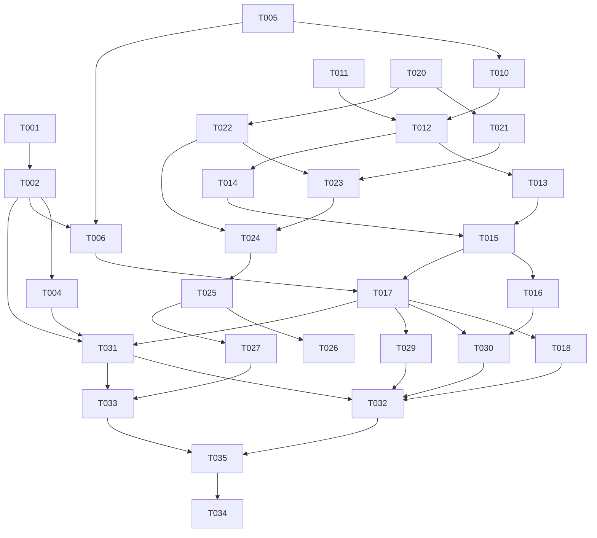

# Tasks: Account Playground

**Feature**: 004-account-playground
**Plan**: `specs/004-account-playground/plan.md`
**Spec**: `specs/004-account-playground/spec.md`
**Contracts**: `specs/004-account-playground/contracts/playground-api.md`
**OpenAPI**: `openapi/admin.yaml`
**Created**: 2026-04-23
**Status**: Implementing

## Task Format

- `[P]` = parallelizable within its phase when dependencies are satisfied.
- `[US-X]` = traces to a user story from `spec.md`; `[Infra]` = cross-cutting setup.
- `[L1]` = standard implementation an AI can complete directly.
- `[L2]` = implementation has branching/domain judgement; AI writes code and flags review points with `// [CONFIRM]` only where needed.
- Every implementation task includes its test work. Write the failing test first, then the code.

Commands from `AGENTS.md`:

- Backend build: `go build ./...`
- Backend tests: `go test ./...`
- Backend lint: `golangci-lint run`
- OpenAPI gates: `bash scripts/envelope-parity.sh`, `bash scripts/codegen-go.sh`, `bash scripts/codegen-frontend.sh`
- Frontend build: `pnpm --dir frontend build`
- Frontend typecheck: `pnpm --dir frontend typecheck`
- Frontend tests: `pnpm --dir frontend test`
- Frontend lint: `pnpm --dir frontend lint`

---

## Phase 1: Setup and Contracts

> Checkpoint: `go test ./internal/api/errcode/... && bash scripts/codegen-go.sh && bash scripts/codegen-frontend.sh` exits 0, with generated diffs committed.

- [x] **T-000** [Infra] [L1] Create spec-derived test plan — `specs/004-account-playground/test-plan.md`
  - context_files:
    - `specs/004-account-playground/spec.md`
    - `specs/004-account-playground/contracts/playground-api.md`
    - `specs/004-account-playground/quickstart.md`
  - what: Map every AC, edge case, and NFR to concrete backend contract/integration/unit, frontend unit, and Playwright E2E test IDs before implementation proceeds.
  - must_not: Derive tests from implementation code.
  - verify:
    - command: `rg -n 'CT-001|IT-001|UT-001|FE-001|E2E-001|20 \\(100%\\)|18 \\(100%\\)' specs/004-account-playground/test-plan.md`
    - assert: P0 AC coverage is 100%; edge-case coverage is planned at 100%.

- [x] **T-001** [P] [Infra] [L1] Register 004 error codes in docs, Go, and TS — `docs/error-codes.md`, `internal/api/errcode/codes.go`, `internal/api/errcode/codes_test.go`, `internal/api/errcode/parity_test.go`, `frontend/src/lib/errcode.ts`
  - context_files:
    - `specs/004-account-playground/plan.md` (§API and Error Codes)
    - `specs/004-account-playground/contracts/playground-api.md` (§Response Business Errors)
    - `docs/error-codes.md` (§Code space layout)
  - what: Reassign 4000-4999 to Feature 004 Account Playground; add 4001..4007 and 4900 constants/symbols; mirror TS constants and `CodeSymbols`.
  - must_not: Reuse the stale "004 admin auth/client keys/routing policy" range label; register reserved or unknown codes.
  - verify:
    - command: `go test ./internal/api/errcode/... && pnpm --dir frontend test -- errcode`
    - assert: Go symbols and TS `CodeSymbols` agree for every new 004 code; `Symbol(4001)` is `invalid_playground_request`; `Symbol(4900)` is `playground_internal_error`.

- [x] **T-002** [Infra] [L2] Extend OpenAPI for `POST /api/admin/playground/run` and regenerate clients — `openapi/admin.yaml`, `internal/generated/adminapi/*.gen.go`, `frontend/src/generated/openapi/*`
  - depends_on: T-001
  - context_files:
    - `specs/004-account-playground/contracts/playground-api.md`
    - `openapi/README.md` (§Codegen pipeline)
    - `specs/004-account-playground/plan.md` (§API and Error Codes)
  - constraints: Use named component schemas for oneOf response unions; do not inline oneOf under the operation; do not hand-edit generated files.
  - what: Add a `playground` tag, `playgroundRun` operation, request schema, success envelope, business-error envelopes, and `4900` system error schema; regenerate Go and TS.
  - must_not: Add `/v1/*` to OpenAPI; fold 001/002 inherited account routes into this feature.
  - verify:
    - command: `bash scripts/codegen-go.sh && bash scripts/codegen-frontend.sh && go build ./internal/generated/... && pnpm --dir frontend typecheck`
    - assert:
      - happy_path: generated Go and TS expose `playgroundRun`.
      - error_path: generated unions include 4001..4007 and 4900 branches.
      - boundary: export-auth-json raw attachment behavior remains unchanged.
      - coverage: one operation, one request schema, success schema, seven business error schemas, one system error schema.

- [x] **T-003** [P] [Infra] [L1] Reconcile stale admin-auth feature-number references — `openapi/admin.yaml`, `openapi/README.md`, `docs/error-codes.md`
  - context_files:
    - `specs/004-account-playground/research.md` (§Decision 6)
    - `openapi/admin.yaml` (`x-mvp-enforcement-tracked-by`)
  - what: Change prose that claims feature 004 is admin-auth/client-keys/routing-policy to "future admin-auth feature" or another unnumbered future reference.
  - must_not: Change the declared aspirational `adminAuth` security scheme itself.
  - verify:
    - command: `rg -n '004-admin-auth|Feature 004 — Admin auth|Feature 004 - Admin auth|target: feature 004|feature 004\\+' openapi docs || true`
    - assert: No stale numbered admin-auth references remain in current OpenAPI/docs sources; historical specs may still describe their original roadmap assumptions.

- [x] **T-004** [Infra] [L1] Add Playground to envelope parity probe matrix — `internal/api/testutil/admin_probe_matrix.go`, `internal/api/envelope_parity_test.go`, `scripts/envelope-parity.sh`
  - depends_on: T-002
  - context_files:
    - `AGENTS.md` (§HTTP API Style)
    - `specs/004-account-playground/contracts/playground-api.md`
    - `internal/api/testutil/admin_probe_matrix.go`
  - what: Ensure the new `/api/admin/playground/run` route is covered by the admin envelope parity check by adding required `playgroundRun_*` probes to `internal/api/testutil/admin_probe_matrix.go`; edit `scripts/envelope-parity.sh` only if the shell entrypoint itself needs to change.
  - must_not: Weaken existing OAuth/import/export parity coverage.
  - verify:
    - command: `bash scripts/envelope-parity.sh`
    - assert: The script visits or otherwise accounts for `/api/admin/playground/run`; non-envelope responses fail the gate.

- [x] **T-005** [P] [Infra] [L1] Scaffold backend Playground package files — `internal/api/playgroundapi/doc.go`, `internal/core/playground_service.go`
  - context_files:
    - `specs/004-account-playground/plan.md` (§Module Boundaries)
  - what: Create package docs and empty typed skeletons/interfaces without behavior.
  - must_not: Wire routes or implement business logic in this scaffold task.
  - verify:
    - command: `go test ./internal/api/playgroundapi/... ./internal/core/... -run TestNonExistent`
    - assert: Packages compile.

- [x] **T-006** [Infra] [L1] Write failing Playground contract/envelope tests before service implementation — `internal/api/playgroundapi/handler_contract_test.go`
  - depends_on: T-002, T-005
  - context_files:
    - `specs/004-account-playground/test-plan.md`
    - `specs/004-account-playground/contracts/playground-api.md`
    - `internal/api/envelope.go`
  - what: Add RED contract tests for success, 2008, 2009, 4001..4007, 4900, and `X-Request-Id` header-only behavior.
  - must_not: Implement service behavior in this task; skip request-id/header assertions; return HTTP 4xx for business errors.
  - verify:
    - command: `go test ./internal/api/playgroundapi/... ./internal/api/... -run 'TestPlaygroundRunContract|TestEnvelopeParity' -v`
    - assert: Tests fail before handler/service implementation and pass only after T-017/T-018.

---

## Phase 2: Backend Foundation

> Checkpoint: `go test ./internal/provider/openai/... ./internal/core/... ./internal/api/playgroundapi/... && go build ./...` exits 0.

- [x] **T-010** [P] [US-3] [L1] Add OpenAI Responses request/output helpers — `internal/provider/openai/playground.go`, `internal/provider/openai/playground_test.go`
  - depends_on: T-005
  - context_files:
    - `specs/004-account-playground/research.md` (§Decision 2, §Decision 4)
    - `specs/004-account-playground/contracts/playground-api.md` (§Request, §Response Success)
  - what: Build non-streaming Responses JSON body from model/text/max_output_tokens; extract output text from known Responses JSON fields; preserve existing usage extraction.
  - must_not: Add a provider SDK; expose downstream streaming UI for P0. Feature 003 OAuth transport may still collect upstream SSE internally so Playground remains non-streaming downstream.
  - verify:
    - command: `go test ./internal/provider/openai/... -run 'TestBuildPlaygroundResponsesBody|TestExtractPlaygroundOutputText' -v`
    - assert: Request body contains `model`, `input`, `stream:false`; extractor handles top-level `output_text`, nested `output[].content[].text`, and no-text responses.

- [x] **T-011** [US-2] [L2] Add explicit active-account selection to AccountSelector — `internal/core/account_selector.go`, `internal/core/account_selector_test.go`
  - context_files:
    - `specs/004-account-playground/spec.md` (US-2)
    - `specs/004-account-playground/plan.md` (§Data Flow: US-2)
    - `internal/core/account_selector.go`
  - constraints: Reuse the existing `PreForward` hook; enforce active account status; return wrapped/sentinel errors that the Playground service can map to 4003.
  - what: Add `SelectByID(ctx, id)` or equivalent narrow method returning account, token, usedFallback, error.
  - must_not: Return token material to admin handlers; allow disabled/deleted accounts; change existing `Select` behavior.
  - verify:
    - command: `go test ./internal/core/... -run 'TestAccountSelector_SelectByID' -v`
    - assert:
      - happy_path: active API-key and OAuth accounts return non-empty token through the same hook.
      - error_path: missing/disabled/deleted account returns a distinguishable error.
      - boundary: `id <= 0` fails before repository work.
      - coverage: active, disabled, deleted, missing, pre-forward failure.

- [x] **T-012** [US-1,US-2,US-3] [L2] Implement Playground service validation and request model — `internal/core/playground_service.go`, `internal/core/playground_service_test.go`
  - depends_on: T-010, T-011
  - context_files:
    - `specs/004-account-playground/contracts/playground-api.md` (§Request)
    - `specs/004-account-playground/data-model.md` (§Entity: Playground Run)
  - constraints: Validate before upstream calls; keep prompt length limit at 16000 trimmed Unicode characters; keep max output default/range at 1024 / 1..4096; use registered 4001 for request validation failures.
  - what: Define `PlaygroundRunRequest`, `PlaygroundRunResult`, service constructor, validation errors, and tests for every invalid request branch.
  - must_not: Call upstream or record request history on validation-only failures.
  - verify:
    - command: `go test ./internal/core/... -run 'TestPlaygroundService_Validate' -v`
    - assert:
      - happy_path: valid auto/account requests pass validation.
      - error_path: empty text, over-limit text, missing model, invalid mode, missing account id, invalid max output fail with field names.
      - boundary: exactly 16000 ASCII chars succeeds; 16000 non-ASCII chars succeeds when request body is under 96 KiB; 16001 chars fails.
      - coverage: all request fields.

- [x] **T-013** [US-1] [L1] Implement Automatic mode service path — `internal/core/playground_service.go`, `internal/core/playground_service_auto_test.go`
  - depends_on: T-012
  - context_files:
    - `specs/004-account-playground/spec.md` (US-1)
    - `specs/004-account-playground/quickstart.md` (§2, §3)
  - what: Use `AccountSelector.Select(ctx, session_key)`; map no-capacity to 4002; include selected account metadata on success/failure when known.
  - must_not: Use stale frontend account list state for backend selection.
  - verify:
    - command: `go test ./internal/core/... -run 'TestPlaygroundService_Auto' -v`
    - assert: One active account succeeds; no active accounts returns 4002 and zero fake upstream calls; session key is passed to selector.

- [x] **T-014** [US-2] [L1] Implement Account mode service path — `internal/core/playground_service.go`, `internal/core/playground_service_account_test.go`
  - depends_on: T-012
  - context_files:
    - `specs/004-account-playground/spec.md` (US-2)
    - `specs/004-account-playground/quickstart.md` (§4)
  - what: Use explicit selector path; map missing/disabled/deleted/ineligible account to 4003; never fall back to Automatic.
  - must_not: Attempt upstream call when selected account is unavailable.
  - verify:
    - command: `go test ./internal/core/... -run 'TestPlaygroundService_AccountMode' -v`
    - assert: Requested active account id is used; disabled/deleted/missing account returns 4003; fallback counter remains unused.

- [x] **T-015** [US-3] [L2] Classify upstream outcomes and bounded response handling — `internal/core/playground_service.go`, `internal/core/playground_service_upstream_test.go`
  - depends_on: T-013, T-014
  - context_files:
    - `specs/004-account-playground/contracts/playground-api.md` (§Response Business Errors)
    - `specs/004-account-playground/research.md` (§Decision 4)
  - constraints: Bound upstream body reads; classify non-2xx as 4004, timeout as 4005, malformed JSON as 4006, too large as 4007; no-extractable-text remains `code:0` with `text_available:false`; apply a 30s P0 wait limit; sanitize raw/provider diagnostics.
  - what: Complete provider forward/read/result classification and tests using `httptest.Server` or fake `openai.Client`; implement provider_error/provider_message caps and raw-response redaction.
  - must_not: Convert upstream non-2xx to success; invent output text; return raw bytes larger than the cap; return credential-like keys or token-like values through raw response/provider message.
  - verify:
    - command: `go test ./internal/core/... -run 'TestPlaygroundService_Upstream' -v`
    - assert:
      - happy_path: 200 JSON with text returns `code=0` result.
      - error_path: 401 provider error maps to 4004 with sanitized provider fields.
      - boundary: body cap +1 maps to 4007; invalid JSON maps to 4006; timeout maps to 4005; valid no-text JSON returns `text_available=false`; provider message >512 chars is clipped and token-like strings are redacted.
      - coverage: success, non-2xx, timeout, malformed, too large, no text, raw redaction.

- [x] **T-016** [US-4] [L1] Record Playground runs and body-logging behavior — `internal/core/playground_service.go`, `internal/core/playground_service_recording_test.go`
  - depends_on: T-015
  - context_files:
    - `specs/004-account-playground/data-model.md` (§Entity: Request Record)
    - `internal/core/request_recorder.go`
  - what: Emit request records with path `/api/admin/playground/run`, account id/session key/model/params/outcome/usage; body fields obey runtime body logging toggles; observe request-context cancellation and record `outcome=cancelled` when upstream work is interrupted.
  - must_not: Record credential material or authorization headers.
  - verify:
    - command: `go test ./internal/core/... -run 'TestPlaygroundService_Recording' -v`
    - assert: Body logging off stores nil request/response bodies; body logging on stores prompt/provider body; `Path` equals `/api/admin/playground/run`; cancellation stores a cancelled outcome; fake token bytes are absent.

- [x] **T-017** [US-1,US-2,US-3] [L1] Implement Playground Admin API handler — `internal/api/playgroundapi/handler.go`, `internal/api/playgroundapi/handler_test.go`
  - depends_on: T-006, T-012, T-013, T-014, T-015
  - context_files:
    - `specs/004-account-playground/contracts/playground-api.md`
    - `internal/api/envelope.go`
  - what: Decode JSON body with the 96 KiB Playground body cap, call service, map service errors to registered envelope codes, return success envelope with non-null data.
  - must_not: Write HTTP 4xx for business errors; duplicate `X-Request-Id` into response body; marshal raw `domain.UpstreamAccount` with secrets; drop safe account summary from known-account failure responses.
  - verify:
    - command: `go test ./internal/api/playgroundapi/... -v`
    - assert: Success, malformed body, oversized body, invalid request, no active account, unavailable account, upstream error, timeout, malformed response, too large response, request-id header-only, and system error branches match contract.

- [x] **T-018** [Infra] [L1] Wire Playground handler into steady-state app — `internal/app/app.go`, `internal/app/app_test.go`
  - depends_on: T-017
  - context_files:
    - `specs/004-account-playground/plan.md` (§Module Boundaries)
    - `internal/app/app.go` (`registerSteadyStateRoutes`)
  - what: Construct Playground service with account repo, selector, recorder, OpenAI client, body-log function, and logger; register `POST /api/admin/playground/run` under the same admin chain.
  - must_not: Register the route while setup is pending outside the existing gate behavior; change `/v1/` proxy wiring.
  - verify:
    - command: `go test ./internal/app/... -run 'Test.*Playground|TestBuildHandler' -v && go build ./...`
    - assert: Route exists in steady state; setup gate protects it; `/v1/` proxy tests remain unaffected.

---

## Phase 3: Admin Portal Page

> Checkpoint: `pnpm --dir frontend typecheck && pnpm --dir frontend test -- playground` exits 0.

- [x] **T-020** [P] [US-1] [L1] Add route, sidebar item, and breadcrumb — `frontend/src/router.tsx`, `frontend/src/components/shared/Sidebar.tsx`, `frontend/src/routes/admin/layout.tsx`, related tests
  - context_files:
    - `specs/004-account-playground/spec.md` (FR-001)
    - `frontend/AGENTS.md`
  - what: Add `/admin/playground`, enabled sidebar nav, and breadcrumb label.
  - must_not: Enable unrelated planned nav items.
  - verify:
    - command: `pnpm --dir frontend test -- Sidebar router`
    - assert: Sidebar has enabled Playground item; active state works for `/admin/playground`; breadcrumb is `playground`.

- [x] **T-021** [P] [US-1,US-2] [L1] Add Playground account-list query helpers — `frontend/src/routes/admin/playground.strings.ts`, `frontend/src/routes/admin/playground.tsx`
  - depends_on: T-020
  - context_files:
    - `specs/004-account-playground/spec.md` (US-1, US-2)
    - `frontend/src/routes/admin/accounts/query-keys.ts`
    - `frontend/src/lib/api-client.ts`
  - what: Fetch existing account list, filter active accounts for selection, expose no-active empty state, and render account-list load failures as non-blocking errors with correlation id while preserving prompt text.
  - must_not: Display secret fields or use generated SDK for inherited 002 account list unless that route is added to OpenAPI.
  - verify:
    - command: `pnpm --dir frontend test -- playground`
    - assert: Active accounts populate picker; disabled/deleted accounts are not runnable; no-active state disables Run; account-list failure preserves prompt and does not block Automatic mode.

- [x] **T-022** [P] [US-3] [L1] Implement prompt/model form validation and pending state — `frontend/src/routes/admin/playground.tsx`, `frontend/src/routes/admin/playground.test.tsx`
  - depends_on: T-020
  - context_files:
    - `specs/004-account-playground/contracts/playground-api.md` (§Request)
  - what: Textarea, model input defaulting to `gpt-5.4-mini`, optional max-output control, Automatic/Account segmented mode, inline validation, pending submit disable, status region.
  - must_not: Use viewport-scaled fonts or allow text overflow in fixed controls.
  - verify:
    - command: `pnpm --dir frontend test -- playground`
    - assert: Empty text and over-limit text validate inline without API call; default model is `gpt-5.4-mini`; pending state appears within interaction test; duplicate submit calls API once.

- [x] **T-023** [US-2] [L1] Implement account picker behavior — `frontend/src/routes/admin/playground.tsx`, `frontend/src/routes/admin/playground.test.tsx`
  - depends_on: T-021, T-022
  - context_files:
    - `specs/004-account-playground/spec.md` (US-2)
    - `frontend/src/lib/account-auth-methods.ts`
    - `frontend/src/lib/plan-label.ts`
  - what: Account mode requires one active account and shows non-secret account metadata, including OAuth email/plan label when available.
  - must_not: Render API keys/tokens or allow Account mode submit without account id.
  - verify:
    - command: `pnpm --dir frontend test -- playground`
    - assert: Picker labels distinguish auth method/provider/email/plan; missing selection blocks submit; selected account id is sent.

---

## Phase 4: Results, Errors, and Non-Destructive UX

> Checkpoint: `pnpm --dir frontend test -- playground && pnpm --dir frontend typecheck` exits 0.

- [x] **T-024** [US-1,US-2,US-3] [L1] Render successful and no-extractable-text results — `frontend/src/routes/admin/playground.tsx`, `frontend/src/routes/admin/playground.test.tsx`
  - depends_on: T-022, T-023
  - context_files:
    - `specs/004-account-playground/contracts/playground-api.md` (§Response Success)
  - what: Show selected account, mode, latency, outcome, output text, usage, and collapsible safe raw JSON when available.
  - must_not: Invent text when `text_available=false`.
  - verify:
    - command: `pnpm --dir frontend test -- playground`
    - assert: Success with text renders output; no-text response renders explicit no-text state and raw JSON area only when available.

- [x] **T-025** [US-3] [L1] Render Playground error states with prompt preservation — `frontend/src/routes/admin/playground.tsx`, `frontend/src/routes/admin/playground.test.tsx`
  - depends_on: T-022, T-023
  - context_files:
    - `frontend/src/lib/router-api-error.ts`
    - `specs/004-account-playground/contracts/playground-api.md` (§Response Business Errors)
  - what: Display validation/provider/router/timeout errors with stable symbol, safe message, correlation id when available, selected account when known, and preserved prompt/mode.
  - must_not: Clear operator input after failures or show raw credential-like data.
  - verify:
    - command: `pnpm --dir frontend test -- playground`
    - assert: 4003/4004/4005 errors render distinct states; prompt remains; correlation id from error object appears.

- [x] **T-026** [US-3] [L1] Add accessibility coverage for form/status/result/error states — `frontend/src/routes/admin/playground.test.tsx`
  - depends_on: T-024, T-025
  - context_files:
    - `specs/004-account-playground/spec.md` (NFR Accessibility)
  - what: Add semantic labels, status/alert regions, keyboard operation tests, and focus behavior for validation failures.
  - must_not: Depend on mouse-only interactions.
  - verify:
    - command: `pnpm --dir frontend test -- playground`
    - assert: Keyboard can reach every control; pending/success/error are announced via status/alert; validation returns focus to the relevant input.

- [x] **T-027** [US-5] [L1] Keep Playground non-destructive and link to account repair surfaces — `frontend/src/routes/admin/playground.tsx`, `frontend/src/routes/admin/playground.test.tsx`
  - depends_on: T-024, T-025
  - context_files:
    - `specs/004-account-playground/spec.md` (US-5, Out of Scope)
  - what: Add account-detail links for known failed accounts; ensure no enable/disable/delete/import/export/reauth action is embedded in Playground.
  - must_not: Add account mutation controls to the Playground page.
  - verify:
    - command: `pnpm --dir frontend test -- playground`
    - assert: Failed account result links to detail; no mutation action labels/buttons appear on the Playground route.

---

## Phase 5: Quality Gates and Regression

> Checkpoint: `go test ./... && go build ./... && golangci-lint run && bash scripts/coverage-floor.sh && pnpm --dir frontend typecheck && pnpm --dir frontend test && pnpm --dir frontend lint && pnpm --dir frontend build && bash scripts/envelope-parity.sh` exits 0.

- [x] **T-029** [P] [Infra] [L1] Extend coverage floor to Playground packages — `scripts/coverage-floor.sh`
  - depends_on: T-017
  - context_files:
    - `AGENTS.md` (§Quality Gates)
    - `scripts/coverage-floor.sh`
    - `specs/004-account-playground/test-plan.md`
  - what: Add `./internal/api/playgroundapi/...` to the coverage-floor package set and include feature-relevant core/provider packages where the script can gate them without making unrelated historical code fail.
  - must_not: Lower the global 80% coverage floor; remove oauth/oauthapi/adminapi/exportapi packages from the gate.
  - verify:
    - command: `bash scripts/coverage-floor.sh`
    - assert: Existing gated packages remain >=80%; Playground API package is included in printed coverage output.

- [x] **T-030** [P] [US-4] [L1] Extend log-scrub coverage for Playground — `scripts/log-scrub.sh`, test fixtures if present
  - depends_on: T-016, T-017
  - context_files:
    - `specs/004-account-playground/spec.md` (US-4, FR-020)
    - `scripts/log-scrub.sh`
  - what: Ensure test output/log scans catch token-like values from Playground handler/service tests and include a deliberate unsanitized token fixture to prove the scrubber fails when it should.
  - must_not: Reduce existing OAuth token scrub coverage.
  - verify:
    - command: `go test ./internal/core/... ./internal/api/playgroundapi/... > test-output/playground.log 2>&1; bash scripts/log-scrub.sh test-output/`
    - assert: Scrub passes for sanitized logs and fails for a deliberate token fixture.

- [x] **T-031** [P] [Infra] [L1] Run OpenAPI freshness and envelope parity gates — generated files and scripts
  - depends_on: T-002, T-004, T-017
  - context_files:
    - `openapi/README.md`
    - `scripts/envelope-parity.sh`
  - what: Regenerate Go/TS clients, run the repository OpenAPI freshness gate after generated files have been updated, and ensure the new route obeys envelope rules.
  - must_not: Hand-edit generated code.
  - verify:
    - command: `bash scripts/check-openapi-freshness.sh && bash scripts/envelope-parity.sh`
    - assert: Generated outputs are fresh relative to the current working tree/commit state and parity gate includes Playground.

- [x] **T-032** [P] [US-1,US-2,US-3,US-4] [L1] Backend full regression — backend packages
  - depends_on: T-018, T-029, T-030, T-031
  - context_files:
    - `AGENTS.md` (§Quality Gates)
  - what: Run backend build/test/lint/coverage suite and fix regressions caused by Playground changes.
  - must_not: Revert unrelated dirty worktree changes.
  - verify:
    - command: `go test ./... && go build ./... && golangci-lint run && bash scripts/coverage-floor.sh`
    - assert: All backend tests pass; coverage gates pass; `/v1/*` proxy tests remain green.

- [x] **T-033** [P] [US-1,US-2,US-3,US-5] [L1] Frontend full regression — frontend workspace
  - depends_on: T-020, T-021, T-022, T-023, T-024, T-025, T-026, T-027, T-031
  - context_files:
    - `frontend/AGENTS.md`
    - `AGENTS.md` (§Quality Gates)
  - what: Run frontend typecheck, unit tests, lint, and build; fix Playground-related regressions.
  - must_not: Modify generated OpenAPI files by hand.
  - verify:
    - command: `pnpm --dir frontend typecheck && pnpm --dir frontend test && pnpm --dir frontend lint && pnpm --dir frontend build`
    - assert: Frontend suite passes and generated client imports typecheck.

- [x] **T-035** [US-1,US-2,US-3,US-4,US-5] [L1] Add Playwright Playground E2E coverage — `frontend/tests/e2e/playground.spec.ts`, `frontend/tests/e2e/helpers.ts`, `frontend/tests/e2e/fixtures.ts`
  - depends_on: T-032, T-033
  - context_files:
    - `specs/004-account-playground/test-plan.md`
    - `specs/004-account-playground/quickstart.md`
    - `frontend/playwright.config.ts`
    - `frontend/tests/e2e/helpers.ts`
  - what: Add browser-level E2E tests for Account happy path, Automatic happy path, no-active empty state/direct API 4002, stale selected account or provider error, and no-extractable-text.
  - must_not: Require live provider credentials; leak fake credential bytes; ignore console errors or unexpected network 4xx/5xx.
  - verify:
    - command: `pnpm --dir frontend test:e2e -- playground.spec.ts`
    - assert: Every case passes against fake upstream/test fixtures; screenshots/traces are available on failure; console errors and unexpected network failures are zero.

- [x] **T-034** [US-1,US-2,US-3,US-4,US-5] [L1] Quickstart/manual smoke validation — `specs/004-account-playground/quickstart.md`
  - depends_on: T-032, T-033, T-035
  - context_files:
    - `specs/004-account-playground/quickstart.md`
  - what: Execute the quickstart scenarios against a local dev run or test harness and note any deviations for sdd-test.
  - must_not: Treat live provider credentials as required for automated CI; fake upstream is acceptable for smoke.
  - verify:
    - command: `go test ./... && pnpm --dir frontend test`
    - assert: Quickstart scenarios have automated or documented manual coverage; no scenario requires credential exposure.

---

## Dependencies

## Traceability Matrix

| Spec Item | Type | Task IDs | Coverage |
|-----------|------|----------|----------|
| Test Plan | QA Gate | T-000 | Full |
| US-1 | User Story | T-013, T-017, T-020, T-021, T-022, T-024, T-034, T-035 | Full |
| AC-1.1 | Acceptance | T-013, T-017, T-022, T-024 | Full |
| AC-1.2 | Acceptance | T-013, T-021 | Full |
| AC-1.3 | Acceptance | T-013, T-017, T-025 | Full |
| AC-1.4 | Acceptance | T-011, T-013, T-015 | Full |
| US-2 | User Story | T-011, T-014, T-017, T-021, T-023, T-024, T-034 | Full |
| AC-2.1 | Acceptance | T-021, T-023 | Full |
| AC-2.2 | Acceptance | T-011, T-014, T-024 | Full |
| AC-2.3 | Acceptance | T-014, T-017, T-025 | Full |
| AC-2.4 | Acceptance | T-011, T-014, T-015 | Full |
| US-3 | User Story | T-010, T-012, T-015, T-017, T-022, T-024, T-025, T-026 | Full |
| AC-3.1 | Acceptance | T-022, T-026 | Full |
| AC-3.2 | Acceptance | T-010, T-015, T-024 | Full |
| AC-3.3 | Acceptance | T-012, T-017, T-022 | Full |
| AC-3.4 | Acceptance | T-015, T-017, T-025 | Full |
| AC-3.5 | Acceptance | T-010, T-015, T-024 | Full |
| US-4 | User Story | T-016, T-017, T-029, T-030, T-032, T-034, T-035 | Full |
| AC-4.1 | Acceptance | T-016 | Full |
| AC-4.2 | Acceptance | T-016 | Full |
| AC-4.3 | Acceptance | T-016 | Full |
| AC-4.4 | Acceptance | T-016, T-030 | Full |
| US-5 | User Story | T-027, T-034 | Full |
| FR-010/FR-011 | Admin API boundary/envelope | T-002, T-006, T-017, T-031 | Full |
| FR-020 | Credential non-exposure | T-016, T-017, T-023, T-025, T-030 | Full |
| NFR Accessibility | Accessibility | T-022, T-026 | Full |
| NFR Compatibility | Data-plane unchanged | T-018, T-032 | Full |

## Statistics

| Metric | Value |
|--------|-------|
| Total Tasks | 31 |
| Phases | 5 |
| L1 Tasks | 27 (87%) |
| L2 Tasks | 4 (13%) |
| L3 Tasks | 0 (0%) |
| Parallel Tasks | 12 (39%) |
| Estimated AI Sessions | 31 |
| Human Tasks | 0 |

### Distribution Health

- L1 >= 70%: PASS
- L2 <= 20%: PASS
- L3 <= 10%: PASS

### Coverage

- P0 AC Coverage: 17/17 (100%)
- P1 AC Coverage: 3/3 (100%)
- Edge Case Coverage: Covered through validation, selector, upstream, UI, logging, and quickstart tasks.

## Execution Strategies

### MVP

Phase 1 -> Phase 2 -> T-020/T-021/T-022/T-023 -> T-024 -> T-032/T-033.

### Incremental

Phase 1 -> Phase 2 -> frontend shell/form -> result/error states -> quality gates.

### Full Parallel

After Phase 1, run backend foundation tasks and frontend shell/form tasks in parallel. Join at T-031/T-032/T-033 before quickstart.
