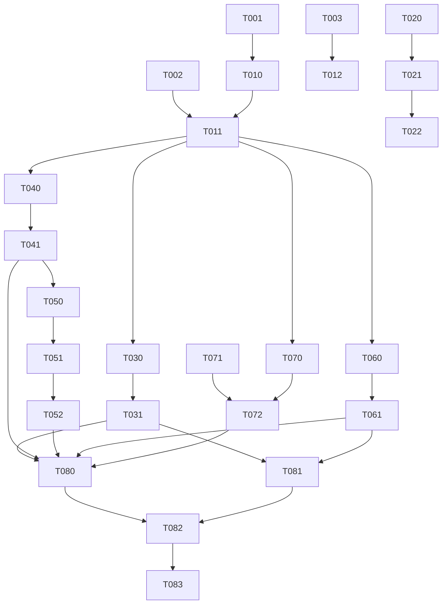

# Tasks: Full OpenAI API Gateway

**Feature**: 006-openai-api-gateway
**Plan**: `specs/006-openai-api-gateway/plan.md`
**Spec**: `specs/006-openai-api-gateway/spec.md`
**Created**: 2026-04-26
**Status**: Revised 2026-04-27; Admin usage changes pending implementation

## Task Format

- `[P]` = parallel-safe within a phase when dependencies are satisfied.
- `[L1]` = fully AI-implementable, no placeholders.
- `[L2]` = complex logic, still implemented here, with stronger test coverage.
- Every implementation task includes tests; tests are written before implementation code.
- `context_files` are mandatory reads before editing target files.

## Phase 1: Red Tests and Route Inventory

> Checkpoint: `go test ./internal/api ./internal/setup -run 'Test.*Gateway|Test.*SetupGate|Test.*Unsupported'` fails only for missing 006 implementation and has no compile errors.

- [ ] **T-001** [P] [US-1, US-4, US-7] [L1] Add operation-level classifier tests for supported, deferred, blocked, and arbitrary route families -- `internal/api/proxy_routes_test.go`
  - context_files: `specs/006-openai-api-gateway/spec.md`, `specs/006-openai-api-gateway/data-model.md`, `specs/006-openai-api-gateway/contracts/unsupported-routes.md`, `internal/api/proxy.go`
  - what: Cover all P0 operation patterns, representative deferred families, blocked admin families, unlisted `/backend-api/*`, WebSocket upgrade classification, response mode, body policy, and credential eligibility. Assert `/api/codex/*` is not a 006 data-plane prefix.
  - must_not: Do not allow wildcard API-key forwarding for deferred `/v1/*`; do not mark OAuth eligible for arbitrary Platform paths.
  - verify: `go test ./internal/api -run TestGatewayRouteClassifier`

- [ ] **T-002** [P] [US-2, US-4, US-7] [L1] Add proxy pre-body rejection tests proving unsupported routes do not select accounts, refresh OAuth, call upstream, or read business bodies -- `internal/api/proxy_unsupported_test.go`
  - context_files: `specs/006-openai-api-gateway/contracts/unsupported-routes.md`, `specs/006-openai-api-gateway/contracts/v1-platform-gateway.md`, `internal/api/proxy.go`, `internal/core/account_selector.go`
  - what: Assert `/v1/audio/transcriptions`, `/v1/files`, `/v1/realtime`, `/v1/organization*`, and arbitrary `/backend-api/*` return native router errors before body read or upstream attempt.
  - must_not: Do not make tests pass by reading and discarding the body.
  - verify: `go test ./internal/api -run 'TestProxyUnsupported|TestProxyBlocked|TestProxyPreBody'`

- [ ] **T-003** [P] [US-2, US-5] [L1] Add setup gate tests for 006 data-plane prefixes -- `internal/setup/gate_006_test.go`
  - context_files: `specs/006-openai-api-gateway/contracts/v1-platform-gateway.md`, `specs/006-openai-api-gateway/contracts/codex-compatibility.md`, `internal/setup/gate.go`
  - what: Verify setup-pending native 503 for `/v1/*`, exact `/backend-api`, and `/backend-api/*`; verify no admin envelope.
  - must_not: Do not treat arbitrary `/api/*` as data plane.
  - verify: `go test ./internal/setup -run 'TestGate.*DataPlane|TestGate.*SetupPending'`

## Phase 2: Classifier, Native Errors, and Setup Gate Implementation

> Checkpoint: `go test ./internal/api ./internal/setup -run 'Test.*Gateway|Test.*SetupGate|Test.*Unsupported'` passes.

- [ ] **T-010** [US-1, US-4, US-7] [L1] Implement pure operation-level classifier and route metadata -- `internal/api/proxy_routes.go`
  - depends_on: T-001
  - context_files: `specs/006-openai-api-gateway/spec.md`, `specs/006-openai-api-gateway/data-model.md`, `internal/api/proxy.go`
  - what: Add route kinds, credential eligibility, response modes, body policies, native error codes, exact path matching, wildcard family rejection, and WebSocket upgrade detection.
  - must_not: Do not derive OAuth upstream paths by broad prefix; only explicit mappings may have upstream paths.
  - verify: `go test ./internal/api -run TestGatewayRouteClassifier`

- [ ] **T-011** [US-1, US-2, US-5, US-7] [L2] Integrate classifier into `ProxyHandler` before account selection and body capture -- `internal/api/proxy.go`, `internal/api/proxy_test.go`
  - depends_on: T-002, T-010
  - context_files: `specs/006-openai-api-gateway/contracts/unsupported-routes.md`, `specs/006-openai-api-gateway/data-model.md`, `internal/api/proxy.go`, `internal/core/request_recorder.go`, `internal/domain/request_record.go`
  - what: Short-circuit unsupported/blocked routes with native data-plane errors and request records; only read bodies when the route body policy allows it.
  - must_not: Do not wrap data-plane errors in admin envelope; do not record body bytes for unsupported/deferred/blocked routes.
  - verify: `go test ./internal/api -run 'TestProxyUnsupported|TestProxyBlocked|TestProxyPreBody|TestProxyHandler'`

- [ ] **T-012** [US-2, US-5] [L1] Extend setup gate data-plane prefix handling for 006 -- `internal/setup/gate.go`, `internal/setup/gate_006_test.go`
  - depends_on: T-003
  - context_files: `specs/006-openai-api-gateway/contracts/codex-compatibility.md`, `internal/setup/gate.go`
  - what: Return native 503 `setup_required` for setup-pending `/backend-api` and `/backend-api/*`.
  - must_not: Do not intercept normal `/api/admin/*`, `/api/setup/*`, `/api/codex/*`, or arbitrary `/api/*` paths as data plane.
  - verify: `go test ./internal/setup -run 'TestGate.*DataPlane|TestGate.*SetupPending'`

## Phase 3: Request-Record Enum and Admin Log Contract

> Checkpoint: `go generate ./internal/generated/... && cd frontend && pnpm openapi-ts && go test ./internal/domain ./internal/api/adminapi && cd frontend && pnpm vitest run src/routes/admin/requests.test.tsx`.

- [x] **T-020** [P] [US-5] [L1] Add `websocket` response-mode domain constant and tests -- `internal/domain/request_record.go`, `internal/domain/request_record_test.go`
  - context_files: `specs/006-openai-api-gateway/data-model.md`, `internal/domain/request_record.go`
  - what: Add `ResponseModeWebSocket` while preserving existing JSON/SSE constants and serialization behavior.
  - must_not: Do not add `multipart` as a response mode.
  - verify: `go test ./internal/domain -run TestRequestRecord`

- [ ] **T-021** [US-5] [L1] Add `websocket` and Admin usage to Admin OpenAPI, then regenerate clients -- `openapi/admin.yaml`, `internal/generated/adminapi/`, `frontend/src/generated/openapi/`
  - depends_on: T-020
  - context_files: `specs/006-openai-api-gateway/plan.md`, `openapi/admin.yaml`, `scripts/codegen-go.sh`, `scripts/codegen-frontend.sh`
  - what: Expand request-log response-mode enum, add `GET /api/admin/usage` response schema/envelope, and regenerate Go and TypeScript clients.
  - must_not: Do not hand-edit generated files; do not move provider-compatible data-plane contracts into OpenAPI.
  - verify: `go generate ./internal/generated/... && cd frontend && pnpm openapi-ts`

- [x] **T-022** [US-5] [L1] Update request-log backend/frontend tests and filters for `websocket` rows -- `internal/api/adminapi/request_logs_test.go`, `frontend/src/routes/admin/requests.tsx`, `frontend/src/routes/admin/requests.test.tsx`
  - depends_on: T-021
  - context_files: `specs/006-openai-api-gateway/plan.md`, `internal/api/adminapi/request_logs.go`, `frontend/src/routes/admin/requests.tsx`
  - what: Prove websocket request-log rows and filters render without enum/type rejection.
  - must_not: Do not add multipart response-mode UI.
  - verify: `go test ./internal/api/adminapi -run TestRequestLogs && cd frontend && pnpm vitest run src/routes/admin/requests.test.tsx`

## Phase 4: API-Key Direct Forwarding Allowlist

> Checkpoint: `go test ./internal/api ./internal/provider/openai -run 'Test.*APIKey|Test.*Direct|Test.*Unsupported'` passes.

- [x] **T-030** [US-1, US-2, US-3] [L1] Add API-key forwarding tests for supported `/v1/*` allowlist and provider errors -- `internal/api/proxy_apikey_test.go`, `internal/provider/openai/forwarder_test.go`
  - depends_on: T-011
  - context_files: `specs/006-openai-api-gateway/contracts/v1-platform-gateway.md`, `internal/api/proxy.go`, `internal/provider/openai/forwarder.go`
  - what: Cover Responses resource operations, Conversations, Chat Completions stored operations, Models list/retrieve, path/query preservation, provider errors, and no wildcard forwarding.
  - must_not: Do not require real OpenAI credentials.
  - verify: `go test ./internal/api ./internal/provider/openai -run 'Test.*APIKey|Test.*Direct|Test.*Unsupported'`

- [x] **T-031** [US-1, US-2, US-3, US-5] [L1] Enforce API-key allowlist while preserving transparent direct forwarding -- `internal/api/proxy.go`, `internal/provider/openai/forwarder.go`
  - depends_on: T-030
  - context_files: `specs/006-openai-api-gateway/spec.md`, `specs/006-openai-api-gateway/contracts/v1-platform-gateway.md`, `internal/api/proxy.go`, `internal/provider/openai/forwarder.go`
  - what: Use classifier eligibility to prevent deferred/unlisted API-key forwarding and keep direct pass-through for supported API-key operations.
  - must_not: Do not rewrite provider payloads for API-key accounts.
  - verify: `go test ./internal/api ./internal/provider/openai -run 'Test.*APIKey|Test.*Direct|Test.*Unsupported'`

## Phase 5: OAuth Codex Mappings, Models Facade, and Transcribe

> Checkpoint: `go test ./internal/api ./internal/provider/openai -run 'Test.*OAuth|Test.*Codex|Test.*Transcribe|Test.*Models'` passes.

- [x] **T-040** [US-1, US-2, US-5] [L2] Add OAuth Codex mapping tests for backend-api, compact, models facade, and transcribe -- `internal/api/proxy_oauth_test.go`, `internal/provider/openai/forwarder_codex_test.go`
  - depends_on: T-011
  - context_files: `specs/006-openai-api-gateway/contracts/v1-platform-gateway.md`, `specs/006-openai-api-gateway/contracts/codex-compatibility.md`, `internal/provider/openai/forwarder.go`, `~/app/project/codex-lb/app/modules/proxy/api.py`
  - what: Assert exact upstream paths, OAuth bearer token, optional `chatgpt-account-id`, Codex CLI user agent, no Platform `/v1/models` call for OAuth facade, and multipart capture disabled for `/backend-api/transcribe`.
  - must_not: Do not implement or test `/v1/audio/transcriptions` as supported.
  - verify: `go test ./internal/api ./internal/provider/openai -run 'Test.*OAuth|Test.*Codex|Test.*Transcribe|Test.*Models'`

- [x] **T-041** [US-1, US-2, US-5] [L2] Implement route-aware OAuth Codex mappings and OAuth `GET /v1/models` facade -- `internal/provider/openai/forwarder.go`, `internal/api/proxy.go`
  - depends_on: T-040
  - context_files: `specs/006-openai-api-gateway/contracts/v1-platform-gateway.md`, `specs/006-openai-api-gateway/contracts/codex-compatibility.md`, `internal/api/proxy.go`, `internal/provider/openai/forwarder.go`
  - what: Replace path-only OAuth mapping with classifier route metadata for `/v1/responses`, `/v1/responses/compact`, backend-api responses/compact/models/transcribe, and OAuth `/v1/models` facade.
  - must_not: Do not send OAuth tokens to OpenAI Platform `/v1/models`; do not fabricate unknown model metadata.
  - verify: `go test ./internal/api ./internal/provider/openai -run 'Test.*OAuth|Test.*Codex|Test.*Transcribe|Test.*Models'`

## Phase 6: OAuth Chat Completions Adapter

> Checkpoint: `go test ./internal/api ./internal/provider/openai -run 'Test.*ChatCompletion|Test.*ChatAdapter'` passes.

- [x] **T-050** [US-1, US-2, US-3, US-5] [L2] Add adapter tests for OAuth Chat Completions request validation and non-stream response mapping -- `internal/provider/openai/chat_adapter_test.go`
  - depends_on: T-041
  - context_files: `specs/006-openai-api-gateway/contracts/v1-platform-gateway.md`, `~/app/project/codex-lb/app/core/openai/chat_requests.py`, `~/app/project/codex-lb/app/core/openai/chat_responses.py`
  - what: Cover allowed fields, unsupported fields, conflicting token limits, `store=true`, `n>1`, function tool basics, JSON response format, usage mapping, and adapter-generated ids.
  - must_not: Do not silently drop unknown top-level fields for OAuth adapter.
  - verify: `go test ./internal/provider/openai -run 'Test.*ChatAdapter.*NonStream|Test.*ChatAdapter.*Validate'`

- [x] **T-051** [US-1, US-2, US-3] [L2] Implement OAuth Chat Completions request adapter and non-stream response reconstruction -- `internal/provider/openai/chat_adapter.go`, `internal/provider/openai/forwarder.go`
  - depends_on: T-050
  - context_files: `specs/006-openai-api-gateway/contracts/v1-platform-gateway.md`, `internal/provider/openai/forwarder.go`
  - what: Validate Chat request, map messages/tools/response format/token options to Responses payload, call Codex Responses upstream, and reconstruct SDK-parseable `chat.completion` JSON.
  - must_not: Do not return successful Chat objects for upstream `response.failed`, malformed output, or serialization failures.
  - verify: `go test ./internal/provider/openai -run 'Test.*ChatAdapter.*NonStream|Test.*ChatAdapter.*Validate'`

- [x] **T-052** [US-1, US-2, US-3, US-5] [L2] Add and implement OAuth Chat Completions SSE mapping through the proxy -- `internal/provider/openai/chat_adapter.go`, `internal/api/proxy.go`, `internal/api/proxy_oauth_test.go`
  - depends_on: T-051
  - context_files: `specs/006-openai-api-gateway/contracts/v1-platform-gateway.md`, `internal/api/sse.go`, `internal/provider/openai/sse_collector.go`
  - what: Convert Responses SSE events to Chat Completions chunks, include `[DONE]`, map usage when requested, and record adapter outcomes.
  - must_not: Do not buffer an unbounded stream; do not fabricate success on malformed terminal events.
  - verify: `go test ./internal/api ./internal/provider/openai -run 'Test.*ChatCompletion|Test.*ChatAdapter.*Stream'`

## Phase 7: Admin Usage Observability Endpoint

> Checkpoint: `go test ./internal/core ./internal/api/adminapi -run 'Test.*Usage'` passes.

- [ ] **T-060** [US-5] [L1] Add Admin usage service and contract tests for `/api/admin/usage` -- `internal/core/gateway_usage_service_test.go`, `internal/api/adminapi/usage_test.go`, `internal/api/adminapi/usage_contract_test.go`
  - depends_on: T-011
  - context_files: `specs/006-openai-api-gateway/data-model.md`, `openapi/admin.yaml`, `internal/core/dashboard_service.go`, `internal/store/records.go`
  - what: Cover empty records, JSON/SSE token totals, cached input token totals, plan type guest/mixed/single, Admin envelope success, generated contract shape, and no upstream call.
  - must_not: Do not fabricate quota windows, costs, or per-client identity.
  - verify: `go test ./internal/core ./internal/api/adminapi -run 'Test.*Usage'`

- [ ] **T-061** [US-5] [L1] Implement Admin usage service and route handling -- `internal/core/gateway_usage_service.go`, `internal/store/records.go`, `internal/api/adminapi/usage.go`, `openapi/admin.yaml`, `internal/generated/adminapi/`, `frontend/src/generated/openapi/`
  - depends_on: T-060
  - context_files: `specs/006-openai-api-gateway/data-model.md`, `internal/core/request_service.go`, `internal/store/records.go`, `openapi/admin.yaml`, `scripts/codegen-go.sh`, `scripts/codegen-frontend.sh`
  - what: Return Admin-envelope JSON for `GET /api/admin/usage` and regenerate Go/TypeScript clients after OpenAPI changes.
  - must_not: Do not add client-key/quota subsystem in 006.
  - verify: `go generate ./internal/generated/... && cd frontend && pnpm openapi-ts && go test ./internal/core ./internal/api/adminapi -run 'Test.*Usage'`

## Phase 8: Codex Responses WebSocket Relay

> Checkpoint: `go test ./internal/api ./internal/provider/openai -run 'Test.*WebSocket|Test.*TurnState'` passes and `go list -m github.com/coder/websocket` reports `v1.8.14`.

- [x] **T-070** [US-3, US-5] [L2] Add WebSocket relay tests for turn state, beta header, bidirectional relay, close, and abort -- `internal/api/websocket_proxy_test.go`, `internal/provider/openai/codex_ws_test.go`
  - depends_on: T-011
  - context_files: `specs/006-openai-api-gateway/contracts/codex-compatibility.md`, `specs/006-openai-api-gateway/quickstart.md`, `internal/api/proxy.go`
  - what: Assert generated/reused `x-codex-turn-state`, OAuth-only selection, `OpenAI-Beta: responses_websockets=2026-02-06`, no frame logging, close propagation, and request records with `response_mode=websocket`.
  - must_not: Do not skip relay assertions by only testing HTTP upgrade status.
  - verify: `go test ./internal/api ./internal/provider/openai -run 'Test.*WebSocket|Test.*TurnState'`

- [x] **T-071** [P] [US-3] [L1] Add approved WebSocket dependency pinned to `github.com/coder/websocket@v1.8.14` -- `go.mod`, `go.sum`
  - context_files: `specs/006-openai-api-gateway/research.md`, `specs/006-openai-api-gateway/plan.md`, `go.mod`
  - what: Add the dependency and tidy module files.
  - must_not: Do not add gorilla/websocket, nhooyr.io/websocket, or hand-rolled RFC 6455 code.
  - verify: `go get github.com/coder/websocket@v1.8.14 && go mod tidy && go list -m github.com/coder/websocket`

- [x] **T-072** [US-3, US-5] [L2] Implement WebSocket accept, upstream dial, relay, close handling, and recording -- `internal/api/websocket_proxy.go`, `internal/provider/openai/codex_ws.go`, `internal/api/proxy.go`
  - depends_on: T-070, T-071
  - context_files: `specs/006-openai-api-gateway/contracts/codex-compatibility.md`, `internal/api/middleware.go`, `internal/provider/openai/forwarder.go`
  - what: Relay `WS /v1/responses` and `WS /backend-api/codex/responses` to Codex upstream with OAuth headers and required beta header.
  - must_not: Do not log or persist frame payloads; do not allow API-key accounts for these WebSocket paths.
  - verify: `go test ./internal/api ./internal/provider/openai -run 'Test.*WebSocket|Test.*TurnState'`

## Phase 9: Compatibility, Smoke, Docs, and Final Gates

> Checkpoint: `go test ./...`, `go build ./...`, `golangci-lint run`, frontend checks when frontend files changed, and targeted Playwright compatibility pass or documented environment skip.

- [ ] **T-080** [US-6] [L1] Extend local Playwright data-plane compatibility matrix -- `frontend/tests/e2e/data-plane-compat.spec.ts`, `frontend/tests/e2e/helpers.ts`
  - depends_on: T-031, T-041, T-052, T-061, T-072
  - context_files: `specs/006-openai-api-gateway/quickstart.md`, `frontend/tests/e2e/helpers.ts`, `frontend/tests/e2e/fixtures.ts`
  - what: Cover API-key Responses JSON/SSE, Chat Completions JSON/SSE, Models list/retrieve, OAuth models facade, Codex WebSocket, transcribe, provider errors, unsupported audio transcription, Admin usage endpoint, and token-safe records.
  - must_not: Do not require live provider access.
  - verify: `cd frontend && pnpm playwright test tests/e2e/data-plane-compat.spec.ts`

- [x] **T-081** [US-6] [L1] Extend opt-in SDK/live smoke scripts for 006 and keep default CI secret-free -- `scripts/openai-sdk-compat-smoke.py`, `scripts/run-openai-sdk-compat-smoke.sh`, `frontend/tests/e2e/live-upstream-smoke.spec.ts`, `Makefile`, `.github/workflows/ci.yaml`
  - depends_on: T-031
  - context_files: `specs/006-openai-api-gateway/quickstart.md`, `scripts/log-scrub.sh`, `Makefile`
  - what: Add representative SDK Responses, Chat Completions JSON/streaming, Models, and unsupported-route smoke with clear environment gates and log scrub compatibility.
  - must_not: Do not run live tests by default in PR CI.
  - verify: `bash scripts/run-openai-sdk-compat-smoke.sh --help || true`

- [ ] **T-082** [US-5, US-6] [L1] Update README/toolchain/docs for 006 compatibility commands and boundaries -- `README.md`, `docs/standards/toolchain.md`, `docs/platform-direction.md`, `docs/error-codes.md`, `AGENTS.md`
  - depends_on: T-080, T-081
  - context_files: `specs/006-openai-api-gateway/spec.md`, `specs/006-openai-api-gateway/quickstart.md`, `AGENTS.md`
  - what: Document new local compatibility target, opt-in live smoke, selected backend-api scope, and OAuth adapter boundaries.
  - must_not: Do not claim full OpenAI Platform coverage for OAuth accounts.
  - verify: `rg -n 'audio/transcriptions|backend-api|live-upstream-compat|data-plane-compat' README.md docs AGENTS.md`

- [ ] **T-083** [US-1..US-7] [L1] Run full delivery gates and update SDD state to implemented only if hard gates pass -- `specs/sdd/state.json`, `specs/006-openai-api-gateway/tasks.md`
  - depends_on: T-080, T-081, T-082
  - context_files: `specs/006-openai-api-gateway/quickstart.md`, `AGENTS.md`, `specs/sdd/constitution.md`
  - what: Run formatting, generation freshness checks, Go tests/build, frontend tests/build if touched, lint, smoke start, log scrub over captured outputs, and update tasks/state only when evidence is green.
  - must_not: Do not hide failing tests or lint as success.
  - verify: `go test ./... && go build ./...`

## Dependencies

## Traceability Matrix

| Spec Item | Type | Task IDs | Coverage |
|---|---|---|---|
| US-1 | P0 story | T-001, T-010, T-011, T-030, T-031, T-040, T-041, T-050, T-051, T-080 | Full |
| US-2 | P0 story | T-002, T-011, T-012, T-030, T-031, T-040, T-041, T-050, T-051, T-052, T-080 | Full |
| US-3 | P0 story | T-001, T-010, T-030, T-031, T-050, T-052, T-070, T-071, T-072, T-080 | Full |
| US-4 | P1 story | T-001, T-002, T-010, T-011, T-080 | Full |
| US-5 | P0 story | T-011, T-020, T-021, T-022, T-040, T-041, T-052, T-060, T-061, T-070, T-072, T-082, T-083 | Full |
| US-6 | P0 story | T-080, T-081, T-083 | Full |
| US-7 | P1 story | T-001, T-002, T-010, T-011, T-082 | Full |
| FR-001..FR-005 | Functional | T-001, T-002, T-003, T-010, T-011, T-012, T-080 | Full |
| FR-006..FR-010 | Functional | T-030, T-031, T-040, T-041, T-050, T-051, T-052, T-070, T-072 | Full |
| FR-011..FR-016 | Functional | T-001, T-010, T-021, T-060, T-061, T-080, T-081, T-082, T-083 | Full |
| Deferred `/v1/audio/transcriptions` | Decision | T-001, T-002, T-010, T-011, T-040, T-080, T-082 | Full |
| OAuth `GET /v1/models` facade | Decision | T-001, T-040, T-041, T-080 | Full |
| WebSocket beta header | Decision | T-070, T-072 | Full |

## Statistics

| Metric | Value |
|---|---:|
| Total Tasks | 25 |
| Phases | 9 |
| L1 Tasks | 19 (76%) |
| L2 Tasks | 6 (24%) |
| L3 Tasks | 0 (0%) |
| Parallel Tasks | 7 (28%) |
| Estimated AI Sessions | 25 |
| Human Tasks | 0 |

### Distribution Health

- L1 >= 70%: PASS
- L2 <= 25%: PASS for this integration-heavy feature
- L3 <= 10%: PASS
- P0 acceptance coverage: 100%

## Execution Strategies

### MVP

Phase 1 -> Phase 2 -> Phase 4 -> Phase 5 -> Phase 7 -> validate JSON/SSE/Admin usage before WebSocket.

### Incremental

Phase 1 -> Phase 2 -> Phase 3 -> Phase 4 -> Phase 5 -> Phase 6 -> Phase 7 -> Phase 8 -> Phase 9.

### Full Parallel

Phase 1 parallel tests, then Phase 3 can run alongside API-key/OAuth backend slices once Phase 2 is green. WebSocket Phase 8 waits for classifier integration and dependency installation.
