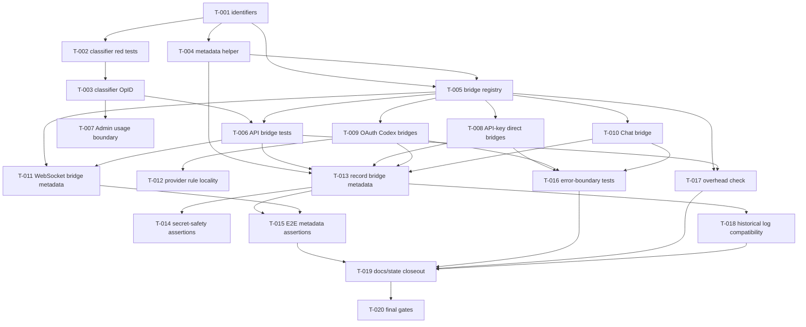

# Tasks: Data-Plane Operation Bridge

**Feature**: 007-data-plane-operation-bridge
**Plan**: `specs/007-data-plane-operation-bridge/plan.md`
**Spec**: `specs/007-data-plane-operation-bridge/spec.md`
**Created**: 2026-04-27
**Status**: Implemented

## Task Format

- `[P]` means the task can run in parallel with other tasks in the same phase because it touches different files and has no dependency on their output.
- `[US-X]` traces the task to a user story in `spec.md`.
- `[L1]` is directly AI-executable. `[L2]` requires careful engineering judgment but remains AI-executable with review. No L3 human-only tasks are planned.
- Every implementation task includes its own red test first, then implementation.

## Phase 1: Foundation

> Goal: introduce stable bridge vocabulary without changing runtime behavior.
> Checkpoint: `go test ./internal/provider/openai ./internal/api` passes.

- [x] T-001 [P] [US-1] [L1] Define bridge identifier and contract types — `internal/provider/bridge.go`, `internal/provider/openai/contracts.go`, `internal/provider/openai/contracts_test.go`
  - context_files:
    - `specs/007-data-plane-operation-bridge/spec.md` (§Functional Requirements, §Key Entities)
    - `specs/007-data-plane-operation-bridge/plan.md` (§Naming Model, §Initial OpID Set, §Initial Bridge Families)
    - `specs/007-data-plane-operation-bridge/contracts/internal-bridge.md` (§Identifier Namespaces)
  - constraints: keep values internal and stable; do not add public HTTP endpoints, OpenAPI changes, dependencies, or schema changes.
  - what: add provider-generic `OpID`, `BridgeID`, `Contract`, `CredentialClass`, and `ClientContract`/`UpstreamContract`-style accessors/helpers where needed; define OpenAI/Codex constants for all supported 006 OpIDs, bridge IDs, and contracts.
  - must_not: do not include `/api/codex/usage` or any Admin API route as an OpID or BridgeID.
  - verify:
    - command: `go test ./internal/provider/openai -run 'TestBridgeIdentifier|TestContract'`
    - assert:
      - all OpID constants start with `op.`
      - all BridgeID constants start with `bridge.`
      - all Contract constants start with `contract.`
      - no constant value contains `/api/codex/usage`

- [x] T-002 [US-1] [L1] Extend route classifier tests with OpID expectations — `internal/api/proxy_routes_test.go`
  - depends_on: T-001
  - context_files:
    - `specs/006-openai-api-gateway/spec.md` (§Operation-Level Coverage Matrix)
    - `specs/007-data-plane-operation-bridge/plan.md` (§Initial OpID Set, §Credential-Class Bridge Matrix)
    - `specs/007-data-plane-operation-bridge/contracts/internal-bridge.md` (§Compatibility Requirements)
  - constraints: tests first; keep current external status codes and error codes unchanged.
  - what: add table assertions for every supported 006 route's OpID, response mode, body policy, and credential eligibility; add negative assertions that unsupported/deferred/blocked routes have no OpID.
  - must_not: do not route `/api/codex/*` through the classifier as a supported data-plane operation.
  - verify:
    - command: `go test ./internal/api -run TestGatewayRouteClassifier`
    - assert:
      - supported P0 operations resolve to exact `op.*` values from `plan.md`
      - `/api/codex/usage`, `/api/codex/usage/`, `/v1/audio/transcriptions`, arbitrary `/backend-api/*`, and blocked OpenAI Administration paths resolve with no supported OpID

- [x] T-003 [US-1] [L1] Add OpID fields to classifier implementation — `internal/api/proxy_routes.go`
  - depends_on: T-002
  - context_files:
    - `specs/007-data-plane-operation-bridge/data-model.md` (§Operation Resolution)
    - `specs/007-data-plane-operation-bridge/plan.md` (§Operation and Bridge Resolution)
    - `internal/api/proxy_routes.go`
  - constraints: preserve pre-body rejection and all 006 route support/unsupported behavior.
  - what: extend `gatewayRoute` with a stable OpID for supported routes and ensure unsupported/blocked routes do not receive one.
  - must_not: do not move provider logic into the classifier; it only classifies operation/support metadata.
  - verify:
    - command: `go test ./internal/api -run TestGatewayRouteClassifier`
    - assert: every red assertion from T-002 passes without changing existing status/error expectations

- [x] T-004 [P] [US-1] [L1] Define safe bridge metadata model and merge helper tests — `internal/provider/bridge.go`, `internal/provider/bridge_test.go`
  - depends_on: T-001
  - context_files:
    - `specs/007-data-plane-operation-bridge/data-model.md` (§Bridge Audit Metadata)
    - `specs/007-data-plane-operation-bridge/contracts/internal-bridge.md` (§Audit Metadata Contract)
    - `internal/domain/request_record.go`
  - constraints: metadata must be additive under `router_metadata.bridge`; historical rows without metadata remain valid.
  - what: add a small metadata struct/map helper that produces only `op_id`, `bridge_id`, `client_contract`, `upstream_contract`, and `credential_class`.
  - must_not: do not include headers, tokens, cookies, body bytes, response bodies, or frame payloads.
  - verify:
    - command: `go test ./internal/provider -run 'TestBridgeMetadata|TestMergeBridgeRouterMetadata'`
    - assert:
      - helper output has exactly the safe keys
      - merging preserves existing `router_metadata` keys
      - `authorization`, `cookie`, literal API key values such as `sk-...`, `access_token`, `request_body`, and `response_body` never appear

## Phase 2: Bridge Registry and Selection

> Goal: select a bridge explicitly after route classification and account-class selection.
> Checkpoint: `go test ./internal/provider/openai ./internal/api -run 'Bridge|GatewayRoute'` passes.

- [x] T-005 [US-1] [L2] Implement OperationBridge interface and registry skeleton — `internal/provider/bridge.go`, `internal/provider/openai/bridge.go`, `internal/provider/openai/bridge_test.go`
  - depends_on: T-001, T-004
  - context_files:
    - `specs/007-data-plane-operation-bridge/contracts/internal-bridge.md` (§Bridge Interface Semantics, §Bridge I/O Types)
    - `specs/007-data-plane-operation-bridge/plan.md` (§Initial Bridge Families)
    - `internal/provider/openai/forwarder.go`
  - constraints: keep low-level HTTP send/header helpers reusable; no provider-wide RequestPolicy DSL.
  - what: add provider-generic `OperationBridge`, `DecodeInput`, `ClientRequest`, `BuildInput`, `UpstreamRequest`, `ClientResponseAdapter`, and a registry capable of resolving expected bridge IDs for OpID + credential class; keep OpenAI/Codex bridge implementations in `internal/provider/openai`.
  - must_not: do not build upstream HTTP requests yet except through placeholders that tests can identify; do not add network calls to registry tests.
  - verify:
    - command: `go test ./internal/provider/openai -run TestBridgeRegistry`
    - assert:
      - API-key supported routes resolve to direct bridge families
      - OAuth supported routes resolve to Codex facade/native bridge families
      - negative credential cases return no eligible bridge
      - Admin usage and `/api/codex/*` have no bridge entry

- [x] T-006 [US-1] [L1] Add API-layer bridge selection tests — `internal/api/proxy_routes_test.go`, `internal/api/proxy_oauth_test.go`, `internal/api/proxy_apikey_test.go`
  - depends_on: T-003, T-005
  - context_files:
    - `specs/007-data-plane-operation-bridge/spec.md` (US-1, AC-1.1~1.3)
    - `specs/007-data-plane-operation-bridge/plan.md` (§Credential-Class Bridge Matrix)
    - `internal/api/proxy_routes_test.go`
  - constraints: keep account selection behavior unchanged; tests should use deterministic fixtures and mock upstreams only.
  - what: assert selected OpID and BridgeID for representative API-key direct, OAuth facade, and OAuth native operations; assert no bridge for unsupported/deferred/blocked routes.
  - must_not: do not make live network calls.
  - verify:
    - command: `go test ./internal/api -run 'TestGatewayRouteClassifier|TestProxy.*Bridge'`
    - assert:
      - API-key `/v1/chat/completions` uses `bridge.openai.chat_completions.direct`
      - OAuth `/v1/chat/completions` uses `bridge.openai.chat_completions.to_codex`
      - OAuth `/backend-api/codex/responses` uses `bridge.codex_native.responses.direct`
      - `/api/admin/usage` is not a data-plane bridge test target

- [x] T-007 [US-1] [L1] Preserve Admin usage and removed alias boundaries — `internal/api/proxy_routes_test.go`, `internal/api/adminapi/usage_test.go`
  - depends_on: T-003
  - context_files:
    - `specs/007-data-plane-operation-bridge/spec.md` (FR-009)
    - `specs/006-openai-api-gateway/contracts/unsupported-routes.md`
    - `openapi/admin.yaml` (`/api/admin/usage`)
  - constraints: Admin usage remains router-owned and enveloped; `/api/codex/*` remains outside data-plane proxy registration.
  - what: add or update tests proving `/api/admin/usage` keeps `{code,msg,data}` envelope and removed aliases are not assigned OpID/BridgeID.
  - must_not: do not reintroduce `/v1/usage`, `/api/codex/usage`, or `/api/codex/usage/` handlers.
  - verify:
    - command: `go test ./internal/api ./internal/api/adminapi -run 'Usage|GatewayRouteClassifier'`
    - assert:
      - `GET /api/admin/usage` returns Admin envelope in adminapi tests
      - `/api/codex/usage` and `/api/codex/usage/` have no supported OpID

## Phase 3: Direct and Facade Bridges

> Goal: route existing provider behavior through bridge boundaries while preserving 006 wire behavior.
> Checkpoint: `go test ./internal/provider/openai ./internal/api` passes.

- [x] T-008 [US-2] [L1] Move API-key direct forwarding behind direct bridges — `internal/provider/openai/bridge.go`, `internal/provider/openai/forwarder.go`, `internal/provider/openai/bridge_test.go`
  - depends_on: T-005
  - context_files:
    - `specs/007-data-plane-operation-bridge/spec.md` (US-2, AC-2.1)
    - `specs/007-data-plane-operation-bridge/contracts/internal-bridge.md` (§Contract Mismatch Rule)
    - `internal/provider/openai/forwarder.go`
  - constraints: direct API-key bridges preserve raw method/path/query/body and only substitute credentials and filtered headers.
  - what: implement direct bridge `DecodeClientRequest` and `BuildUpstreamRequest` paths using existing direct forwarding behavior.
  - must_not: do not apply Codex normalization, field stripping, or facade collection on API-key direct bridges.
  - verify:
    - command: `go test ./internal/provider/openai -run 'TestDirectBridge|TestForwardRequest'`
    - assert:
      - upstream URL is `account.base_url + original path/query`
      - raw JSON body bytes are preserved
      - inbound Authorization is replaced with selected API key

- [x] T-009 [US-2] [L2] Move OAuth Responses, compact, models, and native Codex mappings behind bridges — `internal/provider/openai/bridge.go`, `internal/provider/openai/forwarder_codex_test.go`, `internal/provider/openai/codex_request.go`
  - depends_on: T-005
  - context_files:
    - `specs/007-data-plane-operation-bridge/spec.md` (US-2, AC-2.2~2.4)
    - `specs/006-openai-api-gateway/contracts/codex-compatibility.md`
    - `internal/provider/openai/codex_request.go`
    - `internal/provider/openai/forwarder.go`
  - constraints: reuse existing Codex normalization and forwarding behavior; native Codex responses stay native.
  - what: implement bridge wrappers for Responses-to-Codex, compact-to-Codex, models-from-Codex, native Codex responses, native compact, native models, and transcribe.
  - must_not: do not send ChatGPT OAuth tokens to OpenAI Platform `/v1/*`; do not collect native `/backend-api/codex/responses` into OpenAI facade JSON.
  - verify:
    - command: `go test ./internal/provider/openai -run 'TestCodex.*Bridge|TestForwardCodex'`
    - assert:
      - OAuth `/v1/responses` upstream path is `/codex/responses`
      - compact upstream path is `/codex/responses/compact`
      - OAuth `GET /v1/models` uses models facade adapter
      - native Codex requests preserve native response semantics

- [x] T-010 [US-2] [L2] Move OAuth Chat Completions facade behind a bridge — `internal/provider/openai/bridge.go`, `internal/provider/openai/chat_adapter.go`, `internal/provider/openai/chat_adapter_test.go`
  - depends_on: T-005
  - context_files:
    - `specs/007-data-plane-operation-bridge/spec.md` (US-2, AC-2.2, AC-2.4)
    - `specs/006-openai-api-gateway/contracts/v1-platform-gateway.md` (§OAuth Chat Completions adapter)
    - `internal/provider/openai/chat_adapter.go`
  - constraints: preserve existing allowlist, unsupported-field, stream/non-stream, usage, and SSE behavior.
  - what: expose existing Chat Completions-to-Codex logic as `bridge.openai.chat_completions.to_codex` with explicit client/upstream contracts and response adapter selection.
  - must_not: do not weaken unsupported parameter rejection; do not require clients to send Codex-native payloads.
  - verify:
    - command: `go test ./internal/provider/openai -run 'TestChatAdapter|TestChat.*Bridge'`
    - assert:
      - non-stream client receives Chat Completions JSON
      - stream client receives Chat Completions SSE chunks
      - unsupported fields still return documented invalid request behavior

- [x] T-011 [US-2] [L1] Move WebSocket relay construction and metadata behind bridge selection — `internal/api/websocket_proxy.go`, `internal/api/websocket_proxy_test.go`, `internal/provider/openai/codex_ws.go`
  - depends_on: T-005, T-006
  - context_files:
    - `specs/007-data-plane-operation-bridge/spec.md` (US-2, AC-2.3; US-4 WebSocket edge case)
    - `specs/006-openai-api-gateway/contracts/codex-compatibility.md` (§WebSocket)
    - `internal/api/websocket_proxy.go`
  - constraints: preserve existing WebSocket handshake, relay, close handling, and no-frame-payload recording.
  - what: use the selected bridge to decode/build the WebSocket upstream request, then attach OpID/BridgeID/Contract metadata to WebSocket request records without changing relay behavior.
  - must_not: do not log or persist frame payloads; do not hand-roll WebSocket protocol.
  - verify:
    - command: `go test ./internal/api -run TestWebSocket`
    - assert:
      - `WS /v1/responses` selects `bridge.openai.responses.websocket.to_codex`
      - `WS /backend-api/codex/responses` selects `bridge.codex_native.responses.websocket.direct`
      - request records contain metadata but no frame body payload

## Phase 4: Provider Rule Locality and Recording

> Goal: ensure operation-specific provider behavior lives in bridges and audit metadata is safe.
> Checkpoint: `go test ./internal/provider/openai ./internal/api ./internal/store` passes.

- [x] T-012 [US-3] [L2] Keep provider-specific normalization inside Codex bridges — `internal/provider/openai/bridge.go`, `internal/provider/openai/codex_request.go`, `internal/provider/openai/forwarder_codex_test.go`
  - depends_on: T-009
  - context_files:
    - `specs/007-data-plane-operation-bridge/spec.md` (US-3, AC-3.1~3.3)
    - `specs/007-data-plane-operation-bridge/research.md` (§Decision 3)
    - `internal/provider/openai/codex_request.go`
  - constraints: no provider-wide RequestPolicy struct or global capability flags.
  - what: keep `store`, `stream`, unsupported-field, compact, and native/facade normalization in selected bridge code paths or private helpers called by those bridges.
  - must_not: do not apply these rules to API-key direct bridges or unrelated operations.
  - verify:
    - command: `go test ./internal/provider/openai -run 'TestCodexRequest|TestDirectBridge|TestCodex.*Bridge'`
    - assert:
      - API-key direct bridge bodies are unchanged
      - OAuth Codex bridge normalization matches existing tests
      - no new provider-wide policy DSL type is introduced

- [x] T-013 [US-1] [L1] Record safe bridge metadata for supported bridge traffic — `internal/api/proxy.go`, `internal/core/request_recorder_test.go`, `internal/api/proxy_*_test.go`
  - depends_on: T-004, T-006, T-008, T-009, T-010
  - context_files:
    - `specs/007-data-plane-operation-bridge/data-model.md` (§Bridge Audit Metadata)
    - `specs/007-data-plane-operation-bridge/contracts/internal-bridge.md` (§Audit Metadata Contract)
    - `internal/api/proxy.go`
    - `internal/core/request_recorder.go`
  - constraints: add metadata only for supported bridge traffic; unsupported/deferred/blocked routes have no bridge metadata.
  - what: store safe metadata under `router_metadata.bridge` on request records.
  - must_not: do not overwrite existing model params such as model/temperature or usage-derived safe fields.
  - verify:
    - command: `go test ./internal/api ./internal/core -run 'BridgeMetadata|RequestRecorder|Proxy'`
    - assert:
      - supported API-key/OAuth records include exact safe metadata
      - unsupported route records omit `router_metadata.bridge`
      - existing model params survive merge

- [x] T-014 [US-3] [L1] Add secret-safety assertions for bridge metadata — `internal/api/proxy_*_test.go`, `scripts/log-scrub.sh`
  - depends_on: T-013
  - context_files:
    - `specs/007-data-plane-operation-bridge/spec.md` (NFR-003)
    - `specs/007-data-plane-operation-bridge/data-model.md` (§Bridge Audit Metadata)
    - `AGENTS.md` (§Security, §Failure Semantics)
  - constraints: tests should inspect records/logs for forbidden metadata keys and values.
  - what: add assertions that bridge metadata never contains Authorization, Cookie, API key, OAuth token, auth.json fields, raw request/response bodies, or WebSocket frame payloads.
  - must_not: do not weaken existing body capture tests.
  - verify:
    - command: `go test ./internal/api -run 'BridgeMetadata|WebSocket|BodyLog'`
    - assert:
      - forbidden keys are absent from `router_metadata.bridge`
      - frame payloads remain absent from WebSocket records

## Phase 5: Compatibility and Performance Coverage

> Goal: prove the bridge refactor preserves external behavior and remains cheap.
> Checkpoint: `make data-plane-compat` and `bash scripts/coverage-floor.sh` pass.

- [x] T-015 [US-4] [L1] Add deterministic compatibility assertions for bridge metadata — `frontend/tests/e2e/data-plane-compat.spec.ts`
  - depends_on: T-013, T-011
  - context_files:
    - `specs/007-data-plane-operation-bridge/spec.md` (US-4, AC-4.1~4.4)
    - `specs/007-data-plane-operation-bridge/quickstart.md`
    - `frontend/tests/e2e/data-plane-compat.spec.ts`
  - constraints: keep E2E deterministic with local mocks; no live credentials or network calls.
  - what: extend local data-plane compatibility tests to assert bridge metadata for direct API-key, OAuth facade, native Codex, SSE, WebSocket, and unsupported no-bridge cases.
  - must_not: do not depend on live OpenAI/ChatGPT.
  - verify:
    - command: `make go-build && cd frontend && pnpm playwright test tests/e2e/data-plane-compat.spec.ts`
    - assert:
      - all existing behavior assertions pass
      - supported records include expected `router_metadata.bridge`
      - unsupported/deferred records omit bridge metadata

- [x] T-016 [US-4] [L1] Add bridge error-boundary tests — `internal/provider/openai/bridge_test.go`, `internal/api/proxy_*_test.go`
  - depends_on: T-008, T-009, T-010
  - context_files:
    - `specs/007-data-plane-operation-bridge/contracts/internal-bridge.md` (§Error Boundaries)
    - `specs/006-openai-api-gateway/contracts/unsupported-routes.md`
    - `internal/provider/openai/bridge.go`
  - constraints: error class mapping must preserve current data-plane native error/status behavior.
  - what: cover invalid client request, unsupported client intent, no eligible bridge/account, upstream build failure, and upstream response invalid paths.
  - must_not: do not convert data-plane errors into Admin API envelopes.
  - verify:
    - command: `go test ./internal/provider/openai ./internal/api -run 'Bridge.*Error|Unsupported|Invalid'`
    - assert:
      - invalid client body maps to existing invalid request behavior
      - unsupported/deferred routes reject before body reads
      - upstream response invalid still maps to existing router error

- [x] T-017 [US-4] [L2] Add bridge selection overhead check — `internal/api/proxy_benchmark_test.go` or `internal/provider/openai/bridge_benchmark_test.go`
  - depends_on: T-005, T-006
  - context_files:
    - `specs/007-data-plane-operation-bridge/spec.md` (NFR-005)
    - `specs/007-data-plane-operation-bridge/plan.md` (§Bridge Unit Tests)
  - constraints: benchmark/check must be non-flaky; if local runtime noise prevents a hard gate, document measured overhead in the test log while keeping the design review target.
  - what: measure route classification plus bridge resolution against the previous direct classifier path or an equivalent baseline.
  - must_not: do not add sleeps, live network calls, or environment-sensitive assertions.
  - verify:
    - command: `go test ./internal/api ./internal/provider/openai -run TestBridgeSelectionOverhead -bench BridgeSelection -benchtime=100x`
    - assert:
      - deterministic test logs measured overhead
      - median added bridge-selection overhead is <= 1 ms or the check fails with a clear diagnostic

- [x] T-018 [US-5] [L1] Preserve historical request log compatibility — `internal/api/adminapi/request_logs_test.go`, `internal/store/store_test.go`
  - depends_on: T-013
  - context_files:
    - `specs/007-data-plane-operation-bridge/spec.md` (US-5, AC-5.3)
    - `specs/007-data-plane-operation-bridge/data-model.md` (§Migration Strategy)
    - `internal/api/adminapi/request_logs.go`
  - constraints: no new migration version; the current baseline DDL includes `router_metadata`, and historical rows without `router_metadata.bridge` remain readable.
  - what: add tests for request records without bridge metadata and records with bridge metadata.
  - must_not: do not remove existing Admin request-log fields or move model/client params out of `model_params`.
  - verify:
    - command: `go test ./internal/api/adminapi ./internal/store -run 'RequestLogs|RequestRecord'`
    - assert:
      - historical rows decode/render successfully
      - metadata-bearing rows do not break existing request-log filters or response shapes

## Phase 6: Delivery Gates

> Goal: complete behavior-preserving release verification.
> Checkpoint: all project quality gates pass.

- [x] T-019 [P] [US-5] [L1] Update 007 docs and close traceability — `specs/007-data-plane-operation-bridge/*.md`, `specs/sdd/state.json`
  - depends_on: T-015, T-016, T-017, T-018
  - context_files:
    - `specs/007-data-plane-operation-bridge/spec.md`
    - `specs/007-data-plane-operation-bridge/plan.md`
    - `specs/007-data-plane-operation-bridge/checklists/spec-quality.md`
    - `specs/sdd/state.json`
  - constraints: docs must reflect implemented behavior; no new endpoint scope.
  - what: mark any implementation discoveries, update quickstart if commands differ, and ensure state references remain current.
  - must_not: do not mark completion until verification gates pass.
  - verify:
    - command: `rg -n --glob '!tasks.md' 'api_codex_usage|RouterLocalUsage|router-local usage bridge' specs/007-data-plane-operation-bridge`
    - assert: no supported-bridge reference remains for removed usage aliases in 007 design documents

- [x] T-020 [US-5] [L1] Run final backend/frontend compatibility gates — repository root
  - depends_on: T-019
  - context_files:
    - `AGENTS.md` (§Quality Gates, §Commands)
    - `specs/007-data-plane-operation-bridge/quickstart.md`
  - constraints: live smoke remains opt-in only and must skip without live credentials.
  - what: run final quality gates and record any skipped live-smoke reason in the delivery notes.
  - must_not: do not require live upstream credentials for deterministic completion.
  - verify:
    - command: `golangci-lint run && go test ./... && go build ./... && bash scripts/coverage-floor.sh && make data-plane-compat`
    - assert:
      - all commands exit 0
      - deterministic compatibility tests pass
      - no live upstream network call is made unless `LIVE_UPSTREAM_COMPAT=1` is set

## Dependency Graph

## Traceability Matrix

| Spec Item | Type | Task IDs | Coverage |
|---|---|---|---|
| US-1 | User Story | T-001, T-002, T-003, T-004, T-005, T-006, T-013 | Full |
| AC-1.1 | Acceptance | T-002, T-003, T-006 | Full |
| AC-1.2 | Acceptance | T-002, T-003, T-016 | Full |
| AC-1.3 | Acceptance | T-004, T-013, T-014 | Full |
| US-2 | User Story | T-008, T-009, T-010, T-011, T-015 | Full |
| AC-2.1 | Acceptance | T-008, T-015 | Full |
| AC-2.2 | Acceptance | T-009, T-010, T-015 | Full |
| AC-2.3 | Acceptance | T-009, T-011, T-015 | Full |
| AC-2.4 | Acceptance | T-009, T-010, T-016 | Full |
| US-3 | User Story | T-008, T-009, T-010, T-012, T-014 | Full |
| AC-3.1 | Acceptance | T-012 | Full |
| AC-3.2 | Acceptance | T-008, T-012 | Full |
| AC-3.3 | Acceptance | T-009, T-010, T-012, T-016 | Full |
| US-4 | User Story | T-006, T-011, T-015, T-016, T-017 | Full |
| AC-4.1 | Acceptance | T-006, T-015 | Full |
| AC-4.2 | Acceptance | T-009, T-010, T-016 | Full |
| AC-4.3 | Acceptance | T-009, T-011, T-015 | Full |
| AC-4.4 | Acceptance | T-008, T-015 | Full |
| US-5 | User Story | T-007, T-018, T-019, T-020 | Full |
| AC-5.1 | Acceptance | T-002, T-003, T-015, T-020 | Full |
| AC-5.2 | Acceptance | T-007, T-019, T-020 | Full |
| AC-5.3 | Acceptance | T-018 | Full |
| FR-001..FR-003 | Functional | T-001, T-002, T-003, T-005, T-006 | Full |
| FR-004..FR-008 | Functional | T-008, T-009, T-010, T-011, T-012, T-016 | Full |
| FR-009 | Functional | T-007, T-019 | Full |
| FR-010 | Functional | T-002, T-003, T-016 | Full |
| FR-011 | Functional | T-004, T-013, T-014 | Full |
| FR-012..FR-014 | Functional | T-015, T-018, T-019, T-020 | Full |
| NFR-001 | Non-Functional | T-015, T-020 | Full |
| NFR-002 | Non-Functional | T-002, T-016 | Full |
| NFR-003 | Non-Functional | T-004, T-014, T-020 | Full |
| NFR-004 | Non-Functional | T-006, T-015 | Full |
| NFR-005 | Non-Functional | T-017 | Full |
| NFR-006 | Non-Functional | T-009, T-010, T-011 | Full |
| NFR-007 | Non-Functional | T-018, T-019 | Full |
| NFR-008 | Non-Functional | T-020 | Full |

## Task Statistics

| Metric | Value |
|---|---|
| Total Tasks | 20 |
| Phases | 6 |
| L1 Tasks | 16 (80%) |
| L2 Tasks | 4 (20%) |
| L3 Tasks | 0 (0%) |
| Parallel Tasks | 3 (15%) |
| Estimated AI Sessions | 20 |
| Human Tasks | 0 |

### Distribution Health

- L1 >= 70%: PASS
- L2 <= 20%: PASS
- L3 <= 10%: PASS

### Coverage

- P0 Acceptance Coverage: 14/14 (100%)
- P1 Acceptance Coverage: 3/3 (100%)
- Edge Case Coverage: 15/15 (100%)
